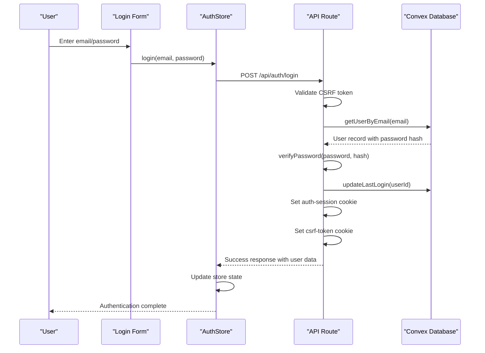
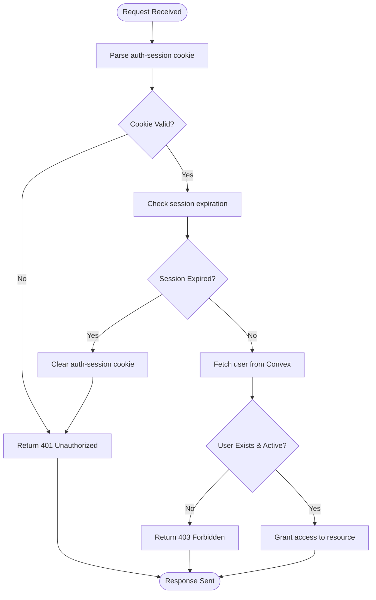
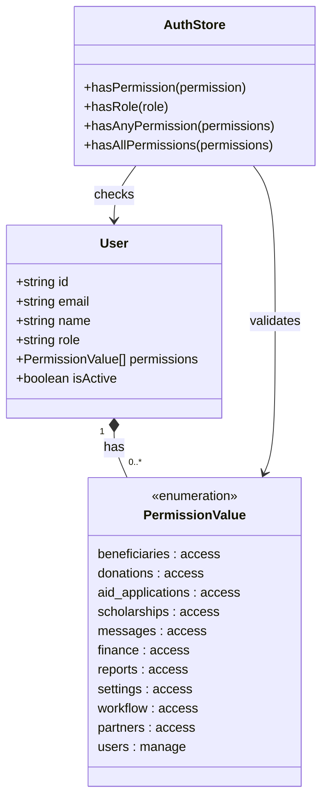
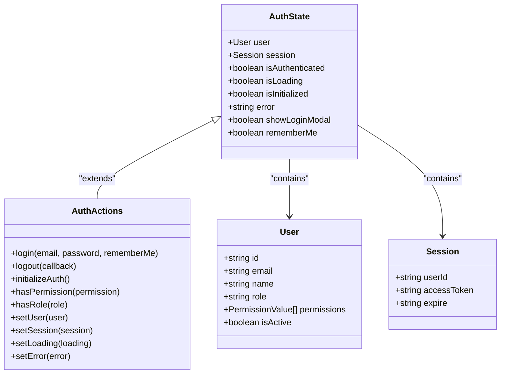
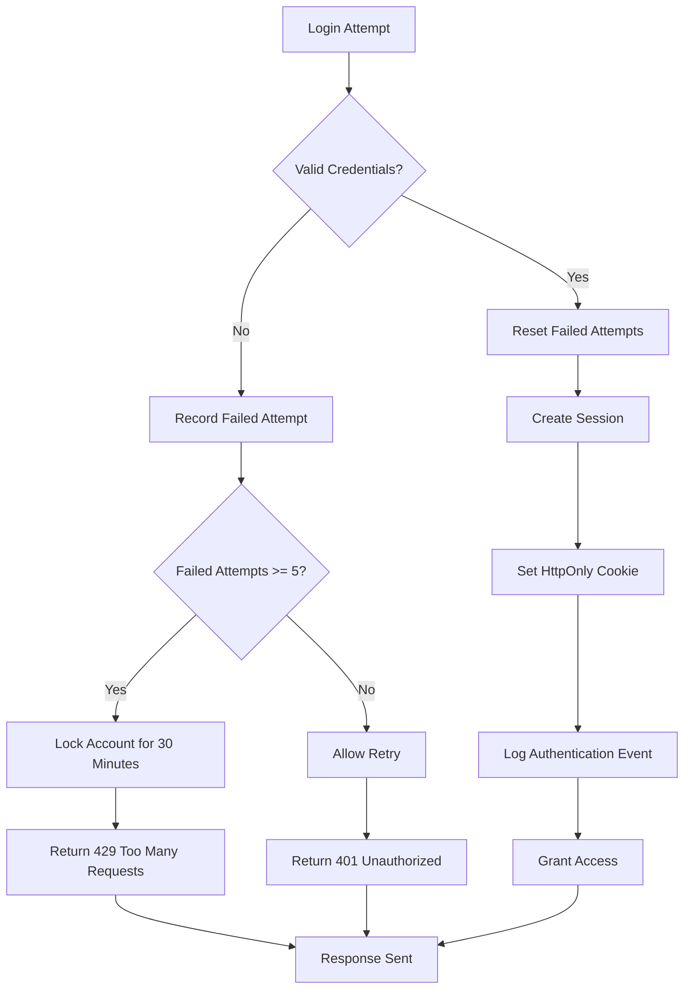

# Authentication & Authorization

<cite>
**Referenced Files in This Document**   
- [auth.ts](file://convex/auth.ts)
- [authStore.ts](file://src/stores/authStore.ts)
- [login/route.ts](file://src/app/api/auth/login/route.ts)
- [session/route.ts](file://src/app/api/auth/session/route.ts)
- [logout/route.ts](file://src/app/api/auth/logout/route.ts)
- [get-user.ts](file://src/lib/auth/get-user.ts)
- [password.ts](file://src/lib/auth/password.ts)
- [account-lockout.ts](file://src/lib/auth/account-lockout.ts)
- [session.ts](file://src/lib/auth/session.ts)
- [permissions.ts](file://src/types/permissions.ts)
- [auth.ts](file://src/types/auth.ts)
- [corporate-login-form.tsx](file://src/components/ui/corporate-login-form.tsx)
- [login/page.tsx](file://src/app/login/page.tsx)
</cite>

## Table of Contents

1. [Introduction](#introduction)
2. [Authentication Flow](#authentication-flow)
3. [Session Management](#session-management)
4. [Role-Based Access Control (RBAC)](#role-based-access-control-rbac)
5. [Client-Side Authentication State](#client-side-authentication-state)
6. [Security Considerations](#security-considerations)
7. [Configuration Options](#configuration-options)
8. [Integration Points](#integration-points)

## Introduction

The Kafkasder-panel authentication and authorization system implements a secure email/password login mechanism with NextAuth-style session management and comprehensive role-based access control (RBAC). The system leverages Convex as the backend database and authentication provider, with Next.js API routes handling authentication logic. User sessions are managed through secure HttpOnly cookies, and client-side authentication state is maintained using Zustand store. The implementation includes robust security features such as password hashing with bcrypt, account lockout protection, CSRF protection, and comprehensive audit logging.

**Section sources**

- [auth.ts](file://convex/auth.ts#L1-L82)
- [authStore.ts](file://src/stores/authStore.ts#L1-L403)

## Authentication Flow

The authentication flow begins when a user submits their email and password through the login form. The system first validates the input credentials, then queries the Convex database to retrieve the user record using the `getUserByEmail` Convex query. The password is verified using bcrypt's comparison function, ensuring secure password handling without exposing the hash on the client side. Upon successful authentication, the system creates a session with a unique session ID and expiration time, sets HttpOnly cookies for session management, and updates the user's last login timestamp in the database.

**Diagram sources**

- [login/route.ts](file://src/app/api/auth/login/route.ts#L23-L231)
- [auth.ts](file://convex/auth.ts#L33-L48)
- [authStore.ts](file://src/stores/authStore.ts#L145-L245)

**Section sources**

- [login/route.ts](file://src/app/api/auth/login/route.ts#L1-L231)
- [password.ts](file://src/lib/auth/password.ts#L1-L54)
- [auth.ts](file://convex/auth.ts#L33-L48)

## Session Management

Session management in Kafkasder-panel uses HttpOnly cookies to securely store session information, preventing client-side JavaScript access and reducing XSS attack risks. The session cookie contains a serialized JSON object with the user ID, session ID, and expiration timestamp. The system implements both short-term and long-term session options based on the "remember me" preference, with default expiration times of 24 hours for regular sessions and 30 days for remembered sessions. Session validation occurs on each request by parsing the session cookie and checking its expiration time before granting access to protected resources.

**Diagram sources**

- [session.ts](file://src/lib/auth/session.ts#L1-L198)
- [login/route.ts](file://src/app/api/auth/login/route.ts#L149-L170)
- [session/route.ts](file://src/app/api/auth/session/route.ts#L1-L65)

**Section sources**

- [session.ts](file://src/lib/auth/session.ts#L1-L198)
- [login/route.ts](file://src/app/api/auth/login/route.ts#L149-L170)
- [session/route.ts](file://src/app/api/auth/session/route.ts#L1-L65)

## Role-Based Access Control (RBAC)

The RBAC system implements a comprehensive permission model with predefined module permissions and special administrative permissions. Permissions are defined as constants in the `permissions.ts` file, with each permission following the format "module:action". Users are assigned specific permissions based on their role, and these permissions are validated on both the client and server sides. The system includes helper methods in the authStore for checking permissions, such as `hasPermission`, `hasAnyPermission`, and `hasAllPermissions`, enabling fine-grained access control throughout the application.

**Diagram sources**

- [permissions.ts](file://src/types/permissions.ts#L1-L39)
- [authStore.ts](file://src/stores/authStore.ts#L44-L53)
- [auth.ts](file://src/types/auth.ts#L3-L16)

**Section sources**

- [permissions.ts](file://src/types/permissions.ts#L1-L39)
- [authStore.ts](file://src/stores/authStore.ts#L278-L305)

## Client-Side Authentication State

Client-side authentication state is managed using a Zustand store (authStore) with persistence enabled through localStorage. The authStore maintains the current user object, session information, authentication status, and error state. The store is initialized by checking for an existing session in localStorage and validating it against the server. The store provides actions for login, logout, and permission checking, with appropriate loading and error states to ensure a smooth user experience. The implementation includes hydration handling to prevent server-client mismatch issues during SSR.

**Diagram sources**

- [authStore.ts](file://src/stores/authStore.ts#L22-L60)
- [auth.ts](file://src/types/auth.ts#L3-L16)
- [session.ts](file://src/lib/auth/session.ts#L8-L12)

**Section sources**

- [authStore.ts](file://src/stores/authStore.ts#L1-L403)
- [get-user.ts](file://src/lib/auth/get-user.ts#L54-L68)

## Security Considerations

The authentication system implements multiple security measures to protect against common vulnerabilities. Passwords are hashed using bcrypt with 12 salt rounds, providing strong protection against brute force attacks. Account lockout protection limits failed login attempts to 5 within a 15-minute window, with a 30-minute lockout period to prevent brute force attacks. CSRF protection is implemented using anti-forgery tokens that are validated on all state-changing requests. All session cookies are marked as HttpOnly and Secure, preventing client-side access and ensuring transmission only over HTTPS. The system also includes comprehensive audit logging of authentication events for security monitoring.

**Diagram sources**

- [account-lockout.ts](file://src/lib/auth/account-lockout.ts#L1-L176)
- [password.ts](file://src/lib/auth/password.ts#L1-L54)
- [login/route.ts](file://src/app/api/auth/login/route.ts#L39-L58)
- [session.ts](file://src/lib/auth/session.ts#L149-L170)

**Section sources**

- [account-lockout.ts](file://src/lib/auth/account-lockout.ts#L1-L176)
- [password.ts](file://src/lib/auth/password.ts#L1-L54)
- [security.ts](file://src/lib/security.ts#L398-L448)

## Configuration Options

Authentication settings are configurable through system settings accessible to administrators. Key configurable options include session timeout duration (5-1440 minutes), maximum login attempts before lockout (3-10 attempts), and password policy settings. The system also supports different session durations based on the "remember me" preference, with configurable long-term session duration. These settings are stored in the system configuration and can be modified through the admin interface, allowing organizations to tailor the authentication behavior to their security requirements.

**Section sources**

- [settings/page.tsx](<file://src/app/(dashboard)/settings/page.tsx#L545-L576>)
- [account-lockout.ts](file://src/lib/auth/account-lockout.ts#L19-L24)

## Integration Points

The authentication system integrates with various components throughout the application. Protected API routes use the authentication middleware to validate sessions before processing requests, returning 401 Unauthorized responses for unauthenticated requests. The corporate login form component provides the user interface for authentication, handling input validation and form submission. The proxy configuration redirects unauthenticated users to the login page, ensuring consistent access control. Audit logging is integrated with authentication events to track login successes and failures. The system also integrates with Convex queries like `getCurrentUser` to retrieve authenticated user data for personalized content.

**Section sources**

- [proxy.ts](file://src/proxy.ts#L174-L174)
- [auth.spec.ts](file://e2e/auth.spec.ts#L171-L213)
- [corporate-login-form.tsx](file://src/components/ui/corporate-login-form.tsx#L24-L538)
- [login/page.tsx](file://src/app/login/page.tsx#L3-L11)
