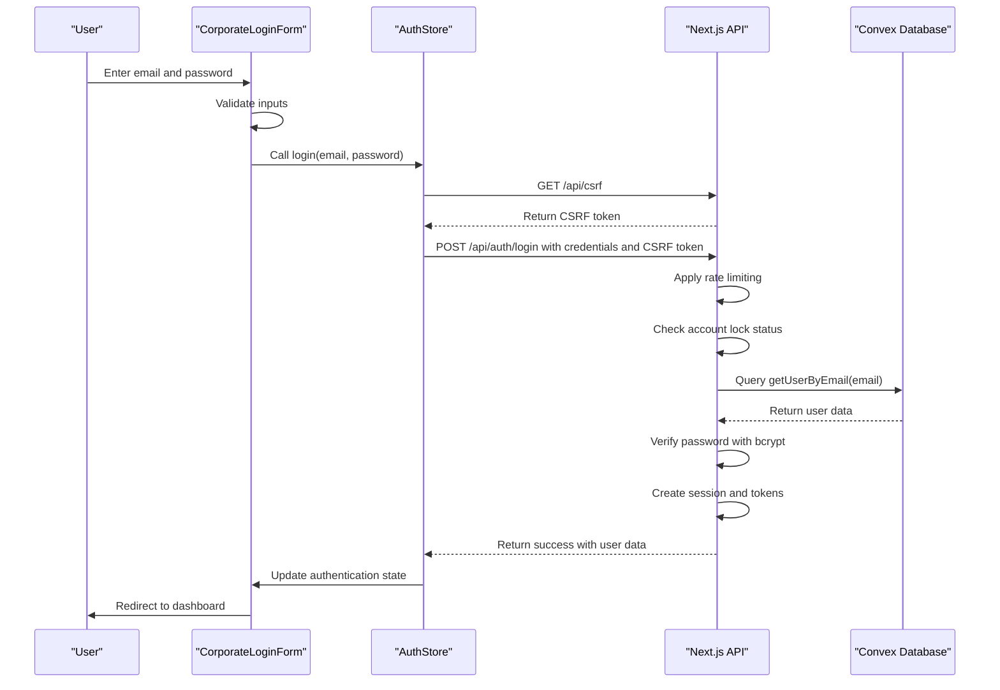

# Login Flow

<cite>
**Referenced Files in This Document**   
- [CorporateLoginForm.tsx](file://src/components/ui/corporate-login-form.tsx)
- [login/route.ts](file://src/app/api/auth/login/route.ts)
- [authStore.ts](file://src/stores/authStore.ts)
- [users.ts](file://convex/users.ts)
- [password.ts](file://src/lib/auth/password.ts)
- [csrf.ts](file://src/lib/csrf.ts)
- [account-lockout.ts](file://src/lib/auth/account-lockout.ts)
- [rate-limit-config.ts](file://src/lib/rate-limit-config.ts)
</cite>

## Table of Contents

1. [Introduction](#introduction)
2. [Client-Side Login Form](#client-side-login-form)
3. [Form Validation and User Experience](#form-validation-and-user-experience)
4. [Authentication Process](#authentication-process)
5. [Server-Side Authentication Flow](#server-side-authentication-flow)
6. [Security Measures](#security-measures)
7. [Session Management](#session-management)
8. [Error Handling](#error-handling)
9. [Rate Limiting and Brute Force Protection](#rate-limiting-and-brute-force-protection)
10. [Sequence Diagram](#sequence-diagram)

## Introduction

The login flow in Kafkasder-panel is a comprehensive authentication process that ensures secure access to the system. This document details the complete journey from user input in the CorporateLoginForm to successful authentication and session establishment. The process involves multiple layers of security including client-side validation, CSRF protection, server-side authentication against the Convex database, password verification with bcrypt, and robust session management. The flow is designed to provide a seamless user experience while maintaining high security standards through rate limiting, account lockout mechanisms, and proper error handling.

## Client-Side Login Form

The login process begins with the CorporateLoginForm component, which provides a professional and user-friendly interface for authentication. This form is rendered on the login page and serves as the entry point for users to access the system. The form collects essential credentials including email address and password, with additional features like password visibility toggle and "remember me" functionality. The form is built with React and leverages Next.js routing for navigation. It integrates with the authentication store to manage the login state and handle the authentication process. The form is designed with accessibility in mind, featuring proper labeling, error messages, and keyboard navigation support.

**Section sources**

- [CorporateLoginForm.tsx](file://src/components/ui/corporate-login-form.tsx#L24-L538)
- [page.tsx](file://src/app/login/page.tsx#L1-L12)

## Form Validation and User Experience

The CorporateLoginForm implements comprehensive client-side validation to enhance user experience and reduce server load. Email validation ensures the input follows the standard email format with proper error messages for invalid entries. Password validation checks for minimum length requirements and provides real-time feedback on password strength. The form includes a password strength indicator that visually represents the security level of the entered password, encouraging users to create stronger passwords. Input sanitization is performed to prevent injection attacks, and all user inputs are properly encoded before transmission. The form also supports keyboard navigation, allowing users to move between fields using the Tab key and submit the form with the Enter key.

**Section sources**

- [CorporateLoginForm.tsx](file://src/components/ui/corporate-login-form.tsx#L84-L135)

## Authentication Process

The authentication process is initiated when the user submits the login form. The handleSubmit method in the CorporateLoginForm prevents the default form submission behavior and performs validation on both email and password fields. If validation passes, the login method from the authStore is called with the provided credentials. Before making the API request, the client first acquires a CSRF token by making a GET request to /api/csrf. This token is then included in the subsequent login request as a header to prevent cross-site request forgery attacks. The entire process is wrapped in a loading state to provide visual feedback to the user during authentication.

**Section sources**

- [CorporateLoginForm.tsx](file://src/components/ui/corporate-login-form.tsx#L149-L192)
- [authStore.ts](file://src/stores/authStore.ts#L145-L245)

## Server-Side Authentication Flow

The server-side authentication flow begins when the POST request reaches the /api/auth/login endpoint. The request is first processed by the authRateLimit middleware, which enforces rate limiting rules to prevent brute force attacks. The request body is parsed to extract the email, password, and rememberMe flag. The system first checks if the account is locked due to previous failed login attempts. If not locked, it queries the Convex database using the getUserByEmail function to retrieve the user record. If the user is found, the system verifies that the account is active before proceeding with password verification. The password is verified using bcrypt's compare function against the stored hash. Upon successful authentication, the system creates a session and returns the user data along with session information.



**Diagram sources**

- [route.ts](file://src/app/api/auth/login/route.ts#L23-L231)
- [users.ts](file://convex/users.ts#L73-L82)
- [password.ts](file://src/lib/auth/password.ts#L18-L20)

**Section sources**

- [route.ts](file://src/app/api/auth/login/route.ts#L23-L231)
- [users.ts](file://convex/users.ts#L73-L82)
- [password.ts](file://src/lib/auth/password.ts#L18-L20)

## Security Measures

The login flow incorporates multiple security measures to protect against various attack vectors. CSRF tokens are generated and validated to prevent cross-site request forgery attacks. Passwords are securely hashed using bcrypt with a salt round of 12, providing strong protection against rainbow table attacks. All communication is encrypted with 256-bit SSL/TLS. The system implements proper input validation and sanitization to prevent injection attacks. Sensitive operations are protected with rate limiting to prevent brute force attacks. The authentication process also includes account lockout mechanisms that temporarily lock accounts after multiple failed login attempts. HttpOnly cookies are used for session storage to prevent client-side script access.

**Section sources**

- [csrf.ts](file://src/lib/csrf.ts#L1-L90)
- [password.ts](file://src/lib/auth/password.ts#L8-L11)
- [account-lockout.ts](file://src/lib/auth/account-lockout.ts#L1-L176)

## Session Management

Session management in Kafkasder-panel is handled through a combination of HttpOnly cookies and client-side state management. Upon successful authentication, the server sets two cookies: an HttpOnly auth-session cookie containing session information and a csrf-token cookie for subsequent requests. The auth-session cookie is marked as HttpOnly to prevent client-side script access, reducing the risk of XSS attacks. The session includes the user ID, session ID, and expiration time. The client-side authStore maintains the user's authentication state using Zustand, with persistence enabled through localStorage. When the rememberMe option is selected, the session duration is extended to 30 days; otherwise, it expires after 24 hours. The system also supports session renewal and proper logout functionality.

**Section sources**

- [route.ts](file://src/app/api/auth/login/route.ts#L148-L179)
- [authStore.ts](file://src/stores/authStore.ts#L196-L213)

## Error Handling

The login flow includes comprehensive error handling to provide meaningful feedback to users while maintaining security. Client-side validation errors are displayed immediately below the respective input fields, guiding users to correct their entries. Server-side errors are categorized and translated into user-friendly messages without revealing sensitive information. Authentication failures return a generic "Invalid email or password" message regardless of whether the email exists or the password is incorrect, preventing user enumeration attacks. Account lockout errors provide information about the remaining lockout time without confirming the existence of the account. Network errors and server-side exceptions are handled gracefully, with appropriate fallback messages. All errors are logged on the server for monitoring and auditing purposes.

**Section sources**

- [CorporateLoginForm.tsx](file://src/components/ui/corporate-login-form.tsx#L179-L189)
- [route.ts](file://src/app/api/auth/login/route.ts#L209-L228)

## Rate Limiting and Brute Force Protection

The system implements a multi-layered approach to rate limiting and brute force protection. The authRateLimit middleware limits login attempts to 10 per 10 minutes per IP address, with failed attempts not counting toward the limit to prevent attackers from exhausting the quota. Additionally, the account-lockout system tracks failed login attempts per email address, locking accounts for 30 minutes after 5 consecutive failed attempts within a 15-minute window. This dual approach effectively prevents both distributed and targeted brute force attacks. The rate limiting configuration is defined in rate-limit-config.ts and applied globally to all API endpoints, with different thresholds for various types of operations. The system also includes monitoring and logging of rate limit violations for security auditing.

**Section sources**

- [rate-limit-config.ts](file://src/lib/rate-limit-config.ts#L22-L28)
- [account-lockout.ts](file://src/lib/auth/account-lockout.ts#L19-L24)
- [rate-limit.ts](file://src/lib/rate-limit.ts#L92-L100)

## Sequence Diagram

The following sequence diagram illustrates the complete login flow from user interaction to successful authentication:

```mermaid
sequenceDiagram
participant User as "User"
participant Form as "CorporateLoginForm"
participant Store as "AuthStore"
participant CSRF as "CSRF API"
participant AuthAPI as "Auth API"
participant Convex as "Convex Database"
participant Logger as "Logger"
User->>Form : Enter credentials and submit
Form->>Form : Validate email and password
alt Validation fails
Form-->>User : Display validation errors
stop
end
Form->>Store : Call login() with credentials
Store->>CSRF : GET /api/csrf
CSRF->>CSRF : Generate or retrieve CSRF token
CSRF-->>Store : Return CSRF token
Store->>AuthAPI : POST /api/auth/login with credentials and CSRF token
AuthAPI->>AuthAPI : Apply rate limiting
alt Rate limit exceeded
AuthAPI-->>Store : Return 429 Too Many Requests
Store-->>Form : Handle rate limit error
Form-->>User : Display rate limit message
stop
end
AuthAPI->>AuthAPI : Check account lock status
alt Account locked
AuthAPI-->>Store : Return 429 Account Locked
Store-->>Form : Handle lockout error
Form-->>User : Display lockout message
stop
end
AuthAPI->>Convex : Query getUserByEmail(email)
Convex-->>AuthAPI : Return user data or null
alt User not found
AuthAPI->>Logger : Log failed attempt
AuthAPI->>AuthAPI : Record failed attempt
AuthAPI-->>Store : Return 401 Invalid credentials
Store-->>Form : Handle authentication error
Form-->>User : Display generic error
stop
end
alt User inactive
AuthAPI-->>Store : Return 403 Account inactive
Store-->>Form : Handle inactive account
Form-->>User : Display inactive message
stop
end
AuthAPI->>AuthAPI : Verify password with bcrypt
alt Password incorrect
AuthAPI->>Logger : Log failed attempt
AuthAPI->>AuthAPI : Record failed attempt
AuthAPI-->>Store : Return 401 Invalid credentials
Store-->>Form : Handle authentication error
Form-->>User : Display generic error
stop
end
AuthAPI->>AuthAPI : Record successful login
AuthAPI->>AuthAPI : Generate CSRF token
AuthAPI->>AuthAPI : Create session cookies
AuthAPI->>Convex : Update last login time
AuthAPI->>Logger : Log successful login
AuthAPI-->>Store : Return 200 Success with user data
Store->>Store : Update state with user data
Store->>Store : Save session to localStorage
Store-->>Form : Authentication successful
Form->>Form : Show success toast
Form->>User : Redirect to dashboard
```

**Diagram sources**

- [CorporateLoginForm.tsx](file://src/components/ui/corporate-login-form.tsx#L149-L192)
- [authStore.ts](file://src/stores/authStore.ts#L145-L245)
- [route.ts](file://src/app/api/auth/login/route.ts#L23-L231)
- [users.ts](file://convex/users.ts#L73-L82)
- [password.ts](file://src/lib/auth/password.ts#L18-L20)
- [csrf.ts](file://src/lib/csrf.ts#L1-L90)

**Section sources**

- [CorporateLoginForm.tsx](file://src/components/ui/corporate-login-form.tsx#L149-L192)
- [authStore.ts](file://src/stores/authStore.ts#L145-L245)
- [route.ts](file://src/app/api/auth/login/route.ts#L23-L231)
