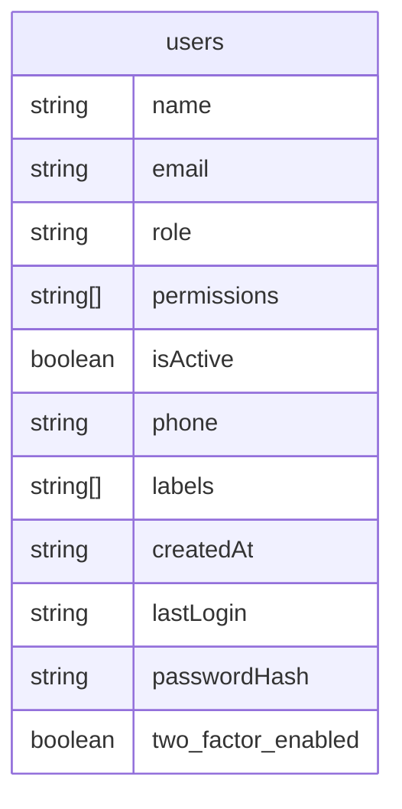
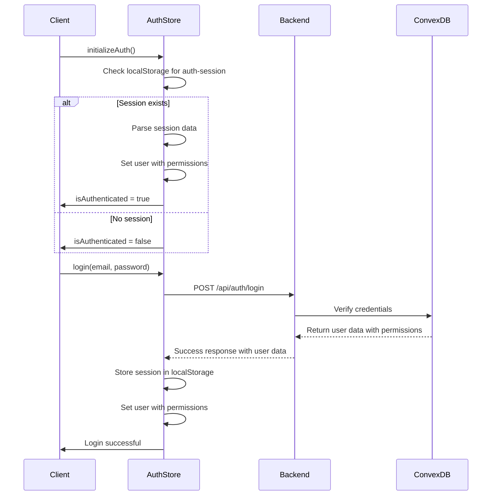
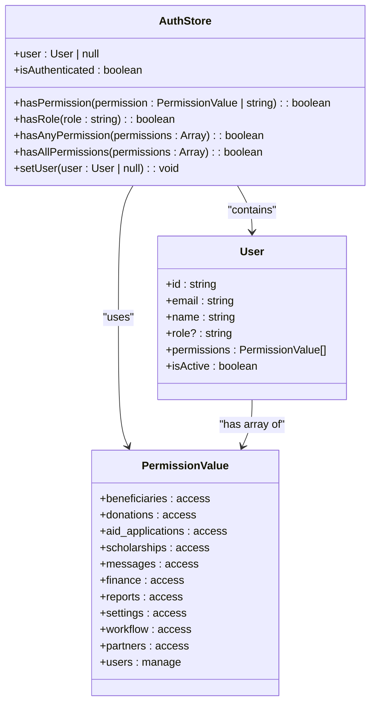

# Role-Based Access Control (RBAC)

<cite>
**Referenced Files in This Document**   
- [auth.ts](file://src/types/auth.ts)
- [authStore.ts](file://src/stores/authStore.ts)
- [permissions.ts](file://src/types/permissions.ts)
- [users.ts](file://convex/users.ts)
- [schema.ts](file://convex/schema.ts)
- [permission-checkbox-group.tsx](file://src/components/users/permission-checkbox-group.tsx)
</cite>

## Table of Contents

1. [Introduction](#introduction)
2. [Data Model for Roles and Permissions](#data-model-for-roles-and-permissions)
3. [User Authentication and Permission Loading](#user-authentication-and-permission-loading)
4. [Permission Checking Mechanisms](#permission-checking-mechanisms)
5. [Role-Based Access in Components](#role-based-access-in-components)
6. [Adding New Roles and Permissions](#adding-new-roles-and-permissions)
7. [Conclusion](#conclusion)

## Introduction

The Role-Based Access Control (RBAC) system in Kafkasder-panel governs user access to application features based on assigned roles and permissions. This document details how user roles and permissions are defined, stored, and enforced throughout the application. The implementation leverages a Convex backend for data storage, a Zustand-based authStore for client-side state management, and a structured permissions model that supports both module-level access and special administrative capabilities.

**Section sources**

- [auth.ts](file://src/types/auth.ts)
- [authStore.ts](file://src/stores/authStore.ts)

## Data Model for Roles and Permissions

The RBAC system is built on a data model that stores user roles and permissions within the Convex database. The `users` collection in the Convex schema includes fields for both `role` (a string) and `permissions` (an optional array of strings). This design allows for flexible permission assignment, supporting both role-based inheritance and granular permission overrides.

**Diagram sources**

- [schema.ts](file://convex/schema.ts#L9-L37)

The `permissions` array in the `users` collection contains specific permission values that determine what actions a user can perform. These values are defined in the `permissions.ts` file using TypeScript constants. The system distinguishes between module-level permissions (e.g., `beneficiaries:access`) and special permissions (e.g., `users:manage`). The `ALL_PERMISSIONS` constant aggregates all possible permissions, providing a comprehensive list for UI rendering and validation.

**Section sources**

- [schema.ts](file://convex/schema.ts#L9-L37)
- [permissions.ts](file://src/types/permissions.ts#L1-L39)
- [users.ts](file://convex/users.ts#L84-L121)

## User Authentication and Permission Loading

During the login process, user permissions are loaded from the backend and stored in the client-side `authStore`. When a user successfully authenticates, the login API returns user data including the `permissions` array. This data is processed by the `backendUserToStoreUser` function in `authStore.ts`, which converts the backend user object into a format suitable for the store, preserving the permissions array.

The `initializeAuth` method in `authStore` handles the restoration of authentication state from localStorage, ensuring that user permissions persist across sessions. When the application initializes, it checks for stored session data and, if valid, sets the user object with its associated permissions, maintaining the user's access level without requiring re-authentication.

**Diagram sources**

- [authStore.ts](file://src/stores/authStore.ts#L108-L142)
- [authStore.ts](file://src/stores/authStore.ts#L145-L222)

## Permission Checking Mechanisms

The RBAC system provides several utility functions through the `authStore` for checking user permissions. These selector functions are exposed as methods on the store and can be used throughout the application to control access to features and UI elements.

The `hasPermission` method checks if a user has a specific permission by verifying its presence in the `permissions` array. The `hasRole` method performs a case-insensitive comparison of the user's role against the requested role. For more complex scenarios, the system provides `hasAnyPermission` (returns true if the user has at least one of the specified permissions) and `hasAllPermissions` (returns true only if the user has all specified permissions).

These methods are implemented as store actions that access the current user state and perform the necessary checks. They return `false` if the user is not authenticated or if the user object is null, ensuring secure default behavior.

**Diagram sources**

- [authStore.ts](file://src/stores/authStore.ts#L22-L60)
- [auth.ts](file://src/types/auth.ts#L3-L16)

## Role-Based Access in Components

UI elements in Kafkasder-panel are conditionally rendered based on user permissions using the selector functions from `authStore`. Components import the necessary permission checking methods and use them to control the visibility of features, buttons, and navigation elements.

The `PermissionCheckboxGroup` component demonstrates how permissions are managed in the user interface. This component renders a series of checkboxes for each available permission, allowing administrators to assign permissions to users. It uses the `DEFAULT_ORDER` array to maintain a consistent ordering of permissions and includes special handling for the `users:manage` permission with descriptive text explaining its capabilities.

When rendering protected content, components typically use patterns like `useAuthStore().hasPermission('beneficiaries:access')` to determine visibility. This approach ensures that unauthorized users cannot access restricted functionality, even if they attempt to navigate directly to protected routes.

**Section sources**

- [authStore.ts](file://src/stores/authStore.ts#L278-L305)
- [permission-checkbox-group.tsx](file://src/components/users/permission-checkbox-group.tsx#L1-L74)

## Adding New Roles and Permissions

To add new roles and permissions to the system, developers must update several components of the codebase. New permissions should be added to the `MODULE_PERMISSIONS` or `SPECIAL_PERMISSIONS` constants in `permissions.ts`, following the naming convention `module:action`. The `ALL_PERMISSIONS` array automatically includes all values from these constants through the spread operator.

After defining new permissions, they must be added to the Convex schema if they require backend validation. The `users` collection already supports an array of string permissions, so no schema changes are typically needed for basic permission addition.

Administrative interfaces that manage user roles and permissions, such as the `PermissionCheckboxGroup` component, may need to be updated to include the new permissions in their UI. The `DEFAULT_ORDER` array in `permission-checkbox-group.tsx` controls the display order of permissions and should be updated to include any new module-level permissions.

When creating new application features that require permission control, developers should use the existing permission checking methods in `authStore` to protect routes, API endpoints, and UI elements. This ensures consistency with the established RBAC pattern throughout the application.

**Section sources**

- [permissions.ts](file://src/types/permissions.ts#L1-L39)
- [permission-checkbox-group.tsx](file://src/components/users/permission-checkbox-group.tsx#L8-L19)

## Conclusion

The RBAC implementation in Kafkasder-panel provides a flexible and secure system for managing user access. By combining a well-structured data model in Convex with a robust client-side authentication store, the application can effectively enforce permission policies across all features. The system's design allows for both role-based access control and granular permission management, supporting the needs of an organization with diverse user roles and responsibilities. The use of TypeScript constants and type safety ensures that permissions are consistently defined and used throughout the codebase, reducing the risk of authorization errors.
