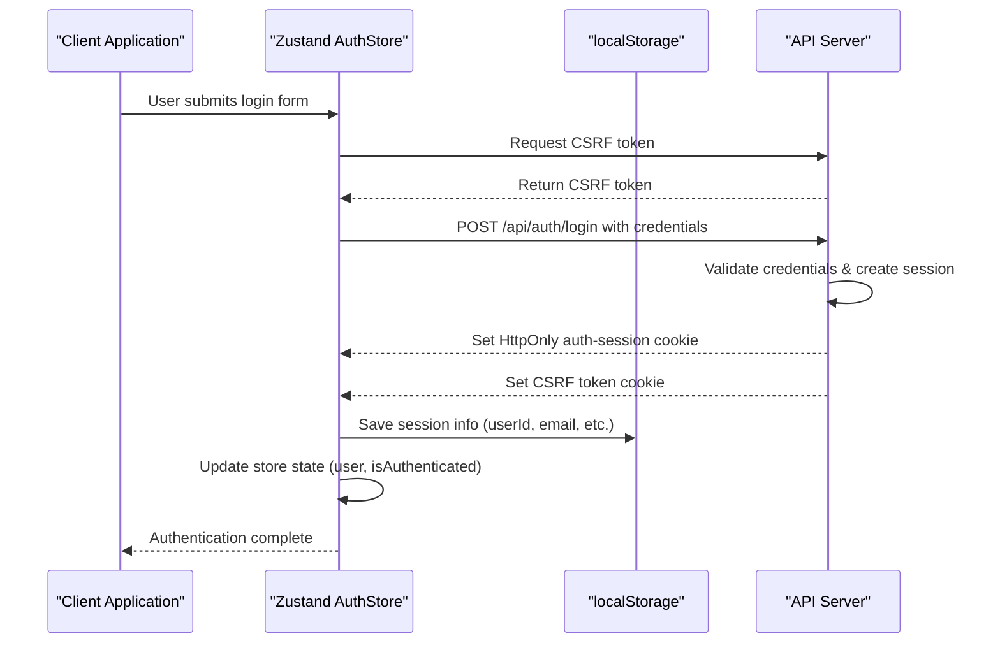
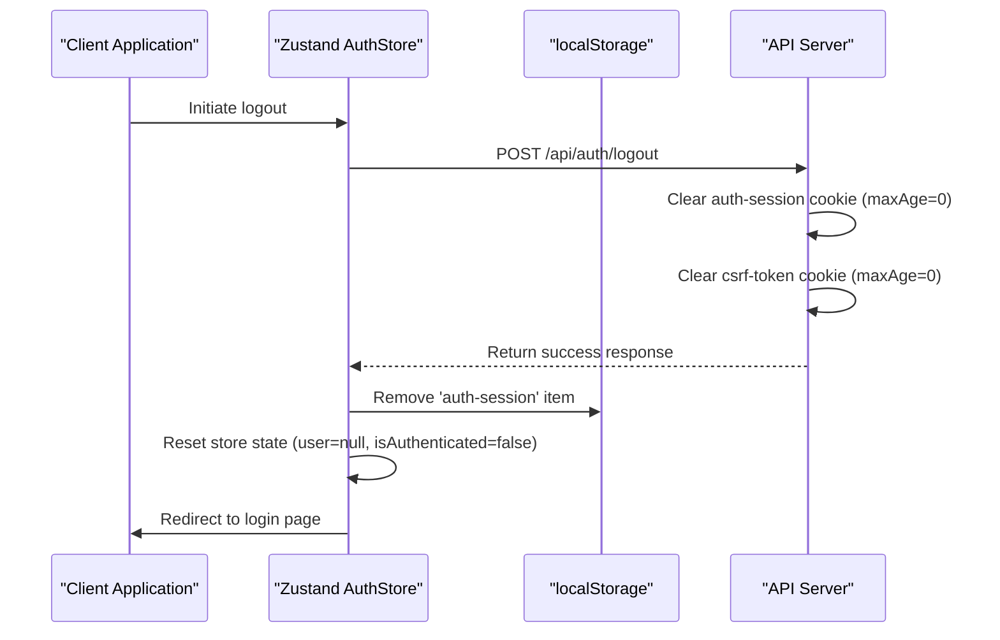
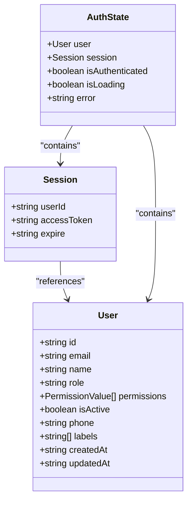
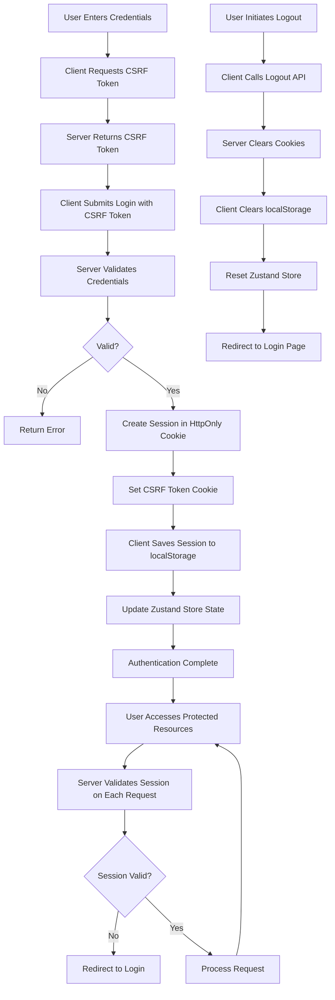

# Session Management

<cite>
**Referenced Files in This Document**   
- [authStore.ts](file://src/stores/authStore.ts)
- [get-user.ts](file://src/lib/auth/get-user.ts)
- [session.ts](file://src/lib/auth/session.ts)
- [login/route.ts](file://src/app/api/auth/login/route.ts)
- [logout/route.ts](file://src/app/api/auth/logout/route.ts)
- [session/route.ts](file://src/app/api/auth/session/route.ts)
- [auth.ts](file://src/types/auth.ts)
- [permissions.ts](file://src/types/permissions.ts)
- [csrf.ts](file://src/lib/csrf.ts)
</cite>

## Table of Contents

1. [Introduction](#introduction)
2. [Session Creation Flow](#session-creation-flow)
3. [Client-Side Session Management](#client-side-session-management)
4. [Server-Side Session Validation](#server-side-session-validation)
5. [Session Expiration and Timeout](#session-expiration-and-timeout)
6. [Logout Process](#logout-process)
7. [Security Considerations](#security-considerations)
8. [Session Object Structure](#session-object-structure)
9. [Authentication Flow Diagram](#authentication-flow-diagram)
10. [Conclusion](#conclusion)

## Introduction

The session management system in Kafkasder-panel implements a secure authentication mechanism that combines server-side HttpOnly cookies with client-side state persistence. This hybrid approach ensures both security and user experience by protecting authentication tokens from client-side access while maintaining session state across page refreshes. The system uses a combination of Convex backend services, Next.js API routes, and Zustand for state management to create a robust authentication flow that handles user login, session validation, and logout operations.

## Session Creation Flow

The session creation process begins when a user submits their credentials through the login interface. The client first retrieves a CSRF token from the `/api/csrf` endpoint to prevent cross-site request forgery attacks. This token is then included in the authorization header of the subsequent login request to `/api/auth/login`. The server validates the credentials against the Convex database, verifying the password hash before proceeding. Upon successful authentication, the server generates a session object containing the user ID and expiration timestamp, which is stored in an HttpOnly cookie named `auth-session`. This cookie configuration includes the Secure flag (when in production), SameSite=strict, and appropriate maxAge values based on the user's rememberMe preference. Simultaneously, a separate CSRF token cookie is set with httpOnly=false to allow client-side access for subsequent authenticated requests.

**Section sources**

- [login/route.ts](file://src/app/api/auth/login/route.ts#L1-L231)
- [csrf.ts](file://src/lib/csrf.ts#L1-L57)

## Client-Side Session Management

Client-side session management is handled through the Zustand store implemented in authStore.ts, which maintains the application's authentication state. The store uses the persist middleware to synchronize session data with localStorage, ensuring that user sessions survive page refreshes. When a user logs in successfully, the authStore stores a simplified session object containing the userId, a placeholder for the accessToken (marked as "stored-in-httponly-cookie"), and the expiration timestamp. This information is also saved to localStorage under the key 'auth-session', containing essential user information such as userId, email, name, role, permissions, and avatar. The store's initialization process checks for existing session data in localStorage and reconstructs the authentication state accordingly, setting isAuthenticated to true if valid session data is found. This dual-storage approach (HttpOnly cookie for security and localStorage for persistence) allows the application to maintain user state while protecting sensitive authentication tokens from JavaScript access.

**Diagram sources**

- [authStore.ts](file://src/stores/authStore.ts#L90-L389)
- [login/route.ts](file://src/app/api/auth/login/route.ts#L1-L231)

## Server-Side Session Validation

Server-side session validation occurs through multiple mechanisms that verify the authenticity and validity of user sessions. The primary validation function, `getCurrentUserId`, extracts the auth-session cookie from either the request object or the cookies helper, parses the JSON content, and validates that a userId is present. It also checks the expiration timestamp to ensure the session has not expired, returning null if the session is invalid or expired. This function is used throughout the application in API routes to authenticate requests and retrieve the current user's ID. Additionally, the `/api/auth/session` endpoint provides client-side applications with a way to validate their current session by returning basic session information (userId and expiration) without exposing sensitive data. The system also implements account lockout mechanisms after multiple failed login attempts, temporarily preventing further login attempts to protect against brute force attacks. These server-side validations ensure that only authenticated users with valid, non-expired sessions can access protected resources.

**Section sources**

- [get-user.ts](file://src/lib/auth/get-user.ts#L12-L47)
- [session.ts](file://src/lib/auth/session.ts#L27-L53)
- [session/route.ts](file://src/app/api/auth/session/route.ts#L1-L65)

## Session Expiration and Timeout

Session expiration and timeout settings in Kafkasder-panel are configurable based on user preferences and system policies. When a user logs in, the session duration is determined by the rememberMe flag: if true, the session lasts for 30 days; otherwise, it expires after 24 hours. This is implemented through the maxAge parameter in the auth-session cookie, which is set to either 30*24*60*60 seconds or 24*60\*60 seconds accordingly. The session object itself contains an expire field with an ISO timestamp that is validated on each request to determine if the session has expired. Administrators can configure system-wide session timeout values through the settings interface, with options to set timeouts between 5 and 1440 minutes. The system also implements automatic cleanup of expired sessions by checking the expiration timestamp during session validation and removing expired cookies when detected. This multi-layered approach to session expiration ensures both security and flexibility, allowing organizations to balance convenience with security requirements.

**Section sources**

- [login/route.ts](file://src/app/api/auth/login/route.ts#L152-L168)
- [settings/page.tsx](<file://src/app/(dashboard)/settings/page.tsx#L545-L576>)

## Logout Process

The logout process in Kafkasder-panel is designed to completely terminate user sessions by clearing both server-side and client-side state. When a user initiates logout, the client sends a POST request to the `/api/auth/logout` endpoint, which clears the auth-session and csrf-token cookies by setting their maxAge to 0 and effectively expiring them immediately. The server-side implementation includes error handling to ensure that cookies are cleared even if an error occurs during the logout process, following a defensive programming approach. After the server confirms successful logout, the client-side authStore clears its state by removing the auth-session data from localStorage and resetting the store's user, session, and isAuthenticated properties to null, null, and false respectively. The logout handler also provides an optional callback parameter for custom post-logout actions, defaulting to redirecting the user to the login page. This comprehensive logout process ensures that no residual session data remains, preventing session fixation attacks and protecting user accounts when shared devices are used.

**Diagram sources**

- [logout/route.ts](file://src/app/api/auth/logout/route.ts#L1-L73)
- [authStore.ts](file://src/stores/authStore.ts#L248-L274)

## Security Considerations

The session management system in Kafkasder-panel incorporates multiple security measures to protect user authentication and prevent common web vulnerabilities. The primary security feature is the use of HttpOnly cookies for storing the auth-session, which prevents client-side JavaScript from accessing the session token and mitigates cross-site scripting (XSS) attacks. The cookies are marked with the Secure flag in production environments, ensuring they are only transmitted over HTTPS connections. The SameSite=strict attribute prevents cross-site request forgery (CSRF) attacks by restricting cookie sending to same-site requests only. The system implements CSRF protection through a separate csrf-token cookie that is required for state-changing operations and validated using constant-time comparison to prevent timing attacks. Account lockout mechanisms after multiple failed login attempts protect against brute force attacks, while session expiration based on rememberMe preferences balances security and user convenience. Additionally, the system avoids storing actual authentication tokens on the client side, using a placeholder value in the Zustand store instead, which prevents token leakage through client-side storage.

**Section sources**

- [login/route.ts](file://src/app/api/auth/login/route.ts#L156-L169)
- [logout/route.ts](file://src/app/api/auth/logout/route.ts#L14-L27)
- [csrf.ts](file://src/lib/csrf.ts#L40-L50)

## Session Object Structure

The session object structure in Kafkasder-panel consists of both server-side and client-side components that work together to maintain authentication state. On the server side, the auth-session cookie contains a JSON object with three properties: sessionId (a unique identifier prefixed with "session\_"), userId (the Convex ID of the authenticated user), and expire (an ISO timestamp indicating when the session expires). This data is transmitted only through secure HTTP cookies and is never exposed directly to client-side JavaScript. On the client side, the authStore maintains a Session interface with userId, accessToken (set to a placeholder value), and expire properties. The actual user data is stored separately in the authStore's user property, which contains a User object with id, email, name, role, permissions, and other profile information. This separation of concerns ensures that sensitive authentication tokens remain protected while still allowing the application to access necessary user information for UI rendering and permission checks. The localStorage persistence layer stores a subset of this data, including userId, email, name, role, permissions, and avatar, enabling session restoration after page refreshes.

**Diagram sources**

- [authStore.ts](file://src/stores/authStore.ts#L16-L20)
- [auth.ts](file://src/types/auth.ts#L3-L15)

## Authentication Flow Diagram

The complete authentication flow in Kafkasder-panel integrates client-side and server-side components to create a secure and user-friendly experience. The process begins with the user submitting their credentials through the login interface, triggering a series of coordinated actions between the client and server. First, the client obtains a CSRF token to prevent cross-site request forgery, then submits the login credentials to the authentication API. Upon successful validation, the server establishes a secure session using HttpOnly cookies while the client stores non-sensitive session data in localStorage for persistence. Subsequent requests include the session cookie automatically, while the client uses the CSRF token for state-changing operations. The system continuously validates sessions on the server side, checking expiration and authenticity, while the client maintains a synchronized state through the Zustand store. Logout operations clear both cookie-based and localStorage-based session data, ensuring complete session termination.

**Diagram sources**

- [authStore.ts](file://src/stores/authStore.ts#L90-L389)
- [login/route.ts](file://src/app/api/auth/login/route.ts#L1-L231)
- [logout/route.ts](file://src/app/api/auth/logout/route.ts#L1-L73)

## Conclusion

The session management system in Kafkasder-panel demonstrates a well-architected approach to authentication that balances security, usability, and maintainability. By leveraging HttpOnly cookies for secure token storage and localStorage for session persistence, the system protects against common web vulnerabilities while providing a seamless user experience. The integration of CSRF protection, account lockout mechanisms, and configurable session timeouts enhances security without compromising functionality. The use of Zustand with persist middleware enables efficient client-side state management that survives page refreshes, while server-side validation ensures the integrity of authentication state. This comprehensive approach to session management provides a solid foundation for the application's security model, protecting user data and ensuring that only authenticated users can access protected resources. Future enhancements could include support for refresh tokens, multi-factor authentication integration, and more granular session management controls.
