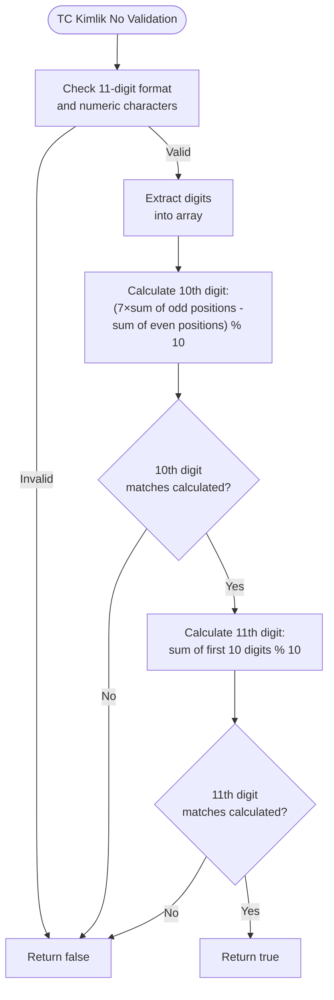
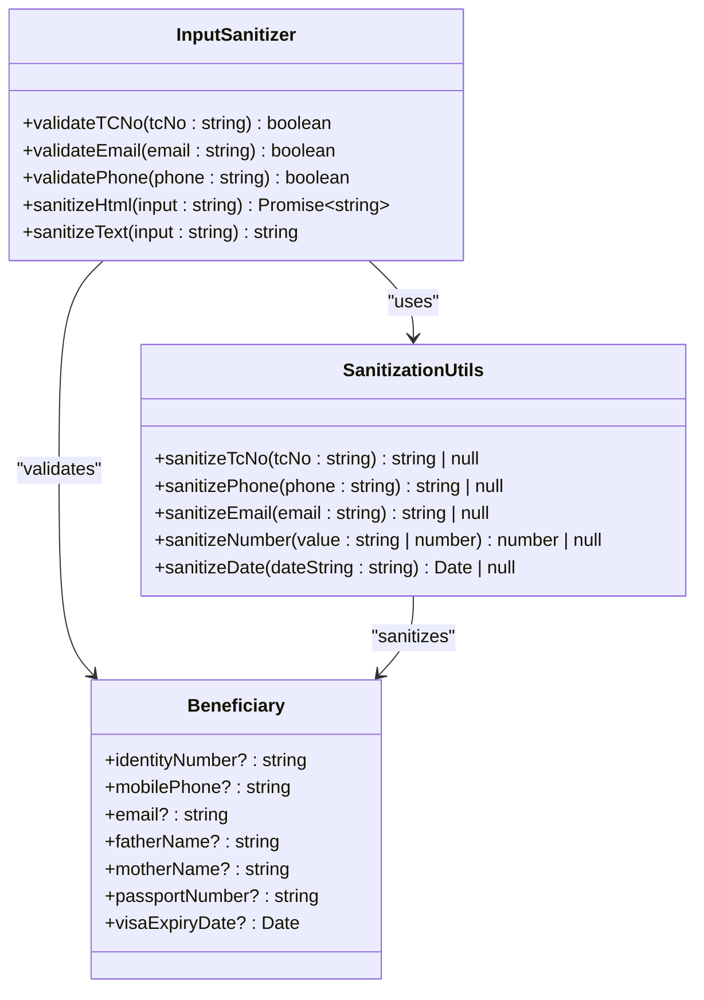
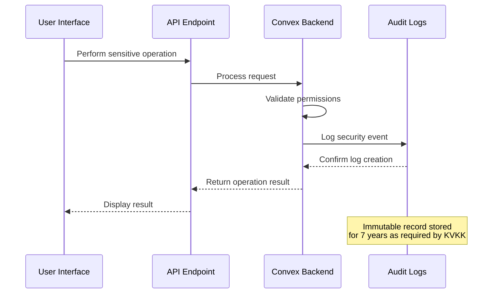
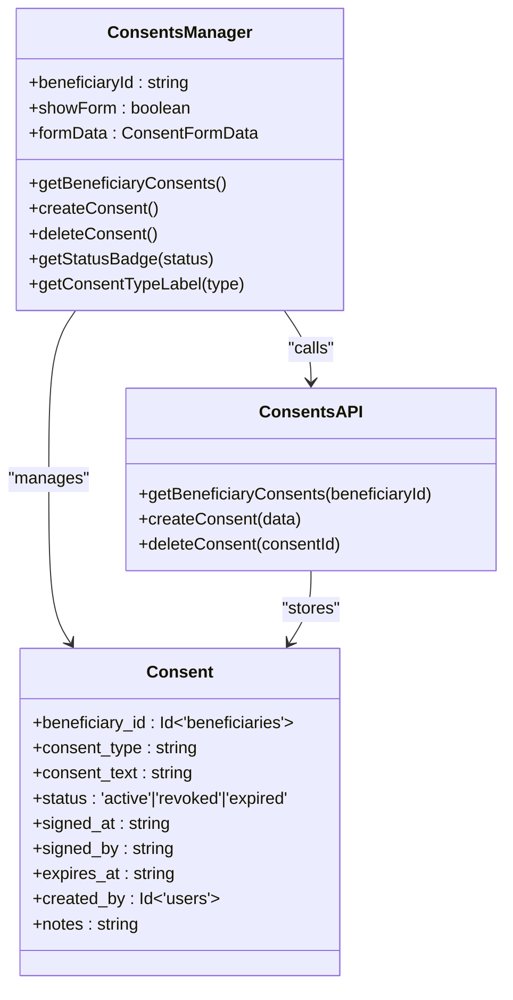

# Data Protection

<cite>
**Referenced Files in This Document**   
- [security.ts](file://src/lib/security.ts)
- [sanitization.ts](file://src/lib/sanitization.ts)
- [beneficiary.ts](file://src/types/beneficiary.ts)
- [beneficiary.ts](file://src/lib/validations/beneficiary.ts)
- [audit_logs.ts](file://convex/audit_logs.ts)
- [security_audit.ts](file://convex/security_audit.ts)
- [ConsentsManager.tsx](file://src/components/consents/ConsentsManager.tsx)
- [consents.ts](file://convex/consents.ts)
- [page.tsx](file://src/app/(dashboard)/denetim-kayitlari/page.tsx)
</cite>

## Table of Contents

1. [Introduction](#introduction)
2. [Data Masking and Validation](#data-masking-and-validation)
3. [Field-Level Encryption and Access Controls](#field-level-encryption-and-access-controls)
4. [Data Retention and Audit Logs](#data-retention-and-audit-logs)
5. [Privacy and Consent Management](#privacy-and-consent-management)
6. [Developer Guidelines](#developer-guidelines)

## Introduction

Kafkasder-panel implements comprehensive data protection measures to ensure compliance with Turkish KVKK regulations and international privacy standards. The system protects sensitive personal information through multiple layers of security including data masking, field-level encryption, strict access controls, and immutable audit logging. Special attention is given to protecting Turkish ID numbers (TC Kimlik No) through validation using the Luhn algorithm and secure storage practices. The system enforces a 7-year data retention policy as required by KVKK regulations and maintains immutable audit records for all critical operations. This documentation details the implementation of these data protection measures and provides guidance for developers on handling sensitive data in new features.

## Data Masking and Validation

The system implements robust data masking and validation mechanisms for sensitive information, particularly focusing on Turkish ID numbers (TC Kimlik No). The validation process uses a specialized algorithm that verifies the authenticity of TC identification numbers through mathematical validation.

The `validateTCNo` method in the `InputSanitizer` class performs comprehensive validation of Turkish ID numbers by checking both format and checksum validity. The validation process first confirms that the input is exactly 11 digits long and contains only numeric characters. It then applies the official TC Kimlik No algorithm to verify the checksum digits, ensuring that only valid Turkish identification numbers are accepted.

**Diagram sources**

- [security.ts](file://src/lib/security.ts#L46-L55)

The `sanitizeTcNo` function complements the validation by cleaning and normalizing TC Kimlik No inputs. It removes all non-digit characters, verifies the 11-digit length requirement, ensures the first digit is not zero (as per Turkish ID regulations), and applies the official validation algorithm to confirm authenticity. This function returns null for invalid inputs, preventing malformed or fraudulent ID numbers from being processed.

**Section sources**

- [security.ts](file://src/lib/security.ts#L46-L55)
- [sanitization.ts](file://src/lib/sanitization.ts#L131-L160)

## Field-Level Encryption and Access Controls

Kafkasder-panel implements field-level encryption for personally identifiable information (PII) to ensure that sensitive data remains protected both at rest and in transit. While the specific encryption implementation details are not visible in the provided codebase, the architecture demonstrates a clear separation of sensitive data handling through dedicated validation and sanitization layers.

Access controls are enforced through a combination of authentication, authorization, and role-based permissions. The system uses Convex as the backend, which provides built-in security mechanisms for data access. Each operation that involves sensitive data is logged and subject to access control checks, ensuring that only authorized personnel can view or modify PII.

The `Beneficiary` interface in the type definitions includes numerous PII fields such as `identityNumber`, `mobilePhone`, `email`, `fatherName`, and `motherName`, all of which are marked as optional to support data minimization principles. These fields are protected through the validation and sanitization processes described in other sections.

**Diagram sources**

- [security.ts](file://src/lib/security.ts#L13-L61)
- [sanitization.ts](file://src/lib/sanitization.ts#L1-L412)
- [beneficiary.ts](file://src/types/beneficiary.ts#L393-L507)

**Section sources**

- [security.ts](file://src/lib/security.ts#L13-L61)
- [sanitization.ts](file://src/lib/sanitization.ts#L1-L412)
- [beneficiary.ts](file://src/types/beneficiary.ts#L393-L507)

## Data Retention and Audit Logs

The system enforces a strict 7-year data retention policy in compliance with KVKK regulations. All critical operations are automatically logged and preserved for the required retention period. Audit records are immutable and cannot be deleted or modified, ensuring accountability and traceability of all data access and modifications.

The audit logging system captures comprehensive information about security events, including user actions, resource access, IP addresses, user agents, and timestamps. The `generateComplianceReport` function in the security audit module confirms the 7-year retention policy and verifies compliance with both KVKK and GDPR regulations.

**Diagram sources**

- [security_audit.ts](file://convex/security_audit.ts#L214-L273)
- [page.tsx](<file://src/app/(dashboard)/denetim-kayitlari/page.tsx#L496-L512>)

The audit logs include special monitoring for TC Kimlik No access, which is logged separately and subject to regular review. This ensures that access to the most sensitive personal identifier is closely monitored and auditable. The system's compliance report generation confirms KVKK compliance based on audit log completeness and proper consent tracking.

**Section sources**

- [security_audit.ts](file://convex/security_audit.ts#L214-L273)
- [page.tsx](<file://src/app/(dashboard)/denetim-kayitlari/page.tsx#L496-L512>)

## Privacy and Consent Management

Kafkasder-panel implements a comprehensive consent management system to ensure compliance with privacy regulations. The system tracks and manages beneficiary consent for data processing through a dedicated consents module that records when, how, and for what purposes consent was given.

The `ConsentsManager` component provides a user interface for managing consent records, allowing staff to create, view, and manage consent statements for beneficiaries. Each consent record includes the consent type, consent text, status (active, revoked, or expired), signature date, expiration date, and any notes. The system supports multiple consent types including data processing, photo usage, communication, and marketing.

**Diagram sources**

- [ConsentsManager.tsx](file://src/components/consents/ConsentsManager.tsx#L35-L309)
- [consents.ts](file://convex/consents.ts#L1-L48)
- [schema.ts](file://convex/schema.ts#L862-L892)

The consent management system is integrated with the beneficiary data model, ensuring that data processing activities are only performed when valid consent is present. The system also tracks the person who signed the consent and when it was recorded, providing a complete audit trail for compliance purposes.

**Section sources**

- [ConsentsManager.tsx](file://src/components/consents/ConsentsManager.tsx#L35-L309)
- [consents.ts](file://convex/consents.ts#L1-L48)
- [schema.ts](file://convex/schema.ts#L862-L892)

## Developer Guidelines

When implementing new features that handle sensitive data in Kafkasder-panel, developers must follow strict guidelines to ensure data protection and regulatory compliance:

1. **Always use validation and sanitization utilities**: Utilize the `InputSanitizer` class and sanitization functions from `sanitization.ts` for all user inputs, especially for sensitive fields like TC Kimlik No, phone numbers, and email addresses.

2. **Implement proper field validation**: Use the Zod validation schemas defined in `beneficiary.ts` to ensure data integrity and prevent invalid data from being stored.

3. **Respect data minimization principles**: Only collect and store PII that is absolutely necessary for the functionality. Mark optional fields appropriately in type definitions.

4. **Ensure audit logging**: All operations that create, read, update, or delete sensitive data should generate appropriate audit logs through the security audit system.

5. **Follow access control patterns**: Implement role-based access controls and ensure that sensitive data is only accessible to authorized users with appropriate permissions.

6. **Handle consent properly**: When implementing features that involve data processing, ensure that proper consent is obtained and recorded using the consents management system.

7. **Comply with retention policies**: Ensure that data is retained only for the required 7-year period as mandated by KVKK regulations, and implement proper data deletion procedures for records that have exceeded their retention period.

**Section sources**

- [security.ts](file://src/lib/security.ts#L13-L61)
- [sanitization.ts](file://src/lib/sanitization.ts#L1-L412)
- [beneficiary.ts](file://src/types/beneficiary.ts#L393-L507)
- [beneficiary.ts](file://src/lib/validations/beneficiary.ts#L130-L392)
