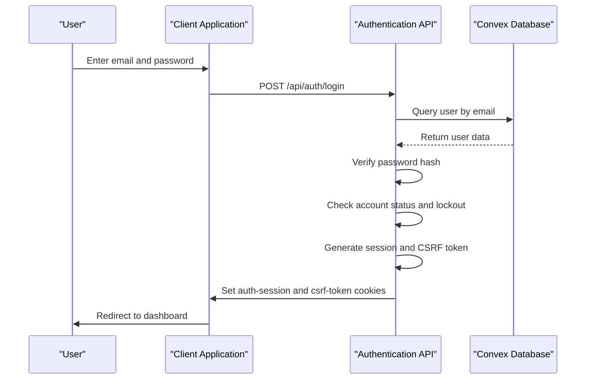
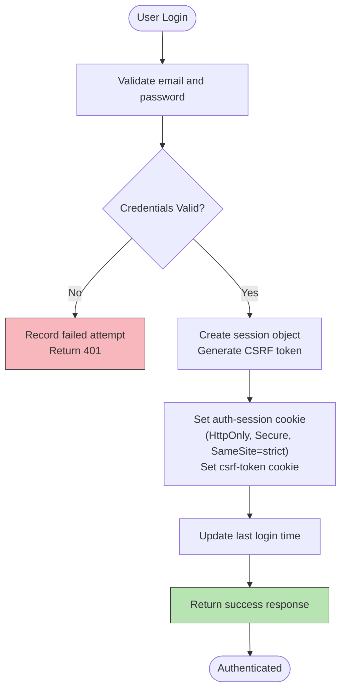
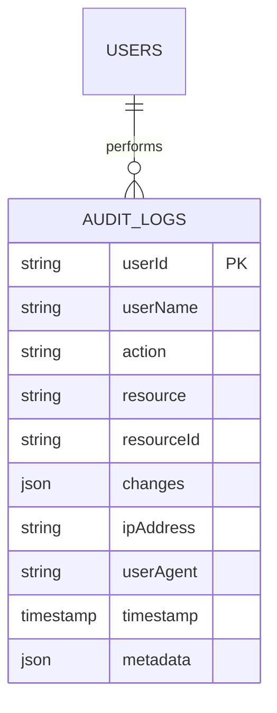
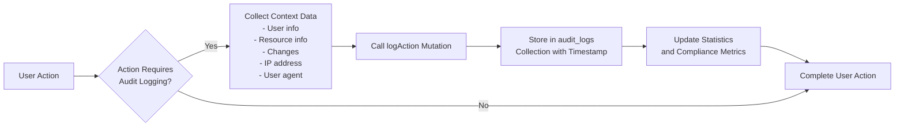
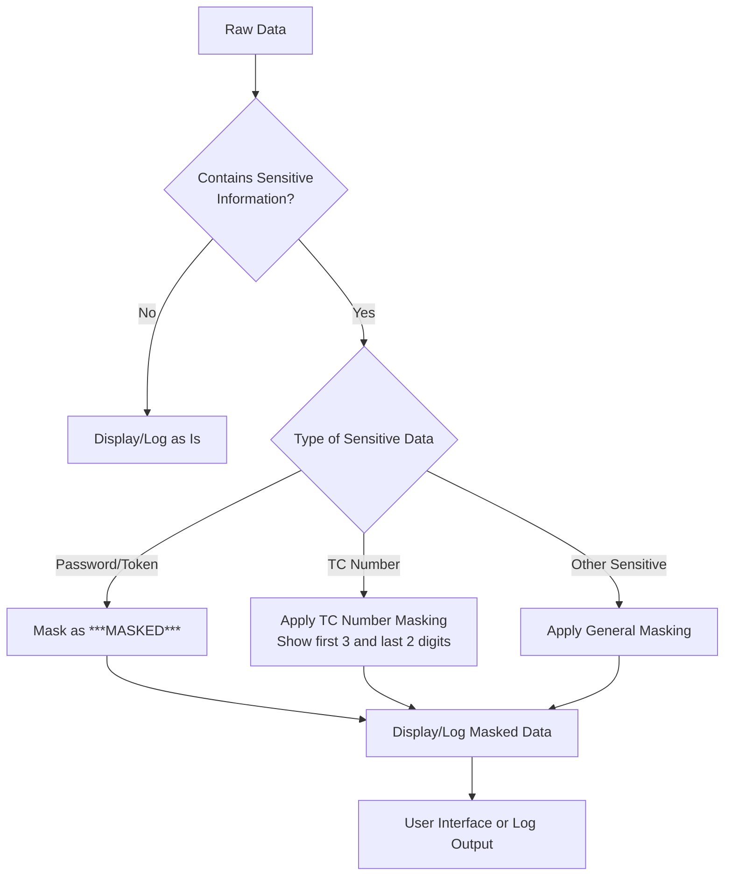
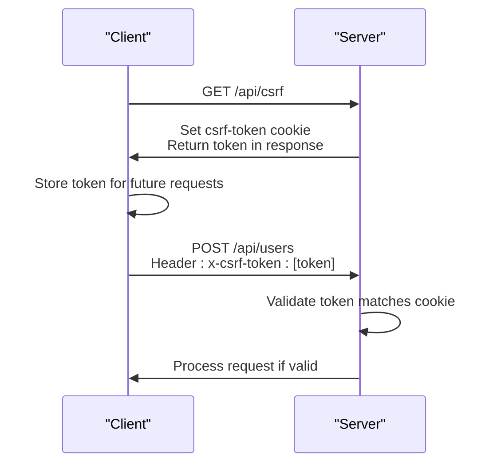
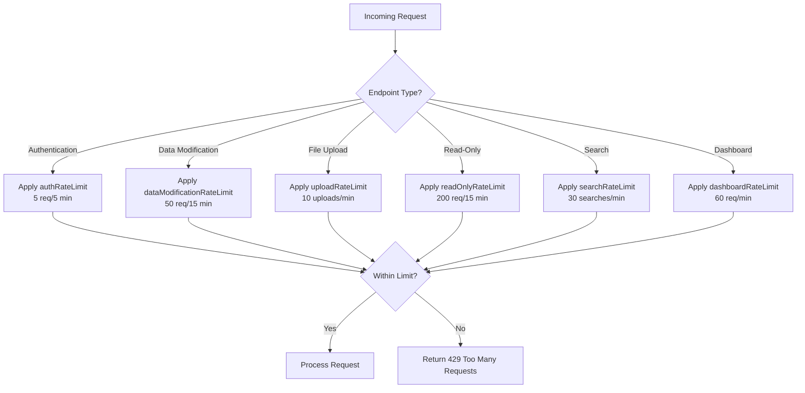

# Security & Compliance

<cite>
**Referenced Files in This Document**   
- [auth.ts](file://convex/auth.ts)
- [login/route.ts](file://src/app/api/auth/login/route.ts)
- [session.ts](file://src/lib/auth/session.ts)
- [audit_logs.ts](file://convex/audit_logs.ts)
- [logger.ts](file://src/lib/logger.ts)
- [csrf.ts](file://src/lib/csrf.ts)
- [rate-limit-config.ts](file://src/lib/rate-limit-config.ts)
- [security_audit.ts](file://convex/security_audit.ts)
- [permissions.ts](file://src/types/permissions.ts)
- [denetim-kayitlari/page.tsx](file://src/app/(dashboard)/denetim-kayitlari/page.tsx)
</cite>

## Table of Contents

1. [Authentication and Authorization System](#authentication-and-authorization-system)
2. [Audit Logging System](#audit-logging-system)
3. [Data Protection Measures](#data-protection-measures)
4. [Security Best Practices](#security-best-practices)

## Authentication and Authorization System

The Kafkasder-panel implements a robust authentication and authorization system based on email/password login, role-based access control, and secure session management. The system is designed to provide secure access while maintaining usability for different user roles within the organization.

The authentication process begins with the `/api/auth/login` endpoint, which validates user credentials against the Convex database. The system implements several security measures during the login process, including account lockout after multiple failed attempts to prevent brute force attacks. When a user successfully authenticates, the system creates a secure session with appropriate cookies and generates a CSRF token for subsequent requests.



**Diagram sources**

- [login/route.ts](file://src/app/api/auth/login/route.ts)
- [auth.ts](file://convex/auth.ts)

**Section sources**

- [login/route.ts](file://src/app/api/auth/login/route.ts)
- [auth.ts](file://convex/auth.ts)

### Role-Based Access Control

The system implements a comprehensive role-based access control (RBAC) model that determines user permissions based on their role and explicit permission assignments. The permission system is defined in the `permissions.ts` file, which establishes both module-level access permissions and special administrative permissions.

Users are assigned roles such as "Dernek Başkanı" (Association President), "Yönetici" (Manager), "Üye" (Member), or "Görüntüleyici" (Viewer), each with different levels of access. The system combines role-based permissions with explicit permission assignments, allowing for fine-grained control over user capabilities. Administrative roles automatically receive enhanced permissions, including user management capabilities.

The authorization system evaluates permissions at both the UI and API levels, ensuring that users can only access functionality they are authorized to use. This prevents unauthorized access even if a user attempts to navigate to restricted routes directly.

```mermaid
classDiagram
class User {
+string id
+string email
+string name
+string role
+PermissionValue[] permissions
+boolean isActive
}
class PermissionValue {
+string BENEFICIARIES
+string DONATIONS
+string AID_APPLICATIONS
+string SCHOLARSHIPS
+string MESSAGES
+string FINANCE
+string REPORTS
+string SETTINGS
+string WORKFLOW
+string PARTNERS
+string USERS_MANAGE
}
class Role {
+string ADMIN
+string MANAGER
+string MEMBER
+string VIEWER
}
User "1" --> "1..*" PermissionValue : has
User "1" --> "1" Role : has
note right of User
Users inherit permissions based on
their role, with additional specific
permissions that can be assigned
end note
```

**Diagram sources**

- [permissions.ts](file://src/types/permissions.ts)
- [session.ts](file://src/lib/auth/session.ts)

**Section sources**

- [permissions.ts](file://src/types/permissions.ts)
- [session.ts](file://src/lib/auth/session.ts)

### Session Management

The application implements secure session management using HttpOnly cookies to prevent client-side script access to session data. When a user logs in, the system creates a session with a unique session ID and expiration time based on whether the user selected "remember me" functionality.

The session cookie is configured with the HttpOnly flag to prevent access via JavaScript, the Secure flag in production to ensure transmission over HTTPS only, and the SameSite=strict attribute to prevent cross-site request forgery attacks. The session includes the user ID and expiration time, allowing the system to validate the session on subsequent requests.

The system also provides a session validation endpoint at `/api/auth/session` that client applications can use to check the current authentication state. This endpoint validates the session cookie, checks for expiration, and returns basic session information without sensitive data.



**Diagram sources**

- [login/route.ts](file://src/app/api/auth/login/route.ts)
- [session.ts](file://src/lib/auth/session.ts)

**Section sources**

- [login/route.ts](file://src/app/api/auth/login/route.ts)
- [session.ts](file://src/lib/auth/session.ts)

## Audit Logging System

The Kafkasder-panel includes a comprehensive audit logging system that tracks all critical operations for compliance and security monitoring. The system logs user activities and system events in the `audit_logs` collection in Convex, providing a complete record of actions taken within the application.

The audit logging system captures essential information for each logged action, including the user ID and name, the type of action (CREATE, UPDATE, DELETE, or VIEW), the resource affected, the resource ID, any changes made, the IP address, user agent, and timestamp. This detailed information enables administrators to reconstruct user activities and investigate potential security incidents.



**Diagram sources**

- [audit_logs.ts](file://convex/audit_logs.ts)

**Section sources**

- [audit_logs.ts](file://convex/audit_logs.ts)
- [denetim-kayitlari/page.tsx](<file://src/app/(dashboard)/denetim-kayitlari/page.tsx>)

### Audit Log Features

The audit logging system provides several features to support compliance and security monitoring. Administrators can filter logs by various criteria including user, action type, resource, and date range. The system also provides statistical summaries of audit data, showing the distribution of actions by type and resource, as well as identifying the most active users.

The audit logs are immutable and cannot be deleted, ensuring the integrity of the audit trail. According to compliance requirements, logs are retained for seven years. The system specifically tracks access to sensitive data such as Turkish ID numbers (TC Kimlik No), with these accesses logged separately for additional scrutiny.

The audit log interface in the application provides a user-friendly way to browse and search through logged events, with filters for action type and resource type. The interface also includes compliance information, confirming that the system meets KVKK (Turkish Data Protection Law) and GDPR requirements for audit logging.



**Diagram sources**

- [audit_logs.ts](file://convex/audit_logs.ts)

**Section sources**

- [audit_logs.ts](file://convex/audit_logs.ts)

## Data Protection Measures

The application implements several data protection measures to safeguard sensitive information, particularly Turkish ID numbers (TC Kimlik No) which are subject to strict privacy regulations under KVKK. The system employs data masking to protect sensitive information both in the user interface and in logging systems.

The data masking system specifically targets Turkish ID numbers, displaying only the first three and last two digits while masking the middle six digits (e.g., 123**\*\***89). This ensures that sensitive personal information is not fully exposed in the user interface or in system logs. The masking function also handles hashed values of ID numbers, displaying only the first eight and last four characters of the hash.



**Diagram sources**

- [logger.ts](file://src/lib/logger.ts)

**Section sources**

- [logger.ts](file://src/lib/logger.ts)

### Data Protection Implementation

The data protection system is implemented at multiple levels within the application. In the logging system, a recursive masking function scans all objects for sensitive field names (such as 'password', 'token', 'tc_no', 'tcno', etc.) and applies appropriate masking before the data is written to logs. This ensures that sensitive information cannot be accidentally exposed in log files.

For Turkish ID numbers specifically, the system uses a dedicated masking function that handles both plain text ID numbers (11 digits) and their hashed representations (64 hexadecimal characters). This dual handling ensures protection regardless of whether the ID number is stored in plain text (during input) or in hashed form (for secure storage).

The data protection measures are designed to comply with Turkish data protection regulations (KVKK) and the General Data Protection Regulation (GDPR), ensuring that personal data is processed lawfully and securely. The system's compliance is verified through regular security audits and the generation of compliance reports that confirm adherence to data protection requirements.

## Security Best Practices

The Kafkasder-panel implements multiple security best practices to protect against common web application vulnerabilities. These practices include CSRF protection, input validation, rate limiting, and comprehensive error handling to ensure the application remains secure against various attack vectors.

### CSRF Protection

The application implements robust CSRF (Cross-Site Request Forgery) protection for all state-changing operations. The system uses a synchronizer token pattern, where a unique CSRF token is generated for each session and must be included in the headers of all POST, PUT, PATCH, and DELETE requests.

The CSRF token is stored in a cookie that is accessible to JavaScript (not HttpOnly) so that client-side code can read it and include it in request headers. However, the cookie is marked with SameSite=strict to prevent cross-site requests from accessing it. The server validates that the CSRF token in the request header matches the token in the cookie, preventing unauthorized cross-site requests.



**Diagram sources**

- [csrf.ts](file://src/lib/csrf.ts)

**Section sources**

- [csrf.ts](file://src/lib/csrf.ts)

### Input Validation with Zod

The application uses Zod for comprehensive input validation to prevent injection attacks and ensure data integrity. Zod schemas are defined for all API endpoints and form submissions, validating data types, formats, and business rules before processing.

The validation system checks for proper data types, required fields, string length constraints, and specific format requirements (such as email addresses, phone numbers, and dates). For sensitive operations, additional validation rules are applied to prevent malicious input. The system returns specific error messages for validation failures, helping users correct their input while avoiding information leakage about system internals.

### Rate Limiting

The application implements comprehensive rate limiting to protect against brute force attacks, denial of service attacks, and excessive resource consumption. The rate limiting system is configured differently for various types of endpoints based on their sensitivity and resource requirements.

Authentication endpoints have the strictest limits (5 requests per 5 minutes) to prevent password guessing attacks. Data modification endpoints (POST, PUT, DELETE) are limited to 50 requests per 15 minutes, while read-only endpoints allow up to 200 requests per 15 minutes. File upload endpoints are limited to 10 uploads per minute to prevent abuse.

The rate limiting system also includes monitoring and alerting capabilities, tracking violation rates and generating alerts when thresholds are exceeded. This allows administrators to identify potential attacks and take appropriate action.



**Diagram sources**

- [rate-limit-config.ts](file://src/lib/rate-limit-config.ts)

**Section sources**

- [rate-limit-config.ts](file://src/lib/rate-limit-config.ts)
