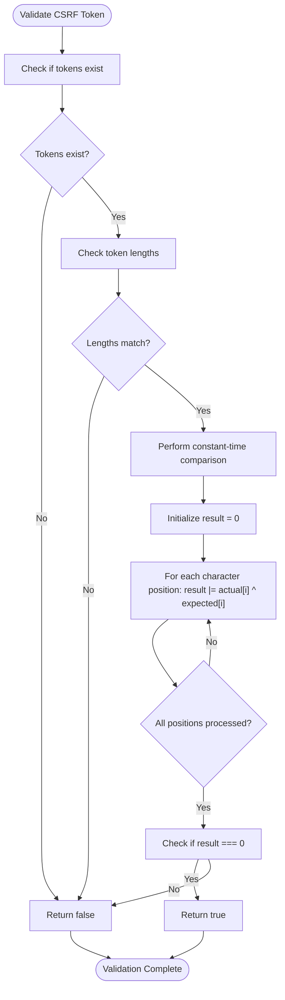
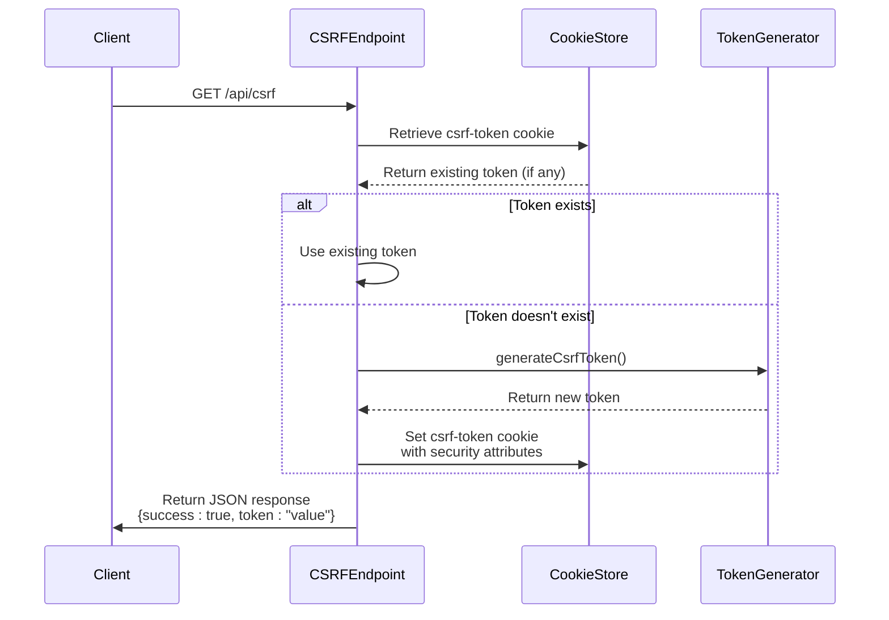

# CSRF Protection

<cite>
**Referenced Files in This Document**   
- [csrf.ts](file://src/lib/csrf.ts)
- [route.ts](file://src/app/api/csrf/route.ts)
- [auth-utils.ts](file://src/lib/api/auth-utils.ts)
- [test-utils.ts](file://e2e/test-utils.ts)
</cite>

## Table of Contents

1. [Introduction](#introduction)
2. [Token Generation Mechanism](#token-generation-mechanism)
3. [Token Validation Process](#token-validation-process)
4. [CSRF Endpoint Implementation](#csrf-endpoint-implementation)
5. [Client-Side Token Management](#client-side-token-management)
6. [Security Configuration](#security-configuration)
7. [Integration with API Requests](#integration-with-api-requests)
8. [Testing Considerations](#testing-considerations)
9. [Best Practices](#best-practices)

## Introduction

The Kafkasder-panel implements a robust Cross-Site Request Forgery (CSRF) protection mechanism to safeguard state-changing operations from unauthorized requests. This documentation details the implementation of the CSRF protection system, focusing on the token generation and validation processes, endpoint configuration, and client-side integration patterns. The system employs cryptographically secure random bytes for token generation and implements constant-time comparison to prevent timing attacks, ensuring a high level of security for all authenticated operations.

## Token Generation Mechanism

The CSRF token generation process utilizes Node.js's built-in `crypto` module to create cryptographically secure random tokens. The `generateCsrfToken` function in the CSRF utilities library generates a 32-byte random token using the `randomBytes` function, which is then converted to a hexadecimal string representation. This approach ensures that each generated token has sufficient entropy to prevent brute-force attacks, with a 256-bit security level provided by the 32-byte length.

The token generation process is designed to be both secure and efficient, leveraging the operating system's cryptographically secure pseudorandom number generator (CSPRNG) to ensure unpredictability. The hexadecimal encoding maintains readability while preserving the full entropy of the original random bytes. This implementation follows security best practices by avoiding predictable patterns or insufficient randomness that could be exploited by attackers attempting to guess valid tokens.

**Section sources**

- [csrf.ts](file://src/lib/csrf.ts#L13-L15)

## Token Validation Process

The CSRF token validation process implements multiple security measures to prevent various attack vectors, including timing attacks. The `validateCsrfToken` function performs a constant-time comparison between the provided token and the expected token, ensuring that the execution time does not reveal information about the similarity of the tokens. This is achieved through a bitwise OR operation across all character positions, which prevents attackers from using timing differences to gradually discover the correct token value.

Before the constant-time comparison, the validation function performs preliminary checks to ensure both tokens exist and have identical lengths. The length check serves as an additional protection against timing attacks by ensuring that the comparison loop always executes the same number of iterations regardless of input. If either token is missing or if their lengths differ, the function immediately returns false without proceeding to the comparison loop.

This multi-layered validation approach effectively mitigates several potential attack vectors, including brute force attempts, timing attacks, and certain types of side-channel attacks. The implementation prioritizes security by rejecting tokens with any discrepancies rather than providing information that could be used to refine attack attempts.

**Diagram sources**

- [csrf.ts](file://src/lib/csrf.ts#L27-L44)

**Section sources**

- [csrf.ts](file://src/lib/csrf.ts#L27-L44)

## CSRF Endpoint Implementation

The CSRF protection system exposes a dedicated endpoint at `/api/csrf` that handles GET requests to retrieve the current CSRF token. When a client requests the token, the endpoint first checks if a CSRF token already exists in the cookie store. If a token is present, it is reused; otherwise, a new token is generated using the `generateCsrfToken` function and stored in a cookie with appropriate security attributes.

The endpoint implements a stateful approach to token management, maintaining the same token for the duration of a user's session unless explicitly regenerated. This reduces server load and improves performance by avoiding unnecessary token generation on each request. The implementation includes comprehensive error handling to ensure that token generation failures are properly logged and communicated to clients, preventing authentication flows from being disrupted by CSRF token issues.

The endpoint returns a JSON response containing the success status and the token value, allowing client-side applications to easily extract and use the token for subsequent requests. This standardized response format simplifies integration across different client implementations and ensures consistent behavior regardless of whether a new token was generated or an existing token was retrieved.

**Diagram sources**

- [route.ts](file://src/app/api/csrf/route.ts#L9-L42)

**Section sources**

- [route.ts](file://src/app/api/csrf/route.ts#L9-L42)

## Client-Side Token Management

The client-side implementation provides utilities for retrieving the CSRF token from cookies and automatically including it in API requests. The `getCsrfTokenFromCookie` function safely extracts the token from the document's cookie string by parsing individual cookie name-value pairs and identifying the CSRF token by its name. This function includes safeguards for server-side rendering environments by checking for the existence of the `document` object before attempting to access cookies.

For seamless integration with API requests, the `fetchWithCsrf` utility function wraps the native fetch API, automatically retrieving the CSRF token and including it in the request headers when appropriate. The function intelligently determines whether to include the token based on the HTTP method, applying CSRF protection only to state-changing operations (POST, PUT, PATCH, DELETE) while omitting it for safe methods (GET, HEAD, OPTIONS). This selective application of CSRF protection follows security best practices by focusing protection on operations that modify server state.

The client-side implementation also defines the standard header name (`x-csrf-token`) used for transmitting the token, ensuring consistency between client and server expectations. This standardized approach simplifies integration and reduces the likelihood of configuration errors that could compromise security.

**Section sources**

- [csrf.ts](file://src/lib/csrf.ts#L49-L88)

## Security Configuration

The CSRF token cookie is configured with strict security attributes to minimize the risk of token leakage and unauthorized access. The cookie is marked with the `SameSite=strict` attribute, which prevents the browser from sending the cookie in cross-site requests, effectively mitigating CSRF attacks that rely on automatic cookie inclusion. This setting ensures that the CSRF token is only sent when the request originates from the same site as the target endpoint.

In production environments, the cookie is marked as `secure`, instructing the browser to only transmit it over HTTPS connections. This prevents the token from being exposed during transmission over unencrypted connections, protecting against network eavesdropping and man-in-the-middle attacks. The cookie is intentionally not marked as `HttpOnly`, allowing client-side JavaScript to read its value for inclusion in API request headers.

The token has a maximum age of 24 hours, providing a reasonable balance between security and user experience. This expiration period limits the window of opportunity for attackers to exploit a compromised token while avoiding excessive token regeneration that could disrupt user sessions. The cookie's path is set to the root (`/`), making it available across all application routes while maintaining the security benefits of the other attributes.

**Section sources**

- [route.ts](file://src/app/api/csrf/route.ts#L21-L27)

## Integration with API Requests

The CSRF protection mechanism is integrated into the API request validation process through the `verifyCsrfToken` function in the authentication utilities. This function extracts the CSRF token from both the request headers and cookies, then validates them using the constant-time comparison implemented in the CSRF library. The dual-source validation approach ensures that both the header and cookie tokens match, implementing the "double submit cookie" pattern that is resistant to cross-site scripting (XSS) attacks.

When a request fails CSRF validation, the system throws an `ApiAuthError` with a 403 Forbidden status code and an appropriate error code (`INVALID_CSRF`). This standardized error handling ensures consistent responses across all protected endpoints and provides clear feedback for debugging while avoiding information leakage to potential attackers. The error is then processed by the error handling middleware, which formats it according to the API's response standards.

The integration is designed to be non-intrusive to the main application logic, with CSRF validation typically performed early in the request processing pipeline. This allows invalid requests to be rejected quickly, conserving server resources and reducing the attack surface. The validation function is asynchronous to accommodate the cookie retrieval operations in the Next.js environment, ensuring compatibility with the server-side rendering architecture.

**Section sources**

- [auth-utils.ts](file://src/lib/api/auth-utils.ts#L78-L87)

## Testing Considerations

The testing framework includes specialized utilities for handling CSRF tokens during end-to-end testing. The `getCSRFToken` function in the test utilities attempts to retrieve a valid CSRF token from the `/api/csrf` endpoint, with fallback mechanisms to generate mock tokens if the endpoint is unavailable or returns an error. This resilient approach ensures that tests can proceed even in environments where the CSRF endpoint might not be fully operational.

The testing implementation includes comprehensive error handling for various failure scenarios, such as network errors, non-JSON responses, or missing token fields in the response. When a real token cannot be obtained, the framework generates a mock token using a combination of timestamps and random values, allowing tests to simulate authenticated requests without compromising the test environment's security.

Authentication-related tests, such as login and logout flows, explicitly include CSRF token handling in their request headers, mirroring the production implementation. This ensures that the CSRF protection mechanism is thoroughly tested under realistic conditions and that any issues with token generation, transmission, or validation are identified during the testing phase rather than in production.

**Section sources**

- [test-utils.ts](file://e2e/test-utils.ts#L421-L451)

## Best Practices

To maximize the effectiveness of the CSRF protection mechanism, several best practices should be followed when implementing client-side functionality. Applications should retrieve the CSRF token once during initialization and cache it for subsequent requests, minimizing the number of calls to the CSRF endpoint and improving performance. The `fetchWithCsrf` utility should be used consistently for all state-changing API requests to ensure uniform protection across the application.

Developers should avoid storing CSRF tokens in local storage or session storage, as these mechanisms are more vulnerable to cross-site scripting attacks than HTTP-only cookies. Instead, the token should be read directly from cookies when needed and included in request headers. For single-page applications, the token can be retrieved during the initial page load and stored in memory for the duration of the session.

When implementing custom API clients or using third-party libraries, developers must ensure that the CSRF token is properly included in the `x-csrf-token` header for protected requests. The token should be treated as sensitive information and not logged, displayed, or transmitted in URLs or query parameters, which could lead to token leakage through browser history, server logs, or referrer headers.
