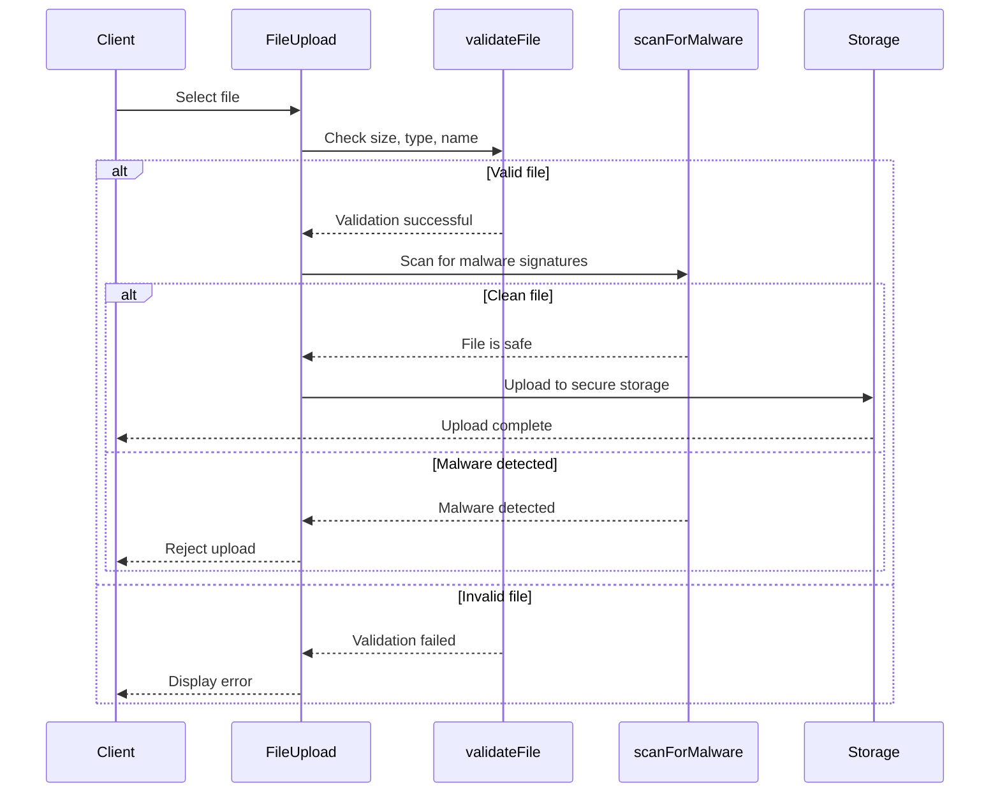
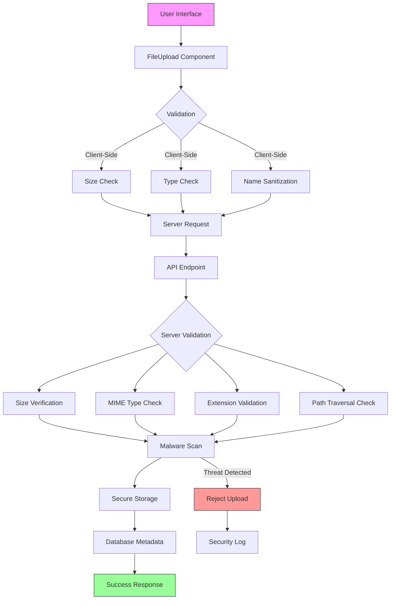

# File Upload Security

<cite>
**Referenced Files in This Document**   
- [FileUpload.tsx](file://src/components/FileUpload.tsx)
- [security.ts](file://src/lib/security.ts)
- [sanitization.ts](file://src/lib/sanitization.ts)
- [route.ts](file://src/app/api/upload/route.ts)
- [storage.ts](file://convex/storage.ts)
</cite>

## Table of Contents

1. [Introduction](#introduction)
2. [File Validation Mechanisms](#file-validation-mechanisms)
3. [Client-Side Validation](#client-side-validation)
4. [Server-Side Validation](#server-side-validation)
5. [Malware Detection](#malware-detection)
6. [Common Vulnerabilities and Protections](#common-vulnerabilities-and-protections)
7. [Configuration Options](#configuration-options)
8. [User Feedback Mechanisms](#user-feedback-mechanisms)
9. [Architecture Overview](#architecture-overview)

## Introduction

The Kafkasder-panel implements a comprehensive file upload security system designed to protect against various threats including malicious file uploads, content-type spoofing, and storage-based attacks. The system employs both client-side and server-side validation mechanisms to ensure that only safe and properly formatted files are accepted. This document details the security measures in place, including file type validation, size limitations, filename sanitization, and malware scanning.

## File Validation Mechanisms

The file upload system implements multiple layers of validation to ensure file integrity and security. These validations occur both on the client side and server side, providing defense in depth against malicious uploads.

### MIME Type and Extension Validation

The system validates files against allowed MIME types and extensions to prevent unauthorized file types from being uploaded. The allowed MIME types include:

- image/jpeg
- image/png
- image/webp
- image/gif
- application/pdf
- text/plain

The validation process checks both the file's MIME type and its extension to prevent content-type spoofing attacks. This dual validation approach ensures that even if an attacker attempts to disguise a malicious file by manipulating its MIME type, the extension check will still catch the discrepancy.

### Size Limitations

All uploaded files are subject to a maximum size limit of 5MB. This limit is enforced both client-side and server-side to prevent denial-of-service attacks through large file uploads. The size validation is implemented in the `FileSecurity` class with a constant `MAX_SIZE = 5 * 1024 * 1024` bytes.

### Filename Sanitization

Filenames are sanitized to remove special characters that could be used in path traversal attacks. The sanitization process:

- Removes characters outside the allowed set (a-z, A-Z, 0-9, period, hyphen, underscore)
- Prevents double extensions (e.g., "document.pdf.exe")
- Checks for path traversal attempts using "..", "/", or "\" characters
- Limits filename length to prevent buffer overflow attacks

**Section sources**

- [security.ts](file://src/lib/security.ts#L282-L350)
- [sanitization.ts](file://src/lib/sanitization.ts#L196-L203)

## Client-Side Validation

The client-side validation is implemented in the `FileUpload` component, which provides immediate feedback to users before files are transmitted to the server.

### FileUpload Component

The `FileUpload` component handles drag-and-drop functionality and file selection through the system file dialog. It performs initial validation on selected files, checking size and type constraints before initiating the upload process.

The component uses React state to track uploading files and their progress, providing visual feedback through a progress bar. Error messages are displayed immediately when validation fails, preventing unnecessary network requests.

### Client-Side Validation Process

The client-side validation flow:

1. User selects or drops files into the upload area
2. The `validateFile` function checks file size against the configured maximum
3. For files with multiple extensions, validation fails to prevent double extension attacks
4. Suspiciously long filenames (>255 characters) are rejected
5. Validated files proceed to upload, while invalid files display appropriate error messages

The client-side validation serves as the first line of defense, reducing server load by catching invalid uploads early in the process.

**Section sources**

- [FileUpload.tsx](file://src/components/FileUpload.tsx#L51-L59)
- [FileUpload.tsx](file://src/components/FileUpload.tsx#L38-L284)

## Server-Side Validation

Server-side validation provides a critical second layer of security, ensuring that files cannot bypass client-side checks through direct API calls or other manipulation.

### validateFile Function

The server-side validation is implemented in the `validateFile` function within the security module. This function performs comprehensive checks on uploaded files:

- **Size validation**: Ensures files do not exceed the 5MB limit
- **MIME type verification**: Confirms the file's actual type matches allowed types
- **Extension validation**: Checks the file extension against permitted extensions
- **Path traversal detection**: Scans for "..", "/", or "\" in filenames
- **Double extension prevention**: Rejects files with multiple extensions

The server-side validation is authoritative and cannot be bypassed, providing a reliable security boundary.

### API Endpoint Security

The `/api/upload` endpoint handles file upload requests and implements additional security measures:

- Authentication checks to ensure only authorized users can upload files
- Rate limiting to prevent abuse
- Input validation for all parameters
- Secure storage of file metadata in the database

The endpoint generates temporary upload URLs through the Convex storage system, which provides additional security by using signed URLs with limited lifetimes.

**Section sources**

- [route.ts](file://src/app/api/upload/route.ts#L1-L32)
- [security.ts](file://src/lib/security.ts#L294-L321)

## Malware Detection

The system includes basic malware scanning capabilities to detect potentially malicious files before they are stored.

### Signature-Based Detection

The malware scanner checks for known executable file signatures:

- MZ header (0x4D, 0x5A) - Windows executables
- ELF header (0x7F, 0x45, 0x4C, 0x46) - Linux executables

When a file is uploaded, the system reads the first few bytes of the file and compares them against these known signatures. If a match is found, the upload is rejected with a security warning.

### Implementation Details

The `scanForMalware` function in the `FileSecurity` class performs the scanning:

1. Converts the file to an ArrayBuffer
2. Creates a Uint8Array view of the buffer
3. Checks the initial bytes against known malware signatures
4. Returns a safety assessment

While this provides basic protection, the system is designed to integrate with more comprehensive antivirus solutions in production environments.

**Diagram sources**

- [security.ts](file://src/lib/security.ts#L328-L349)
- [FileUpload.tsx](file://src/components/FileUpload.tsx#L62-L145)

## Common Vulnerabilities and Protections

The file upload system addresses several common security vulnerabilities through specific countermeasures.

### Malicious File Uploads

To prevent malicious file uploads:

- Strict whitelist of allowed file types
- Comprehensive validation on both client and server
- Disallowance of executable file types
- Malware signature scanning

### Content-Type Spoofing

Content-type spoofing is mitigated by:

- Validating both MIME type and file extension
- Server-side verification of file type (independent of client-provided type)
- Binary analysis of file content when possible

### Path Traversal Attacks

Path traversal attempts are prevented by:

- Sanitizing filenames to remove "..", "/", and "\" characters
- Using secure storage systems that don't expose file paths
- Storing files with generated, random names rather than original names

### Storage-Based Attacks

Protection against storage-based attacks includes:

- Enforcing the 5MB size limit
- Monitoring storage usage and quotas
- Implementing proper file lifecycle management
- Using isolated storage buckets for different file types

**Section sources**

- [security.ts](file://src/lib/security.ts#L312-L318)
- [sanitization.ts](file://src/lib/sanitization.ts#L196-L203)

## Configuration Options

The file upload system provides configurable options to adapt to different security requirements and use cases.

### Allowed File Types

The system allows configuration of permitted MIME types and file extensions. The default configuration permits common document and image formats while excluding executable files.

### Size Limits

The maximum file size is configurable, with a default limit of 5MB. This can be adjusted based on specific requirements, though lower limits are recommended for enhanced security.

### Security Settings

Additional security settings include:

- Enable/disable malware scanning
- Configure strictness of filename validation
- Set maximum filename length
- Define allowed character sets for filenames

These configuration options are typically set through environment variables or system settings, allowing administrators to adjust security policies without code changes.

**Section sources**

- [security.ts](file://src/lib/security.ts#L284-L291)
- [sanitization.ts](file://src/lib/sanitization.ts#L374-L376)

## User Feedback Mechanisms

The system provides clear feedback to users throughout the upload process, enhancing both usability and security awareness.

### Real-Time Validation

Users receive immediate feedback when selecting files:

- Visual indicators for valid/invalid files
- Specific error messages explaining validation failures
- Progress indicators during upload
- Success confirmation upon completion

### Error Messages

The system displays specific error messages for different failure types:

- "File size exceeds 5MB limit"
- "Unsupported file type"
- "Invalid filename"
- "Suspicious file content detected"
- "Upload failed due to security restrictions"

These messages are designed to inform users of the issue without revealing sensitive security details that could aid attackers.

### Accessibility Features

The upload interface includes accessibility features:

- Keyboard navigation support
- Screen reader compatibility
- Clear visual indicators
- High-contrast error states

**Section sources**

- [FileUpload.tsx](file://src/components/FileUpload.tsx#L246-L276)

## Architecture Overview

The file upload system follows a multi-layered security architecture with client-side and server-side components working together to provide comprehensive protection.

**Diagram sources**

- [FileUpload.tsx](file://src/components/FileUpload.tsx#L38-L284)
- [route.ts](file://src/app/api/upload/route.ts#L1-L32)
- [security.ts](file://src/lib/security.ts#L282-L350)
