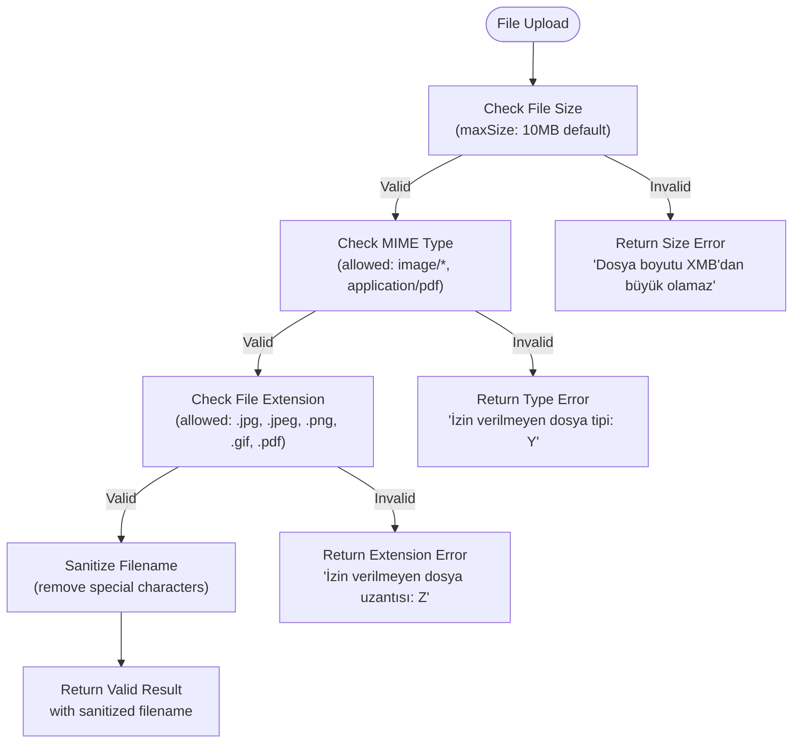
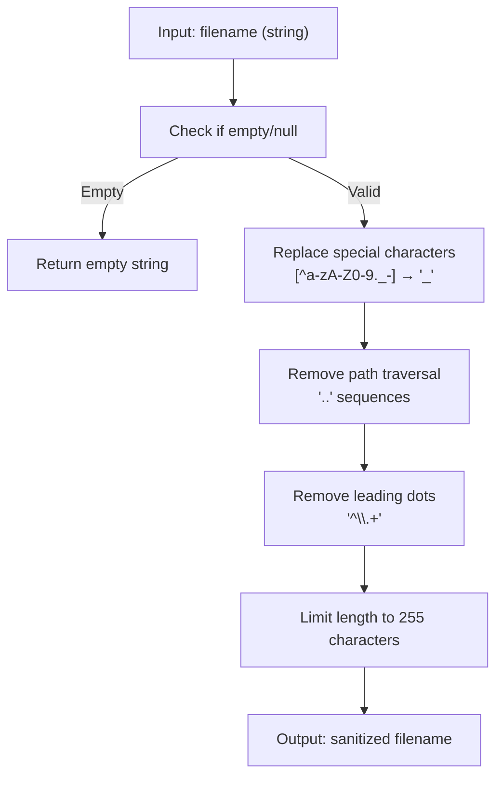
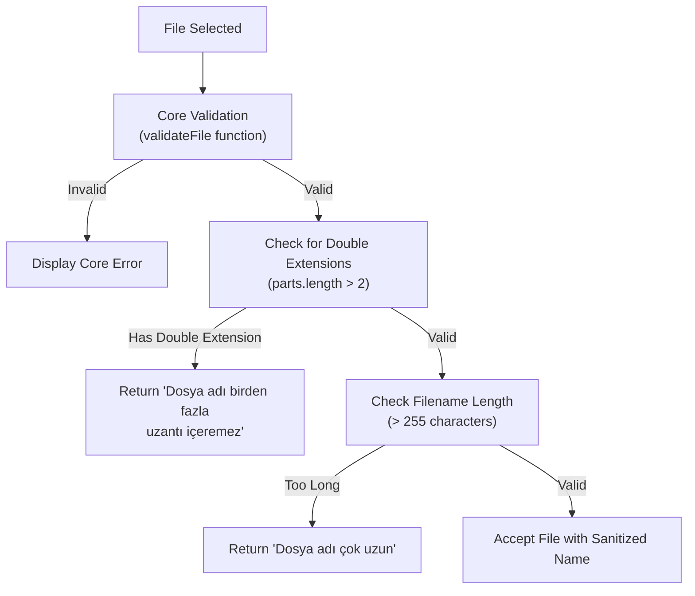
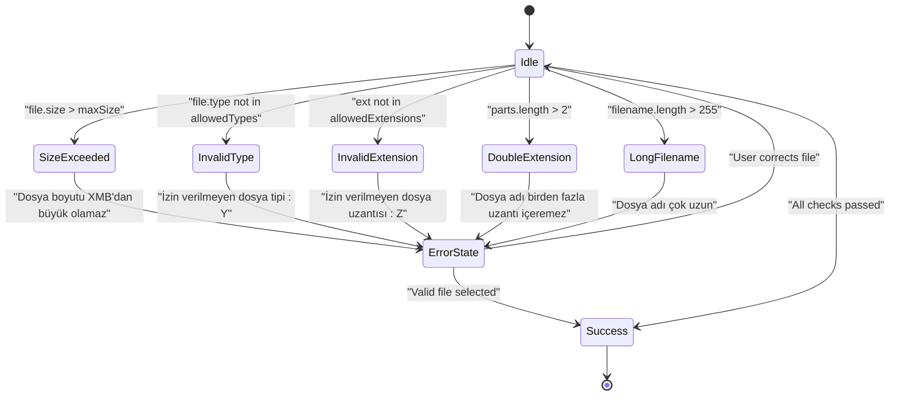
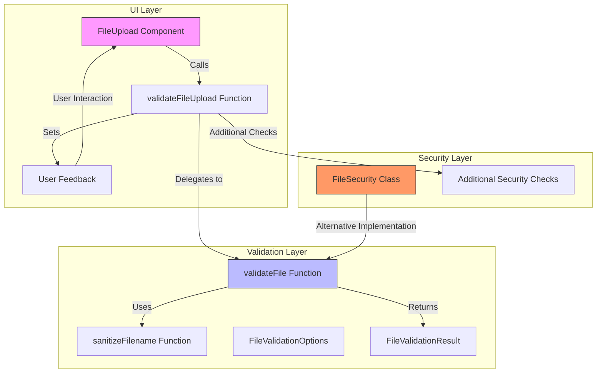

(docs)

# File Validation and Sanitization

<cite>
**Referenced Files in This Document**   
- [sanitization.ts](file://src/lib/sanitization.ts)
- [file-upload.tsx](file://src/components/ui/file-upload.tsx)
- [security.ts](file://src/lib/security.ts)
- [shared-validators.ts](file://src/lib/validations/shared-validators.ts)
</cite>

## Table of Contents

1. [Introduction](#introduction)
2. [Core Validation Implementation](#core-validation-implementation)
3. [Filename Sanitization Process](#filename-sanitization-process)
4. [UI-Level Security Checks](#ui-level-security-checks)
5. [Error Handling and User Feedback](#error-handling-and-user-feedback)
6. [Architecture Overview](#architecture-overview)
7. [Security Considerations](#security-considerations)

## Introduction

The Kafkasder-panel implements a comprehensive file validation and sanitization system to ensure secure file uploads while maintaining usability. The system combines server-side validation with client-side security checks to prevent common security vulnerabilities such as path traversal attacks, malicious file uploads, and oversized file submissions. The implementation features a multi-layered approach with the `validateFile` function serving as the core validation mechanism, complemented by the `sanitizeFilename` function for path traversal prevention and additional UI-level security checks.

The validation system is designed to handle file uploads in a secure manner by enforcing size limits, validating MIME types and file extensions, and sanitizing filenames to prevent directory traversal attacks. The error messaging is provided in Turkish to ensure accessibility for the primary user base while maintaining security by not revealing sensitive implementation details.

## Core Validation Implementation

The core file validation functionality is implemented in the `validateFile` function located in the sanitization library. This function performs comprehensive security checks on file uploads, including size validation, MIME type checking, and file extension validation.

**Diagram sources**

- [sanitization.ts](file://src/lib/sanitization.ts#L368-L410)

**Section sources**

- [sanitization.ts](file://src/lib/sanitization.ts#L354-L411)

## Filename Sanitization Process

The filename sanitization process is implemented through the `sanitizeFilename` function, which prevents path traversal attacks by removing dangerous sequences and sanitizing special characters. This function is critical for security as it neutralizes attempts to access restricted directories through filenames like '../../../etc/passwd'.

The function processes filenames through the following steps:

1. Returns empty string for null or empty inputs
2. Replaces all special characters (except letters, numbers, underscore, dot, and hyphen) with underscores
3. Removes all '..' sequences that could enable path traversal attacks
4. Removes leading dots that could indicate hidden files
5. Limits the filename length to 255 characters to prevent buffer overflow attacks

For example, a malicious filename like '../../../etc/passwd' would be transformed into 'etc_passwd' through this sanitization process, effectively neutralizing the path traversal attempt while preserving the original filename's readability.

**Diagram sources**

- [sanitization.ts](file://src/lib/sanitization.ts#L195-L203)

**Section sources**

- [sanitization.ts](file://src/lib/sanitization.ts#L192-L204)

## UI-Level Security Checks

In addition to the core validation, the UI component implements additional security checks to enhance protection against malicious uploads. These checks are performed in the `validateFileUpload` function within the file upload component and provide an extra layer of defense.

The UI component enforces two additional security measures:

1. **Double extension prevention**: Files with multiple extensions (e.g., 'document.pdf.exe') are rejected to prevent MIME type spoofing attacks where a malicious executable is disguised as a benign file.
2. **Filename length limitation**: Filenames longer than 255 characters are rejected to prevent potential buffer overflow attacks and filesystem issues.

These checks complement the core validation by addressing attack vectors that might bypass MIME type and extension validation through clever filename manipulation.

**Diagram sources**

- [file-upload.tsx](file://src/components/ui/file-upload.tsx#L116-L145)

**Section sources**

- [file-upload.tsx](file://src/components/ui/file-upload.tsx#L116-L145)

## Error Handling and User Feedback

The validation system provides clear error messages in Turkish to guide users through the upload process while maintaining security principles. Error messages are designed to be informative without revealing sensitive implementation details that could be exploited by attackers.

The error messaging strategy follows these principles:

- **Specific but not revealing**: Messages indicate what is wrong (e.g., "Dosya boyutu 10MB'dan büyük olamaz") without explaining the exact validation mechanism
- **Actionable guidance**: Users receive clear information about how to fix the issue
- **Consistent language**: All messages are in Turkish to ensure accessibility for the primary user base
- **Security preservation**: Error messages avoid disclosing internal implementation details that could aid attackers

The system returns validation results with both a boolean `valid` flag and an optional `error` string that contains the Turkish error message when validation fails. Successful validation includes the `sanitizedFilename` property with the cleaned filename ready for safe storage.

**Diagram sources**

- [sanitization.ts](file://src/lib/sanitization.ts#L364-L367)
- [file-upload.tsx](file://src/components/ui/file-upload.tsx#L100-L101)

**Section sources**

- [sanitization.ts](file://src/lib/sanitization.ts#L380-L402)
- [file-upload.tsx](file://src/components/ui/file-upload.tsx#L125-L141)

## Architecture Overview

The file validation and sanitization system follows a layered architecture with distinct responsibilities at different levels of the application stack. This design ensures comprehensive protection while maintaining separation of concerns.

The architecture demonstrates how validation responsibilities are distributed:

- **UI Layer**: Handles user interaction, displays error messages, and provides the upload interface
- **Validation Layer**: Contains the core `validateFile` and `sanitizeFilename` functions that perform the actual security checks
- **Security Layer**: Provides additional security utilities and alternative validation approaches

This layered approach allows for consistent validation across different parts of the application while enabling specific components to add additional security checks as needed.

**Diagram sources**

- [sanitization.ts](file://src/lib/sanitization.ts#L354-L410)
- [file-upload.tsx](file://src/components/ui/file-upload.tsx#L116-L145)
- [security.ts](file://src/lib/security.ts#L282-L321)

## Security Considerations

The file validation system implements multiple security measures to protect against common attack vectors:

1. **Path traversal prevention**: The `sanitizeFilename` function removes '..' sequences and other dangerous patterns from filenames
2. **MIME type validation**: Files are validated against a whitelist of allowed MIME types to prevent execution of malicious content
3. **File extension validation**: Extension checking provides an additional layer of protection against MIME type spoofing
4. **Size limitation**: The 10MB default limit prevents denial-of-service attacks through oversized file uploads
5. **Double extension detection**: The UI-level check prevents files with multiple extensions that could be used to disguise malicious content
6. **Input sanitization**: Special characters are replaced with underscores to prevent injection attacks

The system also includes defense-in-depth measures by having multiple validation functions (`validateFile` in sanitization.ts and `FileSecurity.validateFile` in security.ts) that can be used interchangeably or in combination depending on the specific use case. This redundancy ensures that even if one validation mechanism is bypassed, others remain in place to protect the system.

The error messages are carefully crafted to provide users with actionable feedback in Turkish while avoiding information disclosure that could aid attackers in crafting malicious payloads. This balance between usability and security is critical for maintaining both user experience and system integrity.
(docs)
