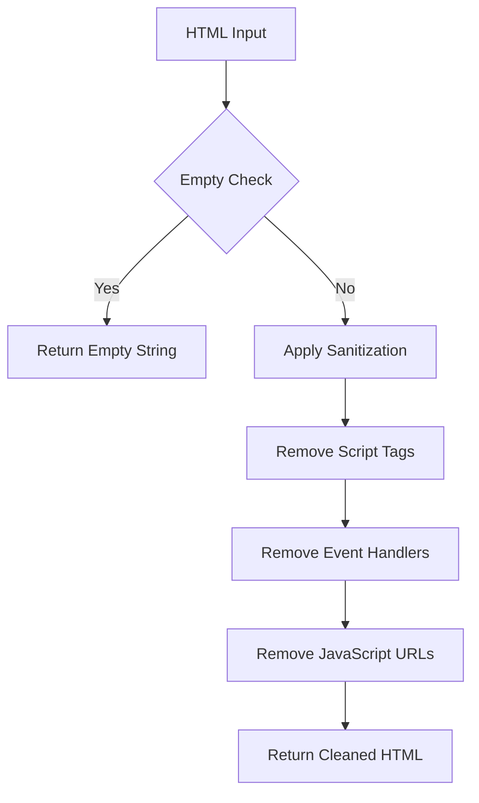
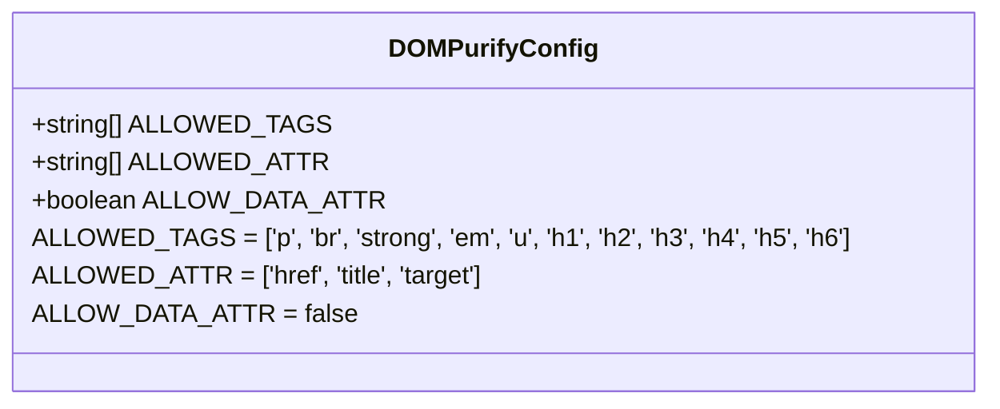
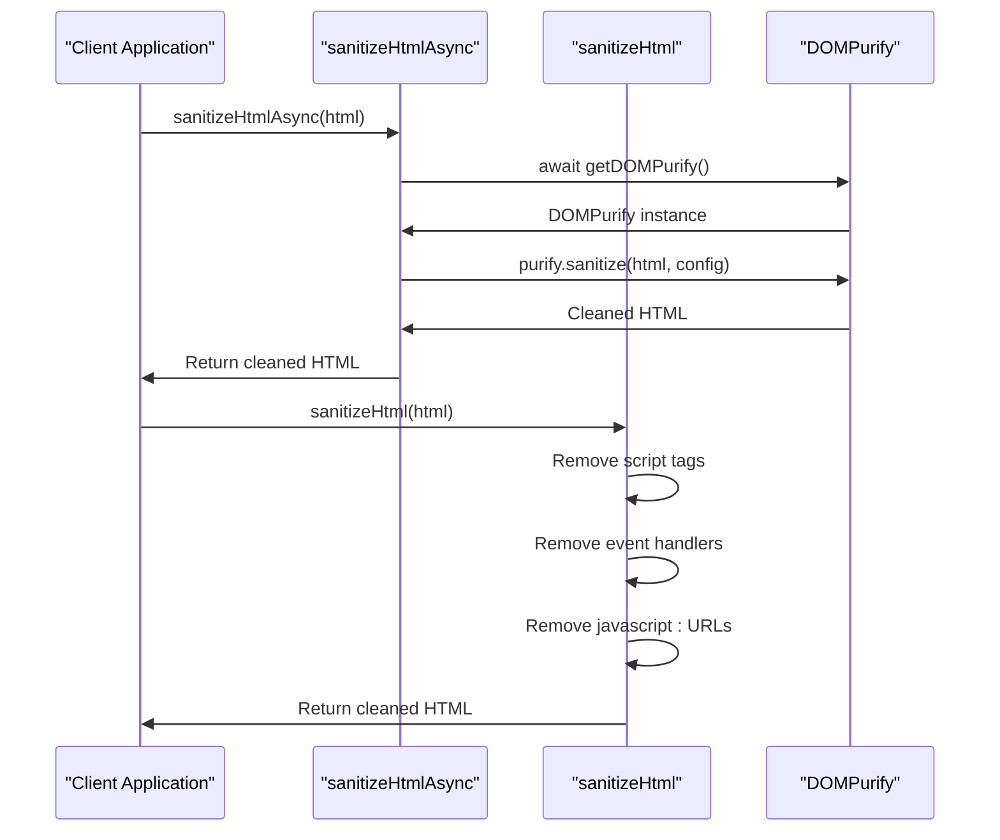
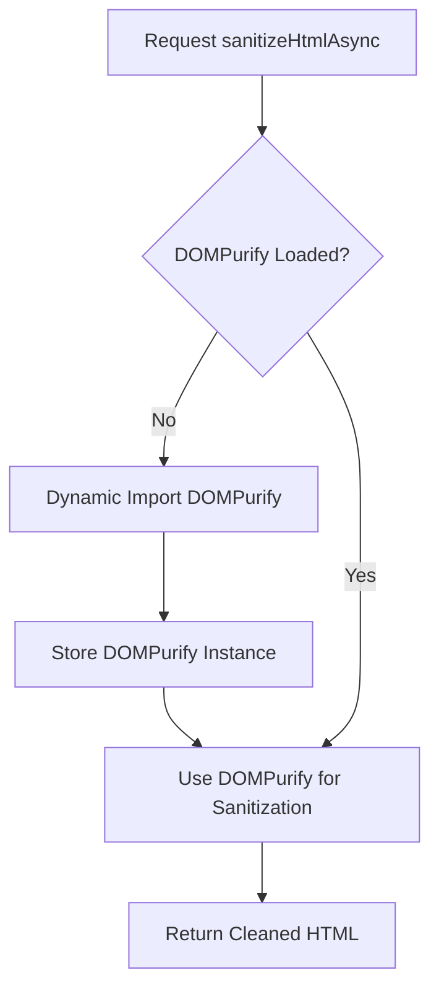
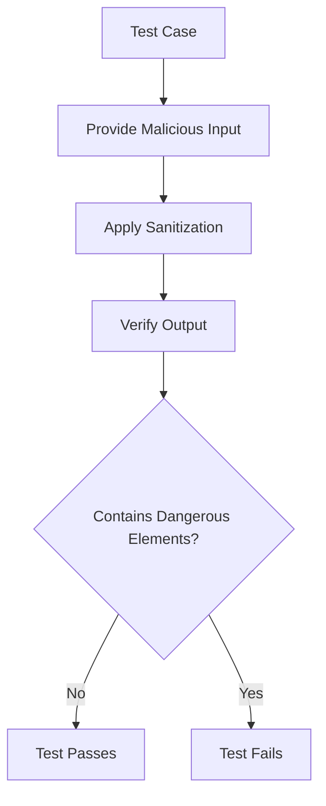

# HTML Sanitization

<cite>
**Referenced Files in This Document**   
- [sanitization.ts](file://src/lib/sanitization.ts)
- [security.ts](file://src/lib/security.ts)
- [sanitization.test.ts](file://src/__tests__/lib/sanitization.test.ts)
</cite>

## Table of Contents

1. [Introduction](#introduction)
2. [Core Sanitization Functions](#core-sanitization-functions)
3. [DOMPurify Configuration](#dompurify-configuration)
4. [Async vs Synchronous Sanitization](#async-vs-synchronous-sanitization)
5. [Lazy Loading Mechanism](#lazy-loading-mechanism)
6. [Security Implications](#security-implications)
7. [Usage Examples](#usage-examples)
8. [Testing and Validation](#testing-and-validation)
9. [Best Practices](#best-practices)

## Introduction

HTML sanitization in Kafkasder-panel is a critical security measure designed to prevent cross-site scripting (XSS) attacks while allowing controlled HTML formatting in user-generated content. The system implements a dual approach using both asynchronous and synchronous sanitization methods, with DOMPurify as the primary sanitization library. This documentation details the implementation, configuration, and proper usage of the HTML sanitization system, focusing on the allowed HTML tags (p, br, strong, em, u, h1-h6) and attributes, as well as the security mechanisms in place to protect against malicious content injection.

**Section sources**

- [sanitization.ts](file://src/lib/sanitization.ts#L1-L10)

## Core Sanitization Functions

The HTML sanitization system provides two primary functions for handling HTML content: `sanitizeHtmlAsync` for runtime use and `sanitizeHtml` for build-time compatibility. These functions are designed to safely remove XSS threats while preserving permitted HTML structure according to the application's security policy.

The `sanitizeHtmlAsync` function is the preferred method for sanitizing HTML content during runtime operations. It leverages DOMPurify's comprehensive sanitization capabilities to analyze and clean HTML input, ensuring that only approved tags and attributes are preserved. The synchronous `sanitizeHtml` function serves as a fallback mechanism, particularly useful in build-time scenarios where asynchronous operations are not supported.



**Diagram sources**

- [sanitization.ts](file://src/lib/sanitization.ts#L53-L63)

**Section sources**

- [sanitization.ts](file://src/lib/sanitization.ts#L20-L63)

## DOMPurify Configuration

The DOMPurify configuration in Kafkasder-panel is carefully designed to balance functionality with security. The system allows a specific set of HTML tags and attributes that support basic text formatting while preventing potentially dangerous elements that could be exploited for XSS attacks.

The allowed tags include structural elements like paragraphs (`p`), line breaks (`br`), and heading tags (`h1`-`h6`), along with formatting tags such as `strong`, `em`, and `u`. For attributes, the configuration permits `href`, `title`, and `target` to support basic hyperlink functionality while maintaining security. The `ALLOW_DATA_ATTR` option is explicitly set to `false` to prevent the use of data attributes that could potentially carry malicious payloads.



**Diagram sources**

- [sanitization.ts](file://src/lib/sanitization.ts#L25-L45)

**Section sources**

- [sanitization.ts](file://src/lib/sanitization.ts#L25-L45)

## Async vs Synchronous Sanitization

Kafkasder-panel implements both asynchronous and synchronous HTML sanitization methods to accommodate different execution contexts within the application. The choice between these methods depends on the specific use case and execution environment.

The `sanitizeHtmlAsync` function is designed for runtime use where asynchronous operations are supported. It provides comprehensive protection by leveraging DOMPurify's full sanitization capabilities, including proper HTML parsing and context-aware cleaning. This method is preferred for user-facing operations where HTML content is dynamically generated or received from external sources.

In contrast, the `sanitizeHtml` function provides synchronous sanitization for build-time compatibility. This method uses regex-based pattern matching to remove dangerous elements, making it suitable for environments where asynchronous imports are not feasible. While less comprehensive than the async version, it still provides essential protection against common XSS vectors.



**Diagram sources**

- [sanitization.ts](file://src/lib/sanitization.ts#L20-L63)

**Section sources**

- [sanitization.ts](file://src/lib/sanitization.ts#L20-L63)

## Lazy Loading Mechanism

To avoid build-time issues with jsdom, Kafkasder-panel implements a lazy loading mechanism for DOMPurify. This approach ensures that the DOMPurify library is only imported when needed during runtime, preventing complications during the build process.

The lazy loading is achieved through the `getDOMPurify` function, which checks if DOMPurify has already been loaded and, if not, performs a dynamic import. This pattern allows the application to maintain compatibility with both server-side rendering and client-side execution environments while ensuring that the sanitization library is available when required.



**Diagram sources**

- [sanitization.ts](file://src/lib/sanitization.ts#L7-L13)

**Section sources**

- [sanitization.ts](file://src/lib/sanitization.ts#L7-L13)

## Security Implications

The HTML sanitization implementation in Kafkasder-panel addresses several critical security concerns related to user-generated content. By allowing specific HTML tags while stripping dangerous elements, the system mitigates XSS risks while maintaining necessary formatting capabilities.

The security model prevents script execution by removing `script` tags and inline event handlers (such as `onclick`). It also blocks JavaScript URLs that could be used in href attributes to execute code. The configuration explicitly disallows data attributes that might be used to store malicious payloads or bypass other security measures.

The dual sanitization approach ensures protection across different execution contexts, with the async method providing comprehensive security during runtime and the sync method offering essential protection during build-time operations. This layered defense strategy enhances the overall security posture of the application.

**Section sources**

- [sanitization.ts](file://src/lib/sanitization.ts#L59-L63)
- [sanitization.test.ts](file://src/__tests__/lib/sanitization.test.ts#L27-L38)

## Usage Examples

The HTML sanitization functions are used throughout the application to process user-generated content before display or storage. Concrete examples from the codebase demonstrate how dangerous content is stripped while preserving permitted HTML structure.

When processing user input containing script tags, the sanitization functions remove the malicious elements while preserving safe content:

```html
<!-- Input -->
<script>
  alert('xss');
</script>
<p>Safe content</p>

<!-- Output -->
<p>Safe content</p>
```

Similarly, event handlers and dangerous attributes are removed:

```html
<!-- Input -->
<a href="#" onclick="maliciousCode()">Click me</a>

<!-- Output -->
<a href="#">Click me</a>
```

The system also handles JavaScript URLs in href attributes:

```html
<!-- Input -->
<a href="javascript:maliciousCode()">Link</a>

<!-- Output -->
<a href="#">Link</a>
```

**Section sources**

- [sanitization.test.ts](file://src/__tests__/lib/sanitization.test.ts#L27-L38)

## Testing and Validation

The HTML sanitization implementation is thoroughly tested to ensure its effectiveness against various XSS attack vectors. The test suite validates that allowed tags are preserved while dangerous elements are properly removed.

Tests verify that safe HTML tags like `p`, `strong`, and heading elements are retained in the output. They also confirm that script tags, event handlers, and JavaScript URLs are successfully stripped from the input. The test cases cover edge cases and various attack patterns to ensure comprehensive protection.

The testing approach includes both positive tests (verifying allowed content is preserved) and negative tests (ensuring dangerous content is removed). This comprehensive testing strategy provides confidence in the sanitization system's ability to protect against XSS attacks.



**Diagram sources**

- [sanitization.test.ts](file://src/__tests__/lib/sanitization.test.ts#L19-L39)

**Section sources**

- [sanitization.test.ts](file://src/__tests__/lib/sanitization.test.ts#L19-L39)

## Best Practices

When implementing HTML sanitization in Kafkasder-panel, developers should follow these best practices:

1. **Prefer async sanitization**: Use `sanitizeHtmlAsync` for runtime operations to leverage DOMPurify's comprehensive protection.

2. **Use sync sanitization judiciously**: Reserve `sanitizeHtml` for build-time scenarios where asynchronous operations are not supported.

3. **Validate input context**: Consider the context in which sanitized HTML will be used and apply additional validation as needed.

4. **Monitor allowed tags**: Regularly review the allowed tags and attributes to ensure they meet current security requirements.

5. **Handle empty input**: Both functions properly handle empty or null input by returning an empty string.

6. **Combine with other security measures**: Use HTML sanitization as part of a comprehensive security strategy that includes input validation, output encoding, and other protective measures.

**Section sources**

- [sanitization.ts](file://src/lib/sanitization.ts#L20-L63)
- [sanitization.test.ts](file://src/__tests__/lib/sanitization.test.ts#L19-L39)
