# Input Validation and Sanitization

<cite>
**Referenced Files in This Document**   
- [sanitization.ts](file://src/lib/sanitization.ts)
- [security.ts](file://src/lib/security.ts)
- [file-upload.tsx](file://src/components/ui/file-upload.tsx)
- [FileUpload.tsx](file://src/components/FileUpload.tsx)
- [beneficiary.ts](file://src/lib/validations/beneficiary.ts)
</cite>

## Table of Contents

1. [Introduction](#introduction)
2. [HTML Sanitization with DOMPurify](#html-sanitization-with-dompurify)
3. [Text Sanitization Methods](#text-sanitization-methods)
4. [Input Validation Functions](#input-validation-functions)
5. [Object and File Validation](#object-and-file-validation)
6. [Security Issue Mitigation](#security-issue-mitigation)
7. [Configuration and Usage Guidelines](#configuration-and-usage-guidelines)

## Introduction

The Kafkasder-panel implements a comprehensive input validation and sanitization framework to protect against common security vulnerabilities such as XSS, path traversal, and malicious file uploads. The system employs both synchronous and asynchronous sanitization methods depending on execution context, with specialized validators for Turkish-specific formats like TC identification numbers and phone numbers. This document details the implementation of these security measures, focusing on the sanitization library, validation functions, and their integration throughout the application.

**Section sources**

- [sanitization.ts](file://src/lib/sanitization.ts#L1-L57)

## HTML Sanitization with DOMPurify

### Async and Synchronous Implementation

The system implements HTML sanitization using DOMPurify with both async and synchronous variants to accommodate different execution contexts. The async version is preferred for runtime use, while the synchronous version provides build-time compatibility with a fallback regex-based approach.

**Diagram sources**

- [sanitization.ts](file://src/lib/sanitization.ts#L21-L47)

### Allowed Tags and Attributes

The HTML sanitization configuration permits a specific set of safe tags and attributes while removing potentially dangerous elements. The allowed configuration includes:

**Diagram sources**

- [sanitization.ts](file://src/lib/sanitization.ts#L26-L45)

**Section sources**

- [sanitization.ts](file://src/lib/sanitization.ts#L21-L64)

## Text Sanitization Methods

### Dangerous Character Removal

The text sanitization process removes characters that could be used in XSS attacks or other injection vulnerabilities. The implementation strips HTML tags and special characters while preserving plain text content.

**Diagram sources**

- [sanitization.ts](file://src/lib/sanitization.ts#L72-L75)

### Sanitization Function Implementation

The text sanitization functions are designed to prevent XSS by removing potentially dangerous characters and HTML content from user inputs.

**Section sources**

- [sanitization.ts](file://src/lib/sanitization.ts#L69-L76)

## Input Validation Functions

### Email Validation

Email validation follows standard RFC-compliant patterns with additional processing for Turkish localization requirements.

**Diagram sources**

- [sanitization.ts](file://src/lib/sanitization.ts#L82-L92)

### Phone Number Validation

Turkish phone number validation enforces mobile number formats with country code normalization.

**Diagram sources**

- [sanitization.ts](file://src/lib/sanitization.ts#L98-L125)

### TC Identification Number Validation

The TC Kimlik No validation implements the official Turkish government algorithm for ID verification.

```mermaid
flowchart TD
TCInput([TC ID Input]) --> RemoveNonDigits["Remove Non-Digit Characters"]
RemoveNonDigits --> CheckLength["Check 11 Digits"]
CheckLength --> |Valid| CheckFirstDigit["First Digit ≠ 0"]
CheckLength --> |Invalid| ReturnNull["Return Null"]
CheckFirstDigit --> |Valid| Calculate10th["Calculate 10th Digit"]
CheckFirstDigit --> |Invalid| ReturnNull
Calculate10th --> Validate10th["Validate 10th Digit"]
Validate10th --> |Valid| Calculate11th["Calculate 11th Digit"]
Validate10th --> |Invalid| ReturnNull
Calculate11th --> Validate11th["Validate 11th Digit"]
Validate11th --> |Valid| ReturnDigits["Return Valid Digits"]
Validate11th --> |Invalid| ReturnNull
```

**Diagram sources**

- [sanitization.ts](file://src/lib/sanitization.ts#L132-L160)

### URL and Filename Validation

URL and filename validation prevent dangerous protocols and path traversal attempts.

**Diagram sources**

- [sanitization.ts](file://src/lib/sanitization.ts#L167-L187)

**Section sources**

- [sanitization.ts](file://src/lib/sanitization.ts#L78-L187)

## Object and File Validation

### Recursive Object Sanitization

The `sanitizeObject` function recursively applies sanitization to all string fields in nested objects, with options to allow HTML in specific fields.

**Diagram sources**

- [sanitization.ts](file://src/lib/sanitization.ts#L318-L351)

### Comprehensive File Validation

File validation checks size, MIME type, extension, and filename safety with configurable options.

**Diagram sources**

- [sanitization.ts](file://src/lib/sanitization.ts#L368-L410)

**Section sources**

- [sanitization.ts](file://src/lib/sanitization.ts#L310-L411)

## Security Issue Mitigation

### XSS Prevention

The system mitigates XSS through multiple layers of defense, including HTML sanitization, text cleaning, and context-specific output encoding.

**Section sources**

- [sanitization.ts](file://src/lib/sanitization.ts#L1-L64)

### Path Traversal Protection

Filename sanitization prevents path traversal by removing dot-dot sequences and other dangerous characters.

**Diagram sources**

- [sanitization.ts](file://src/lib/sanitization.ts#L196-L203)

### Malicious File Upload Prevention

The file upload system prevents malicious uploads through MIME type validation, size limits, and extension checking.

**Section sources**

- [security.ts](file://src/lib/security.ts#L284-L321)
- [file-upload.tsx](file://src/components/ui/file-upload.tsx#L116-L145)

## Configuration and Usage Guidelines

### Validation Rule Configuration

Validation rules can be configured for different input types through optional parameters in the validation functions.

**Section sources**

- [sanitization.ts](file://src/lib/sanitization.ts#L357-L411)

### Integration with Form Components

The sanitization functions are integrated with form components to provide real-time validation feedback.

**Section sources**

- [file-upload.tsx](file://src/components/ui/file-upload.tsx#L116-L145)
- [FileUpload.tsx](file://src/components/FileUpload.tsx#L51-L59)

### Testing and Verification

Comprehensive test coverage ensures the reliability of validation and sanitization functions.

**Section sources**

- [sanitization.test.ts](file://src/__tests__/lib/sanitization.test.ts#L1-L321)
- [beneficiary-sanitization.test.ts](file://src/__tests__/integration/beneficiary-sanitization.test.ts#L1-L342)
