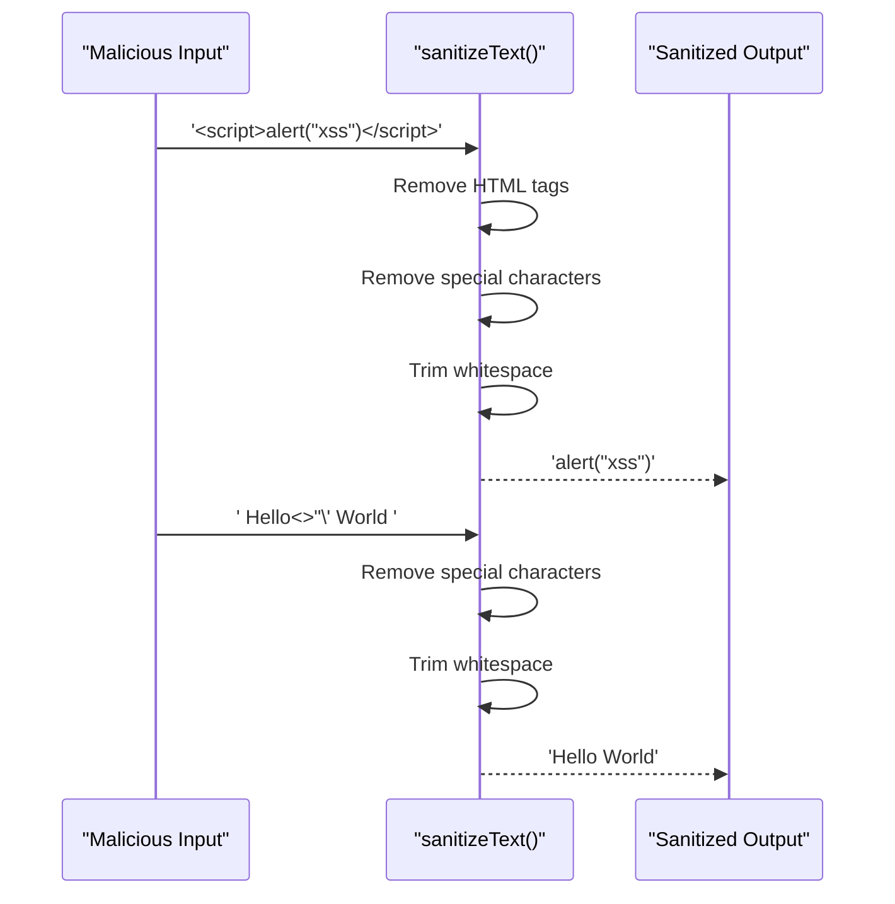

# Text Sanitization

<cite>
**Referenced Files in This Document**   
- [sanitization.ts](file://src/lib/sanitization.ts#L68-L75)
- [sanitization.ts](file://src/lib/sanitization.ts#L318-L351)
- [security.ts](file://src/lib/security.ts#L30-L33)
- [sanitization.test.ts](file://src/__tests__/lib/sanitization.test.ts)
</cite>

## Table of Contents

1. [Introduction](#introduction)
2. [Core Text Sanitization Function](#core-text-sanitization-function)
3. [Implementation Details](#implementation-details)
4. [Usage with Object Sanitization](#usage-with-object-sanitization)
5. [Security Considerations](#security-considerations)
6. [Text vs HTML Sanitization Guidance](#text-vs-html-sanitization-guidance)
7. [Testing and Validation](#testing-and-validation)
8. [Conclusion](#conclusion)

## Introduction

The Kafkasder-panel implements comprehensive text sanitization practices to prevent cross-site scripting (XSS) attacks and other security vulnerabilities. The system provides a robust sanitization library that processes user input by removing potentially dangerous characters and HTML tags. This documentation details the implementation of the `sanitizeText` function, its integration with object-level sanitization, and best practices for using text sanitization versus HTML sanitization based on input context.

**Section sources**

- [sanitization.ts](file://src/lib/sanitization.ts#L1-L10)

## Core Text Sanitization Function

The `sanitizeText` function is designed to process plain text input by removing HTML tags and dangerous characters that could be used in XSS attacks. This function is specifically intended for plain text fields where HTML content is not permitted. The implementation removes all HTML tags and eliminates special characters including `<`, `>`, `'`, and `"` that could be used in injection attacks.

```mermaid
flowchart TD
Start([Input Text]) --> CheckNull["Check if null/undefined"]
CheckNull --> |Null| ReturnEmpty["Return empty string"]
CheckNull --> |Valid| RemoveHTML["Remove HTML tags with regex"]
RemoveHTML --> RemoveSpecial["Remove special characters <, >, ', \""]
RemoveSpecial --> TrimWhitespace["Trim whitespace"]
TrimWhitespace --> ReturnResult["Return sanitized text"]
```

**Diagram sources**

- [sanitization.ts](file://src/lib/sanitization.ts#L68-L75)

**Section sources**

- [sanitization.ts](file://src/lib/sanitization.ts#L68-L75)

## Implementation Details

The `sanitizeText` function implements a three-step sanitization process using regular expressions. First, it removes all HTML tags using the regex pattern `/&lt;[^&gt;]*&gt;/g`. Then, it eliminates dangerous special characters with the pattern `/[&lt;&gt;'"]/g`. Finally, it trims whitespace from the beginning and end of the string. For example, malicious input like '&lt;script&gt;alert("xss")&lt;/script&gt;' is converted to the safe plain text 'alert("xss")'. The function returns an empty string if the input is null or undefined, ensuring consistent behavior across the application.



**Diagram sources**

- [sanitization.ts](file://src/lib/sanitization.ts#L72-L74)

**Section sources**

- [sanitization.ts](file://src/lib/sanitization.ts#L68-L75)

## Usage with Object Sanitization

The text sanitization functionality is integrated with the `sanitizeObject` function for recursive sanitization of string fields in data objects. When processing nested data structures, `sanitizeObject` applies `sanitizeText` to all string values by default. The function traverses objects and arrays recursively, applying text sanitization to string values while preserving other data types. This approach ensures comprehensive protection against XSS attacks across complex data structures used throughout the application.

```mermaid
classDiagram
class sanitizeObject {
+obj : Record<string, any>
+options : { allowHtml? : boolean, fieldsToIgnore? : string[] }
+sanitizeObject() : T
}
class sanitizeText {
+text : string
+sanitizeText() : string
}
class sanitizeHtml {
+html : string
+sanitizeHtml() : string
}
sanitizeObject --> sanitizeText : "uses when allowHtml=false"
sanitizeObject --> sanitizeHtml : "uses when allowHtml=true"
```

**Diagram sources**

- [sanitization.ts](file://src/lib/sanitization.ts#L318-L351)

**Section sources**

- [sanitization.ts](file://src/lib/sanitization.ts#L318-L351)

## Security Considerations

The text sanitization implementation follows security best practices by removing potentially dangerous characters that could be used in XSS attacks. The function specifically targets the characters `<`, `>`, `'`, and `"` which are commonly used in script injection attacks. Unlike the `sanitizeHtml` function which allows a whitelist of safe HTML tags, `sanitizeText` removes all HTML content entirely, making it suitable for plain text fields where formatting is not required. This approach provides a higher level of security for input fields that should not contain any HTML content.

**Section sources**

- [sanitization.ts](file://src/lib/sanitization.ts#L72-L74)
- [security.ts](file://src/lib/security.ts#L30-L33)

## Text vs HTML Sanitization Guidance

The choice between text sanitization and HTML sanitization depends on the input type and context. Use `sanitizeText` for plain text fields such as names, addresses, and simple descriptions where HTML formatting is not needed. Use `sanitizeHtml` for rich text fields that require basic formatting like paragraphs, bold text, or links. The `sanitizeObject` function provides a flexible interface with the `allowHtml` option to control which sanitization method is applied to string fields in data objects. This distinction ensures appropriate security measures while preserving necessary functionality.

**Section sources**

- [sanitization.ts](file://src/lib/sanitization.ts#L342-L343)

## Testing and Validation

The sanitization functions are thoroughly tested using unit tests that verify the removal of HTML tags and special characters. Test cases include various forms of malicious input to ensure the functions properly neutralize potential XSS attacks. The tests confirm that `sanitizeText` correctly removes HTML tags and dangerous characters while preserving legitimate text content. Integration tests validate that the sanitization functions work correctly when applied to complex data objects through the `sanitizeObject` function.

**Section sources**

- [sanitization.test.ts](file://src/__tests__/lib/sanitization.test.ts#L42-L59)

## Conclusion

The text sanitization implementation in Kafkasder-panel provides effective protection against XSS attacks by removing HTML tags and dangerous characters from plain text input. The `sanitizeText` function, combined with the recursive `sanitizeObject` function, ensures comprehensive security across the application's data processing pipeline. By following the guidance for when to use text versus HTML sanitization, developers can maintain both security and functionality in different input contexts.
