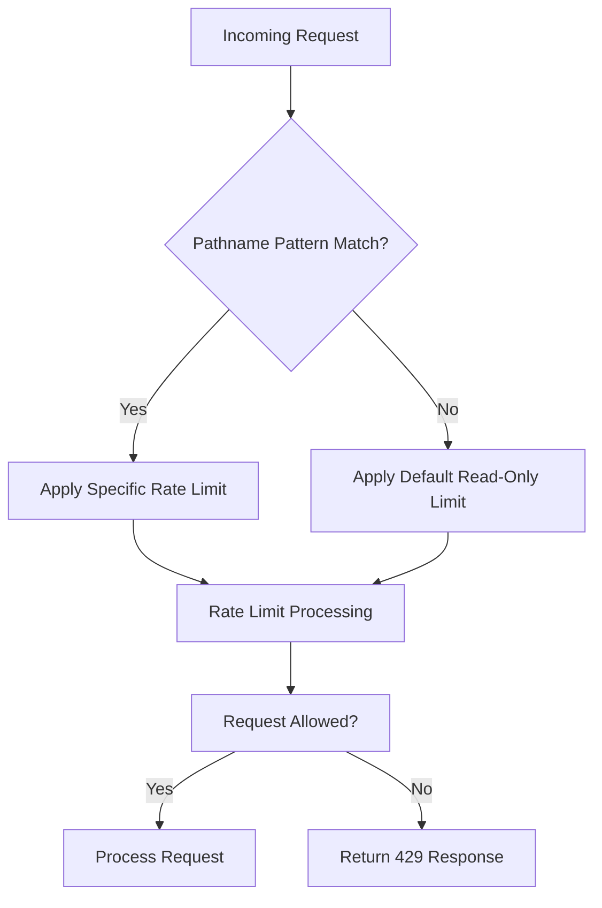
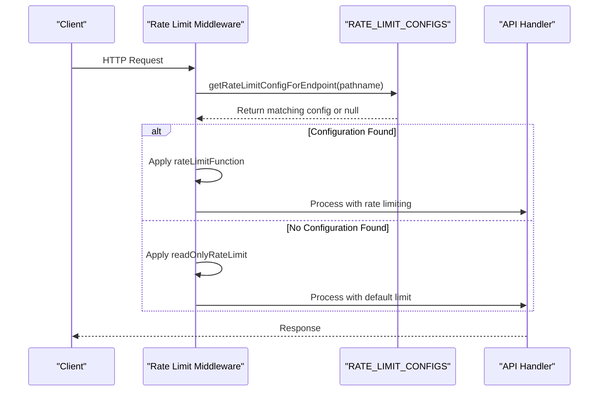
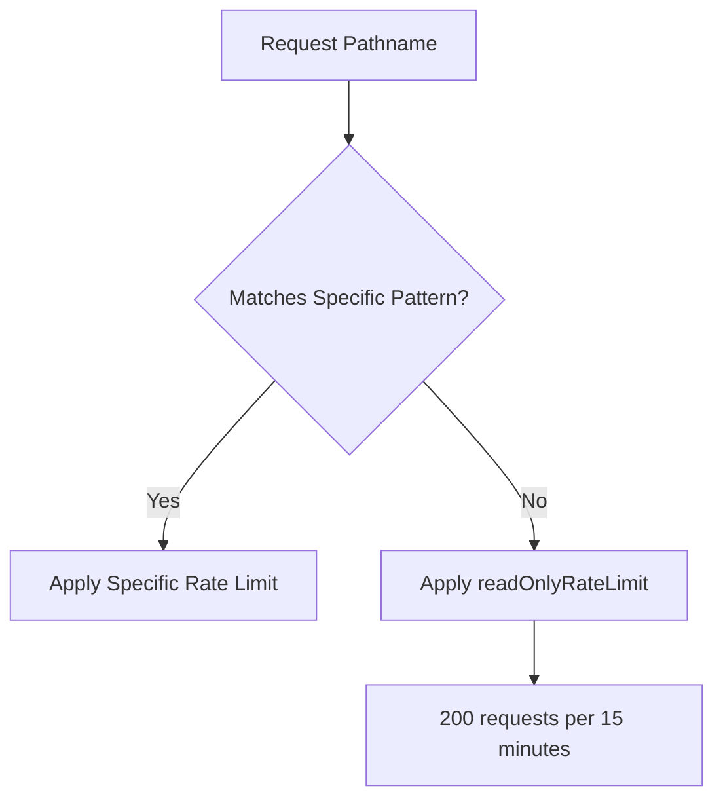
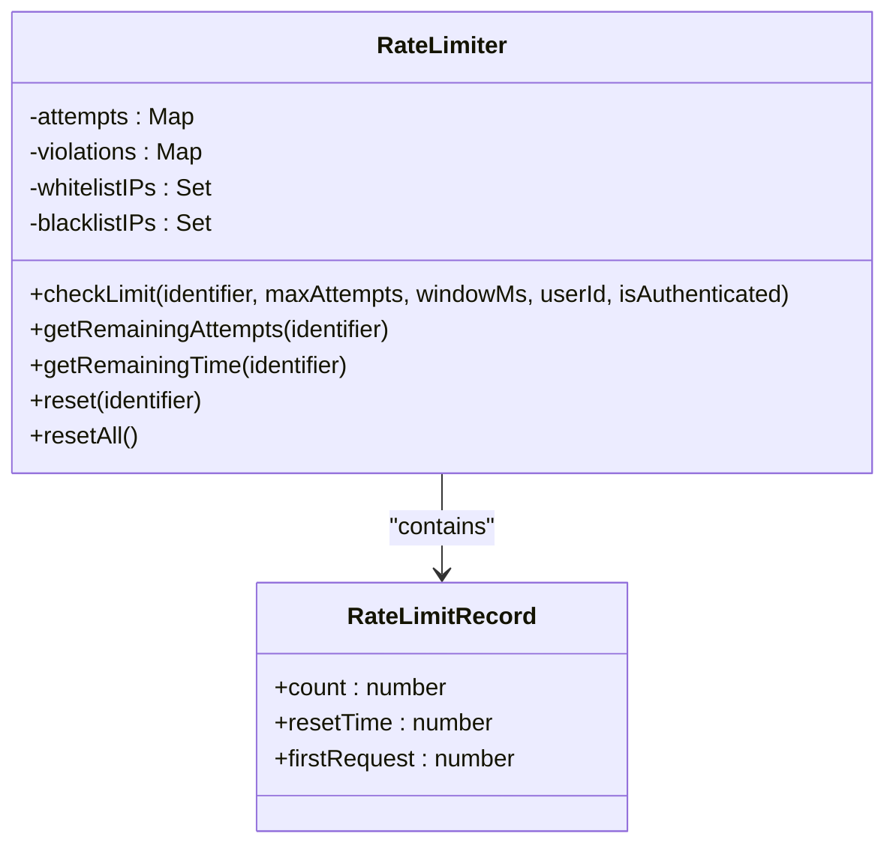

# Endpoint-Specific Rate Limits

<cite>
**Referenced Files in This Document**  
- [rate-limit-config.ts](file://src/lib/rate-limit-config.ts)
- [rate-limit.ts](file://src/lib/rate-limit.ts)
- [security.ts](file://src/lib/security.ts)
</cite>

## Table of Contents

1. [Introduction](#introduction)
2. [Rate Limit Configuration System](#rate-limit-configuration-system)
3. [Endpoint Matching Mechanism](#endpoint-matching-mechanism)
4. [Rate Limit Categories](#rate-limit-categories)
5. [Default Fallback Mechanism](#default-fallback-mechanism)
6. [Health Check Exception](#health-check-exception)
7. [Implementation Details](#implementation-details)
8. [Configuration Validation](#configuration-validation)

## Introduction

The Kafkasder-panel implements a sophisticated endpoint-specific rate limiting system to protect sensitive API endpoints while allowing appropriate throughput for read operations. This system uses pattern matching to apply different rate limit profiles based on endpoint pathname, with specialized configurations for authentication, data modification, and read-only operations. The implementation integrates with Next.js middleware to intercept requests before they reach the API handlers, providing an efficient and centralized rate limiting solution.

## Rate Limit Configuration System

The rate limiting system is configured through a centralized configuration object that maps pathname patterns to specific rate limiting functions. This configuration-driven approach allows for flexible and maintainable rate limit policies across the application.



**Diagram sources**

- [rate-limit-config.ts](file://src/lib/rate-limit-config.ts#L21-L107)

**Section sources**

- [rate-limit-config.ts](file://src/lib/rate-limit-config.ts#L1-L195)

## Endpoint Matching Mechanism

The system uses the `getRateLimitConfigForEndpoint` function to match incoming requests to specific rate limit profiles based on pathname patterns. This function iterates through a predefined list of configurations, testing each regular expression pattern against the request pathname until a match is found.



**Diagram sources**

- [rate-limit-config.ts](file://src/lib/rate-limit-config.ts#L160-L162)
- [rate-limit-config.ts](file://src/lib/rate-limit-config.ts#L115-L127)

**Section sources**

- [rate-limit-config.ts](file://src/lib/rate-limit-config.ts#L160-L162)

## Rate Limit Categories

The system implements three primary rate limit categories with different thresholds based on endpoint sensitivity and function.

### Authentication Rate Limit

Authentication endpoints have the strictest limits to prevent brute force attacks on login functionality. These endpoints are protected by the `authRateLimit` configuration.

```mermaid
flowchart LR
A[/api/auth/*] --> B[authRateLimit]
B --> C["10 requests per 10 minutes"]
C --> D[Skip successful & failed attempts]
```

**Diagram sources**

- [rate-limit-config.ts](file://src/lib/rate-limit-config.ts#L23-L27)
- [rate-limit.ts](file://src/lib/rate-limit.ts#L91-L99)

**Section sources**

- [rate-limit-config.ts](file://src/lib/rate-limit-config.ts#L23-L27)
- [rate-limit.ts](file://src/lib/rate-limit.ts#L91-L99)

### Data Modification Rate Limit

Endpoints that modify data (POST, PUT, DELETE operations) have moderate limits to prevent abuse while allowing legitimate usage. These are protected by the `dataModificationRateLimit` configuration.

```mermaid
flowchart LR
A[/api/(beneficiaries|users|tasks|meetings|messages|donations)/*] --> B[dataModificationRateLimit]
B --> C["50 requests per 15 minutes"]
C --> D[Count all requests]
```

**Diagram sources**

- [rate-limit-config.ts](file://src/lib/rate-limit-config.ts#L37-L48)
- [rate-limit.ts](file://src/lib/rate-limit.ts#L101-L107)

**Section sources**

- [rate-limit-config.ts](file://src/lib/rate-limit-config.ts#L37-L48)
- [rate-limit.ts](file://src/lib/rate-limit.ts#L101-L107)

### Read-Only Rate Limit

Read-only endpoints have higher limits to support analytics and dashboard functionality. These are protected by the `readOnlyRateLimit` configuration.

```mermaid
flowchart LR
A[/api/(beneficiaries|users|tasks|meetings|messages|donations)/*/GET] --> B[readOnlyRateLimit]
B --> C["200 requests per 15 minutes"]
C --> D[Count all requests]
```

**Diagram sources**

- [rate-limit-config.ts](file://src/lib/rate-limit-config.ts#L72-L81)
- [rate-limit.ts](file://src/lib/rate-limit.ts#L109-L115)

**Section sources**

- [rate-limit-config.ts](file://src/lib/rate-limit-config.ts#L72-L81)
- [rate-limit.ts](file://src/lib/rate-limit.ts#L109-L115)

## Default Fallback Mechanism

When no specific configuration matches an endpoint, the system applies a default read-only rate limit as a fallback. This ensures that all endpoints have some level of protection even if they are not explicitly configured.



**Diagram sources**

- [rate-limit-config.ts](file://src/lib/rate-limit-config.ts#L125-L127)

**Section sources**

- [rate-limit-config.ts](file://src/lib/rate-limit-config.ts#L125-L127)

## Health Check Exception

Health check endpoints are specifically excluded from rate limiting to ensure monitoring systems can always check application status. This is implemented through a dedicated configuration that applies no rate limiting.

```mermaid
flowchart LR
A[/api/health] --> B[No Rate Limiting]
B --> C[Direct Request Processing]
```

**Diagram sources**

- [rate-limit-config.ts](file://src/lib/rate-limit-config.ts#L98-L105)

**Section sources**

- [rate-limit-config.ts](file://src/lib/rate-limit-config.ts#L98-L105)

## Implementation Details

The rate limiting system is implemented as a middleware layer that integrates with Next.js API routes. The core functionality is provided by the `RateLimiter` class in the security module, which tracks request counts and enforces limits.



**Diagram sources**

- [security.ts](file://src/lib/security.ts#L78-L280)

**Section sources**

- [security.ts](file://src/lib/security.ts#L78-L280)

## Configuration Validation

The system includes validation functionality to ensure rate limit configurations are correct and don't contain duplicates or missing properties. This helps prevent misconfigurations that could lead to security vulnerabilities or service disruptions.

**Section sources**

- [rate-limit-config.ts](file://src/lib/rate-limit-config.ts#L166-L193)
