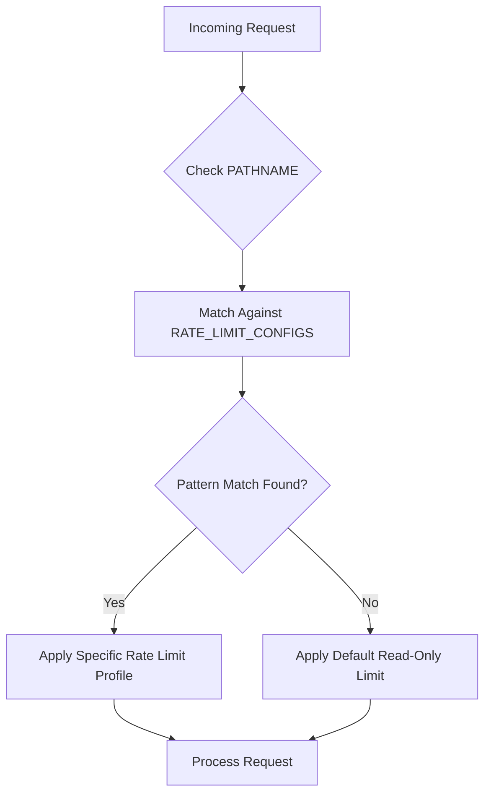
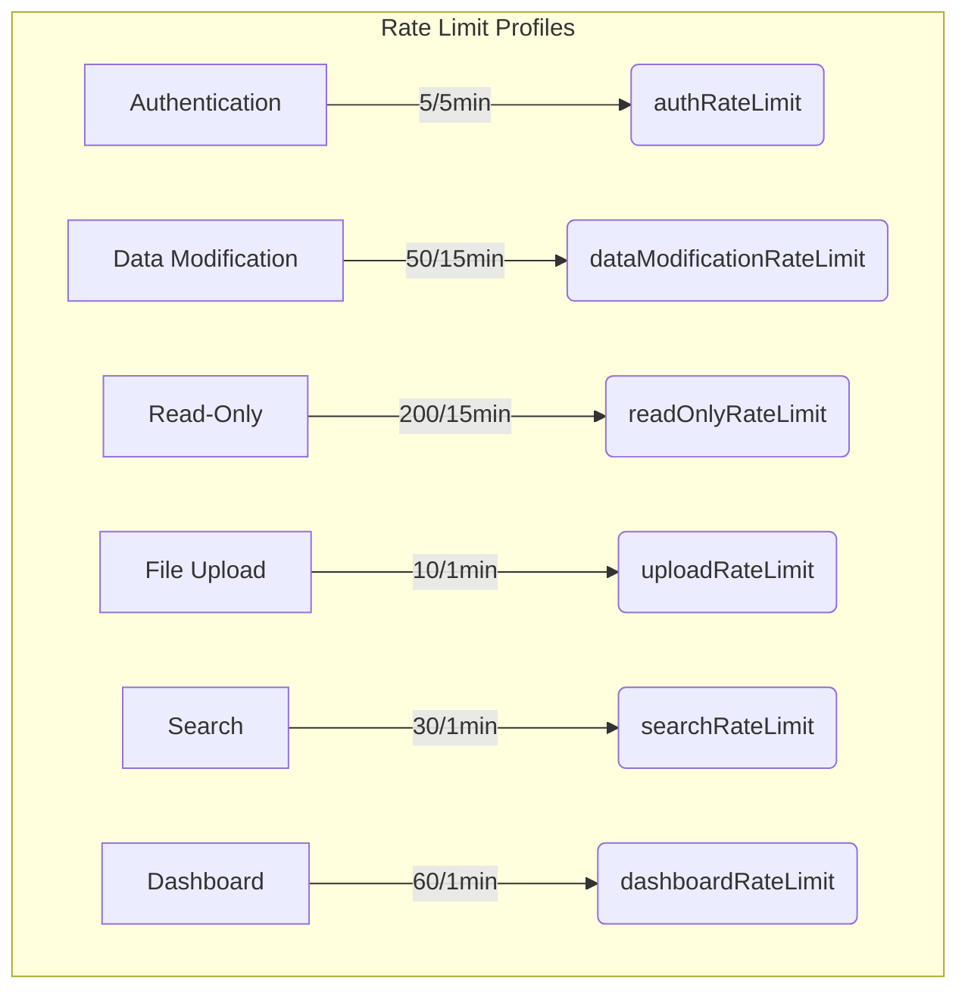

# Rate Limiting Configuration

<cite>
**Referenced Files in This Document**   
- [rate-limit-config.ts](file://src/lib/rate-limit-config.ts)
- [security.ts](file://src/lib/security.ts)
- [rate-limit.ts](file://src/lib/rate-limit.ts)
- [rate-limit-monitor.ts](file://src/lib/rate-limit-monitor.ts)
</cite>

## Table of Contents

1. [Introduction](#introduction)
2. [RATE_LIMIT_CONFIGS Array Structure](#rate_limit_configs-array-structure)
3. [Pattern-Based Endpoint Matching](#pattern-based-endpoint-matching)
4. [Rate Limit Profiles and Functions](#rate-limit-profiles-and-functions)
5. [Environment Variable Configuration](#environment-variable-configuration)
6. [Configuration Validation](#configuration-validation)
7. [Adding New Rate Limit Rules](#adding-new-rate-limit-rules)
8. [Monitoring and Testing](#monitoring-and-testing)

## Introduction

The Kafkasder-panel implements a comprehensive rate limiting system to protect API endpoints from abuse while maintaining optimal performance for legitimate users. The system uses a pattern-based configuration approach that applies different rate limit profiles based on URL patterns, HTTP methods, and endpoint categories. This document details the configuration structure, pattern matching mechanism, environment variable controls, and validation processes that govern the rate limiting behavior across the application.

**Section sources**

- [rate-limit-config.ts](file://src/lib/rate-limit-config.ts#L1-L195)

## RATE_LIMIT_CONFIGS Array Structure

The core of the rate limiting system is the `RATE_LIMIT_CONFIGS` array, which contains endpoint-specific configurations that define how different API routes are protected. Each configuration object in this array follows a standardized structure with essential properties:

- **pattern**: A regular expression that matches specific URL paths
- **rateLimitFunction**: A reference to the rate limiting function with specific thresholds
- **description**: Human-readable explanation of the configuration purpose

The array is processed in order, with the first matching pattern determining the rate limit profile applied to a request. This allows for precise control over different endpoint categories, from authentication routes to read-only APIs. The configuration includes specialized entries for various endpoint types, ensuring appropriate protection levels based on the sensitivity and resource requirements of each route.



**Diagram sources**

- [rate-limit-config.ts](file://src/lib/rate-limit-config.ts#L21-L107)

**Section sources**

- [rate-limit-config.ts](file://src/lib/rate-limit-config.ts#L21-L107)

## Pattern-Based Endpoint Matching

The rate limiting system employs regular expression patterns to match and categorize API endpoints, allowing for flexible and scalable configuration. The pattern matching system evaluates the request pathname against the configured regular expressions to determine the appropriate rate limit profile.

Key pattern examples include:

- `/^\/api\/auth\//` for authentication endpoints
- `/^\/api\/storage\/upload/` for file upload operations
- `/^\/api\/(beneficiaries|users|tasks|meetings|messages|donations)\/[^\/]*\/(GET)/` for read-only operations
- `/^\/api\/.*\/search/` for search functionality
- `/^\/api\/health/` for health check endpoints

The matching process occurs in the `applyGlobalRateLimit` function, which iterates through the `RATE_LIMIT_CONFIGS` array to find the first configuration whose pattern matches the request pathname. This approach enables granular control over different endpoint categories while maintaining a clean and maintainable configuration structure. Health check endpoints are specifically excluded from rate limiting to ensure monitoring systems can function reliably.

**Section sources**

- [rate-limit-config.ts](file://src/lib/rate-limit-config.ts#L110-L127)

## Rate Limit Profiles and Functions

The system implements different rate limit profiles through specialized rate limiting functions that define the specific thresholds for various endpoint categories. These functions are referenced in the `RATE_LIMIT_CONFIGS` array and provide tailored protection based on the endpoint's purpose and sensitivity.

Key rate limit functions include:

- **authRateLimit**: Strict limits for authentication endpoints (5 requests per 5 minutes)
- **dataModificationRateLimit**: Moderate limits for data modification operations (50 requests per 15 minutes)
- **readOnlyRateLimit**: Generous limits for read-only operations (200 requests per 15 minutes)
- **uploadRateLimit**: Specific limits for file uploads (10 uploads per minute)
- **searchRateLimit**: Controlled limits for search operations (30 searches per minute)
- **dashboardRateLimit**: Balanced limits for dashboard endpoints (60 requests per minute)

Authentication endpoints receive the strictest limits to prevent brute force attacks, while read-only APIs have more generous allowances to support legitimate user interactions. The health check endpoints have no rate limiting applied, ensuring monitoring systems can access these routes without restriction.



**Diagram sources**

- [rate-limit-config.ts](file://src/lib/rate-limit-config.ts#L21-L107)
- [rate-limit.ts](file://src/lib/rate-limit.ts#L92-L147)

**Section sources**

- [rate-limit.ts](file://src/lib/rate-limit.ts#L92-L147)

## Environment Variable Configuration

The rate limiting system incorporates environment variables to enable runtime customization of default behavior without requiring code changes. These variables provide flexibility in adjusting rate limit parameters across different deployment environments.

Key environment variables include:

- **RATE_LIMIT_DEFAULT_MAX**: Default maximum requests (default: 100)
- **RATE_LIMIT_DEFAULT_WINDOW**: Default time window in milliseconds (default: 900000ms/15 minutes)
- **RATE_LIMIT_PREMIUM_MULTIPLIER**: Multiplier for authenticated users (default: 2.0)
- **RATE_LIMIT_AUTH_MAX**: Maximum requests for authentication endpoints
- **RATE_LIMIT_AUTH_WINDOW**: Time window for authentication endpoints
- **RATE_LIMIT_READ_MAX**: Maximum requests for read-only endpoints
- **RATE_LIMIT_READ_WINDOW**: Time window for read-only endpoints
- **RATE_LIMIT_DATA_MODIFY_MAX**: Maximum requests for data modification
- **RATE_LIMIT_DATA_MODIFY_WINDOW**: Time window for data modification
- **RATE_LIMIT_UPLOAD_MAX**: Maximum uploads allowed
- **RATE_LIMIT_UPLOAD_WINDOW**: Time window for uploads
- **RATE_LIMIT_SEARCH_MAX**: Maximum searches allowed
- **RATE_LIMIT_SEARCH_WINDOW**: Time window for searches
- **RATE_LIMIT_DASHBOARD_MAX**: Maximum requests for dashboard endpoints
- **RATE_LIMIT_DASHBOARD_WINDOW**: Time window for dashboard endpoints
- **RATE_LIMIT_WHITELIST_IPS**: Comma-separated IP addresses exempt from rate limiting
- **RATE_LIMIT_BLACKLIST_IPS**: Comma-separated IP addresses always denied

Authenticated users receive higher limits through the premium multiplier, which doubles their allowed request count. The system also supports IP-based whitelisting and blacklisting, allowing specific IP addresses to bypass rate limits or be permanently blocked.

**Section sources**

- [security.ts](file://src/lib/security.ts#L81-L121)

## Configuration Validation

The system includes a comprehensive validation function to ensure the integrity of rate limit configurations and prevent deployment of invalid rules. The `validateRateLimitConfig` function performs several critical checks to maintain configuration reliability.

Validation checks include:

- **Duplicate pattern detection**: Ensures no two configurations have identical patterns
- **Required property verification**: Confirms each configuration has pattern, rateLimitFunction, and description properties
- **Configuration completeness**: Validates that all necessary fields are present

The validation function returns an object with a boolean `valid` property and an array of error messages. If any issues are detected, the errors are collected and returned for troubleshooting. This validation process helps prevent configuration errors that could lead to security vulnerabilities or unintended rate limiting behavior. The system automatically applies a default read-only rate limit when no specific configuration matches, providing a safety net for unconfigured endpoints.

**Section sources**

- [rate-limit-config.ts](file://src/lib/rate-limit-config.ts#L165-L193)

## Adding New Rate Limit Rules

To add new rate limit rules to the system, follow these steps to ensure proper configuration and validation:

1. **Identify the endpoint pattern**: Determine the URL pattern that should trigger the new rate limit rule using regular expressions
2. **Select appropriate rate limit function**: Choose from existing functions (authRateLimit, dataModificationRateLimit, readOnlyRateLimit, etc.) or create a new one if necessary
3. **Add configuration entry**: Insert a new object into the `RATE_LIMIT_CONFIGS` array with the pattern, rateLimitFunction, and descriptive description
4. **Validate the configuration**: Run the `validateRateLimitConfig` function to ensure no errors or duplicates exist
5. **Test the implementation**: Verify the new rule works as expected through testing

When creating new entries, place more specific patterns before general ones to ensure proper matching priority. For example, specific endpoint patterns should precede broader category patterns. Always include a clear description that explains the purpose of the rate limit rule, including the allowed request count and time window.

Example of adding a new rule:

```typescript
{
  pattern: /^\/api\/new-feature\//,
  rateLimitFunction: readOnlyRateLimit,
  description: 'New feature endpoints - 150 requests per 15 minutes'
}
```

**Section sources**

- [rate-limit-config.ts](file://src/lib/rate-limit-config.ts#L21-L107)

## Monitoring and Testing

The rate limiting system includes comprehensive monitoring capabilities through the `RateLimitMonitor` class, which tracks violations, generates statistics, and provides alerting for suspicious activity. The monitoring endpoint at `/api/monitoring/rate-limit` offers several actions for observing and managing rate limit behavior.

Monitoring features include:

- **Statistics collection**: Tracks total requests, blocked requests, and violation rates
- **Violation recording**: Logs detailed information about rate limit violations
- **Alert thresholds**: Triggers warnings when violation rates exceed configured thresholds
- **IP-based statistics**: Provides detailed analysis of request patterns by IP address
- **Data export**: Allows exporting monitoring data for analysis

The system can be tested by:

1. Using the monitoring API to check current statistics
2. Simulating high request volumes to verify rate limiting triggers
3. Checking log output for rate limit violation messages
4. Validating that appropriate HTTP 429 responses are returned when limits are exceeded
5. Confirming that rate limit headers (X-RateLimit-Remaining, X-RateLimit-Reset) are properly set

Regular monitoring and testing ensure the rate limiting system functions correctly and provides adequate protection without unduly restricting legitimate users.

**Section sources**

- [rate-limit-monitor.ts](file://src/lib/rate-limit-monitor.ts#L41-L301)
- [security.ts](file://src/lib/security.ts#L77-L279)
