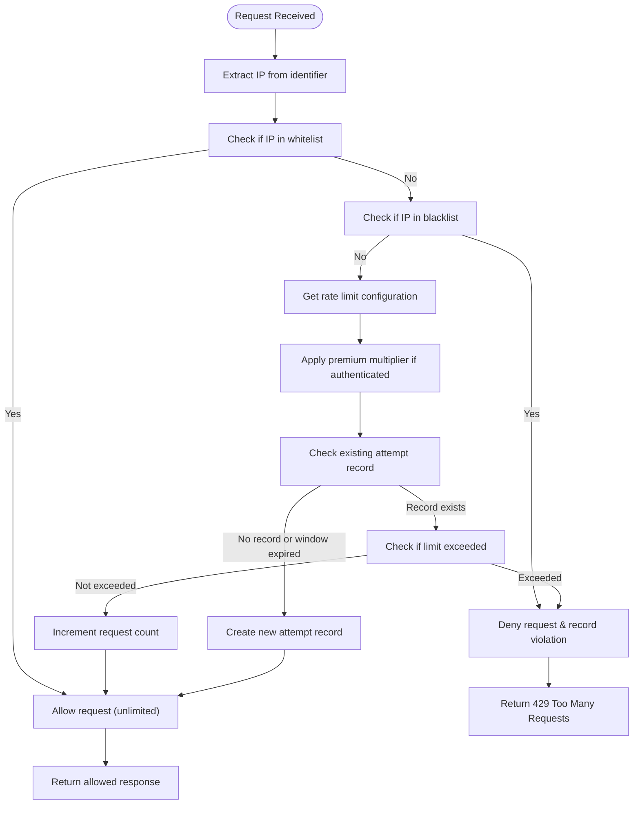
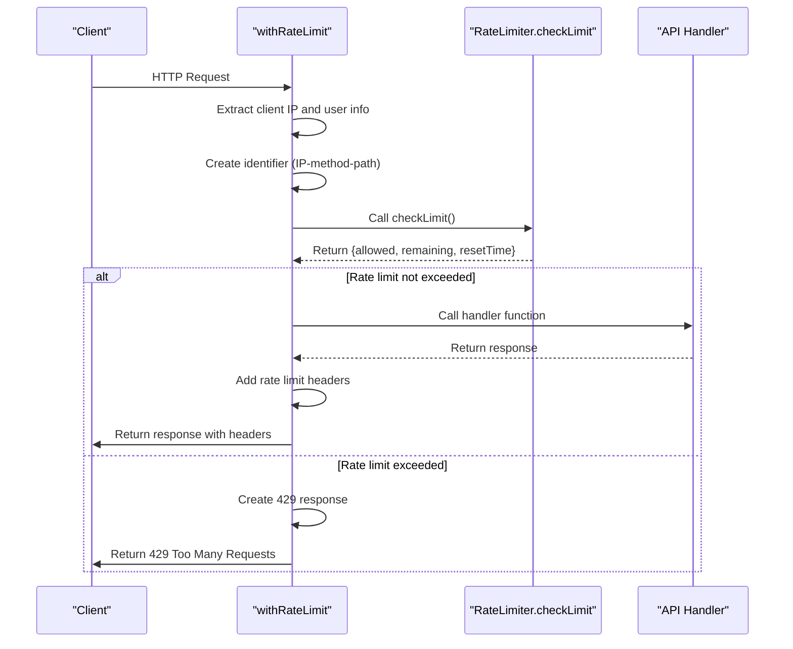
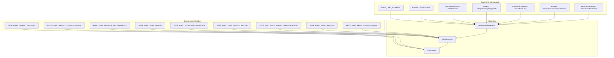
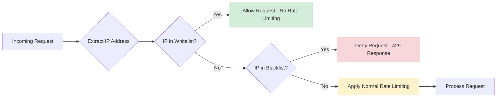
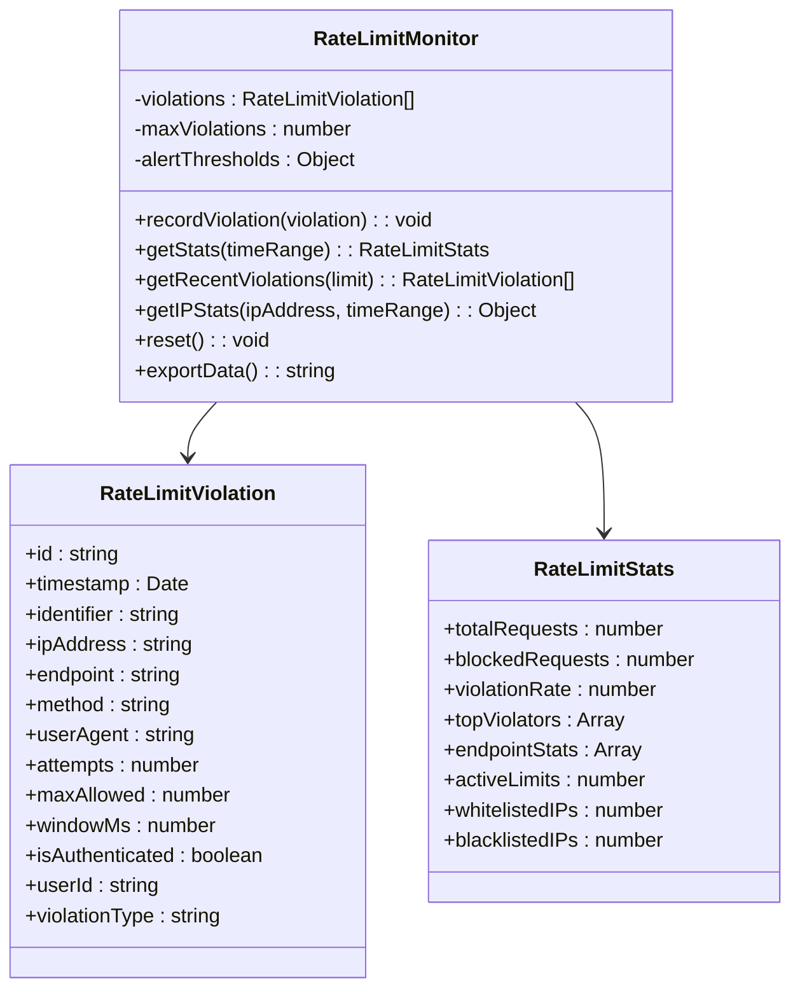

# Rate Limiting

<cite>
**Referenced Files in This Document**   
- [security.ts](file://src/lib/security.ts)
- [rate-limit.ts](file://src/lib/rate-limit.ts)
- [rate-limit-config.ts](file://src/lib/rate-limit-config.ts)
- [rate-limit-monitor.ts](file://src/lib/rate-limit-monitor.ts)
- [ENVIRONMENT.md](file://docs/ENVIRONMENT.md)
</cite>

## Table of Contents

1. [Introduction](#introduction)
2. [RateLimiter Class Implementation](#ratelimiter-class-implementation)
3. [Rate Limit Profiles and Middleware](#rate-limit-profiles-and-middleware)
4. [Configuration and Environment Variables](#configuration-and-environment-variables)
5. [IP Whitelisting and Blacklisting](#ip-whitelisting-and-blacklisting)
6. [Violation Tracking and Monitoring](#violation-tracking-and-monitoring)
7. [Rate Limit Headers](#rate-limit-headers)
8. [Tuning and Monitoring Guidance](#tuning-and-monitoring-guidance)

## Introduction

The rate limiting system in Kafkasder-panel provides comprehensive protection against abuse and denial-of-service attacks by controlling the number of requests clients can make to the API. The implementation tracks request counts by client IP address, HTTP method, and endpoint path, applying different limits based on the sensitivity and resource requirements of various endpoints. This document details the RateLimiter class, its configuration profiles, and the complete ecosystem of rate limiting functionality including monitoring, violation tracking, and configurable limits through environment variables.

**Section sources**

- [security.ts](file://src/lib/security.ts#L77-L279)
- [rate-limit.ts](file://src/lib/rate-limit.ts#L1-L148)

## RateLimiter Class Implementation

The RateLimiter class is a static utility that manages rate limiting across the application. It uses in-memory storage to track request attempts and violations, with the `checkLimit` method serving as the core functionality for determining whether a request should be allowed.

The `checkLimit` method accepts several parameters:

- `identifier`: A string combining IP address, HTTP method, and endpoint path
- `maxAttempts`: Optional override for the maximum number of requests
- `windowMs`: Optional override for the time window in milliseconds
- `userId`: Optional user identifier for authenticated users
- `isAuthenticated`: Boolean flag indicating if the user is authenticated

The method first extracts the IP address from the identifier and checks against whitelist and blacklist configurations. For authenticated users, the rate limit is multiplied by a premium multiplier (default 2.0), effectively doubling their allowed request count. The implementation uses a sliding window approach where request counts are reset when the time window expires.

**Diagram sources**

- [security.ts](file://src/lib/security.ts#L98-L176)

**Section sources**

- [security.ts](file://src/lib/security.ts#L77-L279)

## Rate Limit Profiles and Middleware

The system implements different rate limit profiles for various types of endpoints, each with appropriate thresholds based on the endpoint's purpose and resource requirements. These profiles are implemented as middleware functions that wrap API handlers.

The primary rate limit profiles include:

- **authRateLimit**: Strict limits for authentication endpoints (10 attempts per 10 minutes)
- **dataModificationRateLimit**: Moderate limits for data modification endpoints (50 requests per 15 minutes)
- **readOnlyRateLimit**: Higher limits for read-only endpoints (200 requests per 15 minutes)
- **uploadRateLimit**: Strict limits for file uploads (10 uploads per minute)
- **searchRateLimit**: Moderate limits for search operations (30 searches per minute)
- **dashboardRateLimit**: Higher frequency limits for dashboard endpoints (60 requests per minute)

These profiles are applied through the `withRateLimit` middleware function, which creates a wrapper around API handlers. The middleware extracts client IP from request headers (checking x-forwarded-for, x-real-ip, and x-client-ip) and constructs a unique identifier combining IP, HTTP method, and request path. When a rate limit is exceeded, the middleware returns a 429 Too Many Requests response with appropriate error messaging and headers.

**Diagram sources**

- [rate-limit.ts](file://src/lib/rate-limit.ts#L10-L88)
- [rate-limit-config.ts](file://src/lib/rate-limit-config.ts#L22-L108)

**Section sources**

- [rate-limit.ts](file://src/lib/rate-limit.ts#L91-L147)
- [rate-limit-config.ts](file://src/lib/rate-limit-config.ts#L22-L108)

## Configuration and Environment Variables

Rate limiting parameters are highly configurable through environment variables, allowing administrators to adjust limits without code changes. The system uses sensible defaults but can be customized for different deployment environments.

Key environment variables include:

- `RATE_LIMIT_DEFAULT_MAX`: Default maximum requests (default: 100)
- `RATE_LIMIT_DEFAULT_WINDOW`: Default time window in milliseconds (default: 900000 = 15 minutes)
- `RATE_LIMIT_PREMIUM_MULTIPLIER`: Multiplier for authenticated users (default: 2.0)
- `RATE_LIMIT_AUTH_MAX`: Maximum attempts for authentication endpoints
- `RATE_LIMIT_AUTH_WINDOW`: Time window for authentication attempts
- `RATE_LIMIT_DATA_MODIFY_MAX`: Maximum requests for data modification
- `RATE_LIMIT_DATA_MODIFY_WINDOW`: Time window for data modification
- `RATE_LIMIT_READ_MAX`: Maximum requests for read-only operations
- `RATE_LIMIT_READ_WINDOW`: Time window for read-only operations

The global rate limiting configuration is defined in `RATE_LIMIT_CONFIGS`, which maps regular expression patterns to specific rate limiting functions and descriptions. This allows fine-grained control over which endpoints receive which rate limit profiles. The system includes a validation function to check for configuration errors such as duplicate patterns or missing required properties.

**Diagram sources**

- [security.ts](file://src/lib/security.ts#L90-L97)
- [rate-limit.ts](file://src/lib/rate-limit.ts#L91-L147)
- [rate-limit-config.ts](file://src/lib/rate-limit-config.ts#L22-L108)

**Section sources**

- [security.ts](file://src/lib/security.ts#L90-L97)
- [rate-limit-config.ts](file://src/lib/rate-limit-config.ts#L22-L194)
- [ENVIRONMENT.md](file://docs/ENVIRONMENT.md#L75-L90)

## IP Whitelisting and Blacklisting

The rate limiting system supports both IP whitelisting and blacklisting through environment variables, providing administrators with tools to manage access at the network level.

IPs listed in `RATE_LIMIT_WHITELIST_IPS` are completely exempt from rate limiting, allowing unlimited requests. This is useful for trusted internal systems, monitoring services, or development environments. Conversely, IPs listed in `RATE_LIMIT_BLACKLIST_IPS` are permanently denied access, receiving a 429 response for all requests. This provides an immediate response to abusive clients without consuming additional server resources.

The implementation uses JavaScript Sets for efficient lookups, with IPs loaded from environment variables during application startup. The system also provides programmatic methods to update these lists at runtime, allowing dynamic management of trusted and blocked IPs without requiring application restarts.

**Diagram sources**

- [security.ts](file://src/lib/security.ts#L82-L87)
- [security.ts](file://src/lib/security.ts#L110-L127)

**Section sources**

- [security.ts](file://src/lib/security.ts#L82-L87)
- [security.ts](file://src/lib/security.ts#L110-L127)

## Violation Tracking and Monitoring

The system includes comprehensive violation tracking and monitoring capabilities through the RateLimitMonitor class. This component records detailed information about rate limit violations, enabling administrators to analyze abuse patterns and adjust configurations accordingly.

Each violation record includes:

- Timestamp of the violation
- Identifier (IP-method-path)
- IP address
- Endpoint and HTTP method
- User agent
- Attempt count and maximum allowed
- Authentication status and user ID
- Violation type (limit exceeded, blacklisted IP)

The monitoring system maintains statistics on violation rates, top violators, and endpoint-specific patterns. It includes alert thresholds that trigger warnings when violation rates exceed configured levels, such as when more than 50 violations occur for a single endpoint or when the overall violation rate exceeds 10%. The system also provides export functionality to generate reports of violation data for further analysis.

**Diagram sources**

- [rate-limit-monitor.ts](file://src/lib/rate-limit-monitor.ts#L5-L39)
- [rate-limit-monitor.ts](file://src/lib/rate-limit-monitor.ts#L42-L303)

**Section sources**

- [rate-limit-monitor.ts](file://src/lib/rate-limit-monitor.ts#L5-L303)

## Rate Limit Headers

When rate limiting is applied, the system includes standard rate limit headers in API responses to provide clients with information about their current rate limit status. These headers follow common conventions used by major APIs and allow clients to implement appropriate retry logic.

The headers included are:

- `X-RateLimit-Remaining`: The number of requests remaining in the current window
- `X-RateLimit-Reset`: The timestamp when the rate limit window resets (in ISO format)
- `Retry-After`: The number of seconds until the rate limit resets (when rate limited)

For successful responses, these headers are added to inform clients of their remaining quota. When a client exceeds their rate limit, the 429 response includes these headers along with a JSON payload containing error details and the retry-after duration. This enables client applications to implement exponential backoff strategies and provide meaningful feedback to end users.

**Section sources**

- [rate-limit.ts](file://src/lib/rate-limit.ts#L53-L57)
- [rate-limit.ts](file://src/lib/rate-limit.ts#L75-L77)

## Tuning and Monitoring Guidance

To effectively tune rate limiting parameters, administrators should consider the following guidelines:

1. **Start with conservative limits** and adjust based on actual usage patterns
2. **Monitor violation rates** to identify legitimate users being incorrectly blocked
3. **Adjust limits based on endpoint sensitivity** - authentication endpoints should have stricter limits than read-only endpoints
4. **Consider user experience** - ensure legitimate users are not blocked during normal usage patterns
5. **Use the monitoring endpoint** (`/api/monitoring/rate-limit`) to analyze abuse patterns and adjust configurations

The system provides a monitoring API that exposes rate limit statistics and violation data. This endpoint supports various actions:

- `stats`: Get overall rate limit statistics
- `violations`: List recent violations
- `ip-stats`: Get statistics for a specific IP address
- `export`: Export violation data
- `reset`: Reset monitoring data

When monitoring abuse patterns, pay attention to:

- Sudden spikes in violation rates
- Multiple endpoints being targeted from the same IP
- Patterns of failed authentication attempts
- Unusual request frequencies or timing patterns

Regularly review the rate limit configuration and adjust thresholds based on observed traffic patterns and business requirements.

**Section sources**

- [rate-limit-config.ts](file://src/lib/rate-limit-config.ts#L110-L127)
- [rate-limit-monitor.ts](file://src/lib/rate-limit-monitor.ts#L82-L160)
- [src/app/api/monitoring/rate-limit/route.ts](file://src/app/api/monitoring/rate-limit/route.ts#L1-L39)
