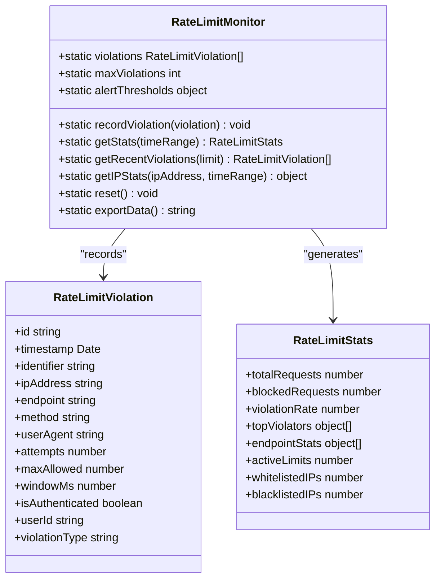
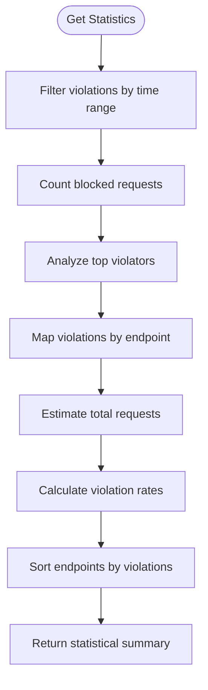
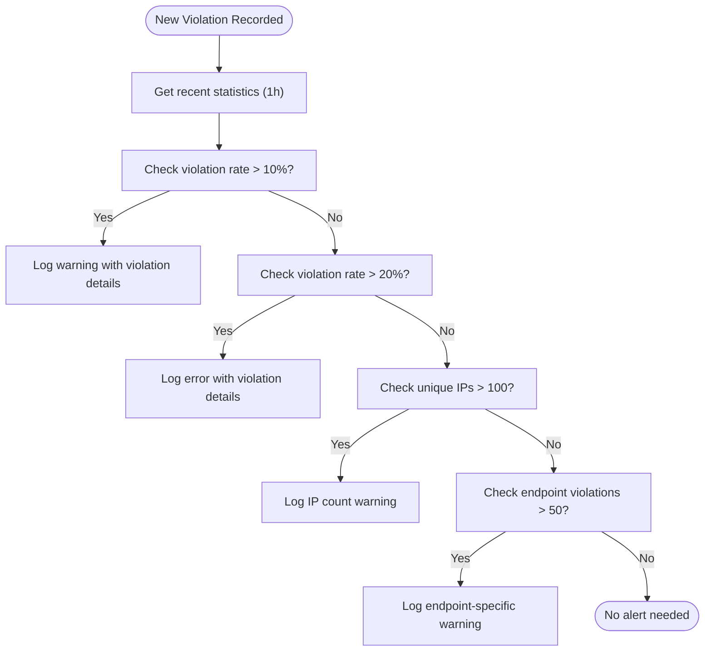
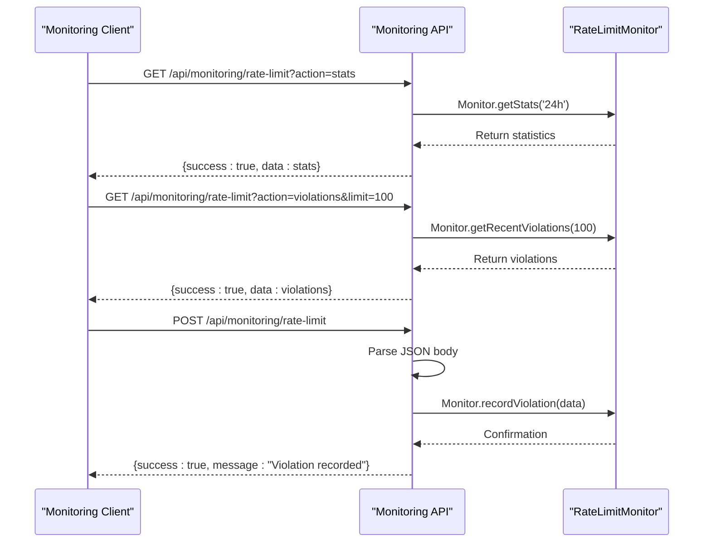

# Violation Tracking and Monitoring

<cite>
**Referenced Files in This Document**   
- [rate-limit-monitor.ts](file://src/lib/rate-limit-monitor.ts)
- [route.ts](file://src/app/api/monitoring/rate-limit/route.ts)
- [security.ts](file://src/lib/security.ts)
- [rate-limit-config.ts](file://src/lib/rate-limit-config.ts)
</cite>

## Table of Contents

1. [Introduction](#introduction)
2. [RateLimitViolation Interface Structure](#ratelimitviolation-interface-structure)
3. [RateLimitMonitor Class Implementation](#ratelimitmonitor-class-implementation)
4. [Data Storage and Retention](#data-storage-and-retention)
5. [Real-time Statistics Generation](#real-time-statistics-generation)
6. [Alerting System](#alerting-system)
7. [Monitoring API Endpoints](#monitoring-api-endpoints)
8. [Data Export and Security Analysis](#data-export-and-security-analysis)
9. [Monitoring Dashboards and Incident Response](#monitoring-dashboards-and-incident-response)

## Introduction

The Kafkasder-panel system implements a comprehensive rate limit violation tracking and monitoring framework to detect, analyze, and respond to abusive API usage patterns. This documentation details the RateLimitMonitor class and associated components that record and analyze rate limit violations across the system. The monitoring infrastructure captures detailed violation data including timestamp, IP address, endpoint, HTTP method, and violation type, providing security teams with actionable insights into potential abuse patterns. The system is designed to maintain real-time statistics on violation rates, identify top violators, and detect endpoint-specific abuse patterns while implementing automated alerting when predefined thresholds are exceeded.

**Section sources**

- [rate-limit-monitor.ts](file://src/lib/rate-limit-monitor.ts#L1-L40)

## RateLimitViolation Interface Structure

The RateLimitViolation interface defines the structure of violation records captured by the monitoring system. Each violation record contains comprehensive metadata that enables detailed analysis of abuse patterns. The interface includes the following properties:

- **id**: Unique identifier for the violation (UUID)
- **timestamp**: Date and time when the violation occurred
- **identifier**: Composite identifier combining IP address and user context
- **ipAddress**: Client IP address that triggered the violation
- **endpoint**: API endpoint that was accessed
- **method**: HTTP method used (GET, POST, PUT, DELETE, etc.)
- **userAgent**: Client user agent string
- **attempts**: Number of requests made within the rate limit window
- **maxAllowed**: Maximum allowed requests for the rate limit window
- **windowMs**: Duration of the rate limit window in milliseconds
- **isAuthenticated**: Boolean indicating if the request was authenticated
- **userId**: Optional user ID if the request was authenticated
- **violationType**: Enum indicating the type of violation with three possible values:
  - `limit_exceeded`: Standard rate limit exceeded
  - `blacklisted_ip`: Request from a blacklisted IP address
  - `too_many_violations`: Excessive violation patterns from the same source

This comprehensive structure enables security analysts to distinguish between different types of abuse patterns and implement targeted mitigation strategies.

**Section sources**

- [rate-limit-monitor.ts](file://src/lib/rate-limit-monitor.ts#L5-L19)

## RateLimitMonitor Class Implementation

The RateLimitMonitor class serves as the central component for tracking and analyzing rate limit violations across the Kafkasder-panel system. Implemented as a static class with singleton-like behavior, it provides methods for recording violations, generating statistics, and triggering alerts. The class maintains an in-memory collection of violation records and exposes several key methods for monitoring operations.

The core functionality is implemented through the `recordViolation` method, which accepts violation data (excluding the auto-generated id and timestamp) and creates a complete violation record. The method automatically generates a UUID and captures the current timestamp before storing the violation. After recording, the method checks alert thresholds and logs the violation at the warning level with detailed context.

The class also provides statistical analysis methods that aggregate violation data across different dimensions. The `getStats` method returns comprehensive statistics including total requests, blocked requests, violation rate, top violators, and endpoint-specific abuse patterns. These statistics can be filtered by time range (1h, 24h, 7d, or 30d) to analyze trends over different periods.

**Diagram sources**

- [rate-limit-monitor.ts](file://src/lib/rate-limit-monitor.ts#L41-L301)

**Section sources**

- [rate-limit-monitor.ts](file://src/lib/rate-limit-monitor.ts#L41-L80)

## Data Storage and Retention

The rate limit monitoring system implements a circular buffer approach to manage violation data storage with bounded memory usage. The system maintains a maximum of 10,000 violation records, ensuring that the monitoring infrastructure does not consume excessive memory resources while preserving recent abuse patterns for analysis.

When a new violation is recorded, it is appended to the end of the violations array. If the array exceeds the maximum capacity of 10,000 records, the oldest violations are automatically removed using the slice operation to maintain the size limit. This approach ensures that the most recent violation data is always available for analysis while preventing unbounded growth of the data store.

The retention strategy prioritizes recency over completeness, as recent abuse patterns are typically more relevant for security analysis and incident response. The system does not implement persistent storage of violation records, relying instead on the ability to export data on demand. This design choice balances the need for detailed monitoring with performance considerations and storage efficiency.

**Section sources**

- [rate-limit-monitor.ts](file://src/lib/rate-limit-monitor.ts#L60-L64)

## Real-time Statistics Generation

The monitoring system generates real-time statistics on violation rates, top violators, and endpoint-specific abuse patterns through the `getStats` method. This method analyzes violations within a specified time range (1 hour, 24 hours, 7 days, or 30 days) and returns a comprehensive statistical summary.

The statistics include several key metrics:

- **Total requests**: Estimated total number of requests during the time period
- **Blocked requests**: Number of requests that triggered rate limit violations
- **Violation rate**: Percentage of requests that were blocked
- **Top violators**: List of the top 10 identifiers with the most violations
- **Endpoint statistics**: Breakdown of violations by endpoint with request counts and violation rates

For endpoint analysis, the system creates a map of endpoints to their violation counts and estimates total requests based on violation patterns. The endpoint statistics are sorted by violation count in descending order to highlight the most abused endpoints. The top violators list includes the identifier, violation count, and timestamp of the last violation, enabling security teams to prioritize investigation of the most active abuse sources.

**Diagram sources**

- [rate-limit-monitor.ts](file://src/lib/rate-limit-monitor.ts#L82-L159)

**Section sources**

- [rate-limit-monitor.ts](file://src/lib/rate-limit-monitor.ts#L82-L159)

## Alerting System

The monitoring system implements an automated alerting mechanism that triggers warnings when violation thresholds are exceeded. The alerting system evaluates three primary thresholds:

- **Violation rate threshold**: 10% violation rate (configurable via `alertThresholds.violationRate`)
- **IP count threshold**: 100 violating IP addresses per hour (configurable via `alertThresholds.ipsPerHour`)
- **Endpoint threshold**: 50 violations per endpoint (configurable via `alertThresholds.endpointThreshold`)

The alerting logic is executed whenever a new violation is recorded, ensuring real-time detection of emerging abuse patterns. When the violation rate exceeds 10%, the system logs a warning. If the rate exceeds 20%, it logs an error to indicate a more severe situation. When more than 100 unique IP addresses trigger violations within an hour, a warning is logged to indicate distributed abuse. Similarly, when a specific endpoint experiences more than 50 violations, a warning is generated to highlight endpoint-specific targeting.

The alerting system integrates with the application's logging infrastructure, ensuring that alerts are captured in the central logging system for monitoring and analysis. This enables security teams to set up external alerting based on log patterns and integrate with incident response workflows.

**Diagram sources**

- [rate-limit-monitor.ts](file://src/lib/rate-limit-monitor.ts#L208-L255)

**Section sources**

- [rate-limit-monitor.ts](file://src/lib/rate-limit-monitor.ts#L208-L255)

## Monitoring API Endpoints

The system exposes a dedicated monitoring API at `/api/monitoring/rate-limit` that provides access to violation data and monitoring functions. The API supports both GET and POST methods with different actions controlled by query parameters and request body.

The GET endpoint supports the following actions:

- **stats**: Retrieve overall statistics with optional time range filtering
- **violations**: Get recent violations with configurable limit
- **ip-stats**: Get IP-specific statistics with time range filtering
- **export**: Export all monitoring data as a JSON file
- **reset**: Reset monitoring data (admin only with Bearer token authentication)

The POST endpoint supports additional actions:

- **record-violation**: Manually record a violation (for testing purposes)
- **bulk-export**: Perform bulk export of monitoring data

The API implements proper error handling and returns structured JSON responses with success status, data, and timestamps. The reset action requires administrative authentication via Bearer token in the Authorization header, ensuring that only authorized personnel can clear monitoring data.

**Diagram sources**

- [route.ts](file://src/app/api/monitoring/rate-limit/route.ts#L26-L138)
- [route.ts](file://src/app/api/monitoring/rate-limit/route.ts#L144-L194)

**Section sources**

- [route.ts](file://src/app/api/monitoring/rate-limit/route.ts#L26-L194)

## Data Export and Security Analysis

The monitoring system provides robust data export capabilities to support security analysis and incident investigation. The `exportData` method generates a comprehensive JSON export containing all current violation records, statistical summaries, and metadata. The exported data includes:

- Complete list of violation records with all properties
- Current statistical summary from `getStats`
- Export timestamp in ISO format

The export functionality is accessible through both the `export` action on the GET endpoint and the `bulk-export` action on the POST endpoint. The exported data is formatted as a downloadable JSON file with appropriate content headers, making it easy to save and analyze offline. This capability enables security teams to perform in-depth analysis of abuse patterns, generate reports for compliance purposes, and share data with external security partners.

The system also supports manual violation recording through the POST API, which can be used for testing alerting configurations or simulating abuse scenarios during security exercises. This feature allows security teams to validate monitoring and alerting workflows without requiring actual abuse events.

**Section sources**

- [rate-limit-monitor.ts](file://src/lib/rate-limit-monitor.ts#L290-L301)
- [route.ts](file://src/app/api/monitoring/rate-limit/route.ts#L80-L86)
- [route.ts](file://src/app/api/monitoring/rate-limit/route.ts#L162-L170)

## Monitoring Dashboards and Incident Response

The rate limit monitoring system is designed to integrate with monitoring dashboards and incident response workflows. The comprehensive statistics and real-time alerts provide the foundation for effective security monitoring. Monitoring dashboards can consume data from the monitoring API to visualize violation trends, display top violators, and highlight abused endpoints.

For incident response, the system provides several key capabilities:

- Real-time alerts for emerging abuse patterns
- Detailed violation records for forensic analysis
- IP-specific statistics to identify compromised hosts
- Endpoint abuse patterns to prioritize mitigation efforts

When responding to abuse incidents, security teams can use the monitoring data to:

1. Identify the scope and scale of the abuse
2. Determine the targeted endpoints and attack patterns
3. Assess the effectiveness of current rate limiting rules
4. Update IP whitelists and blacklists as needed
5. Adjust rate limit thresholds for specific endpoints

The system's design supports both automated responses (through alert integration) and manual investigation (through data export and API access), providing a comprehensive toolkit for maintaining system security and availability.

**Section sources**

- [rate-limit-monitor.ts](file://src/lib/rate-limit-monitor.ts#L1-L301)
- [route.ts](file://src/app/api/monitoring/rate-limit/route.ts#L1-L196)
- [security.ts](file://src/lib/security.ts#L78-L280)
- [rate-limit-config.ts](file://src/lib/rate-limit-config.ts#L22-L194)
