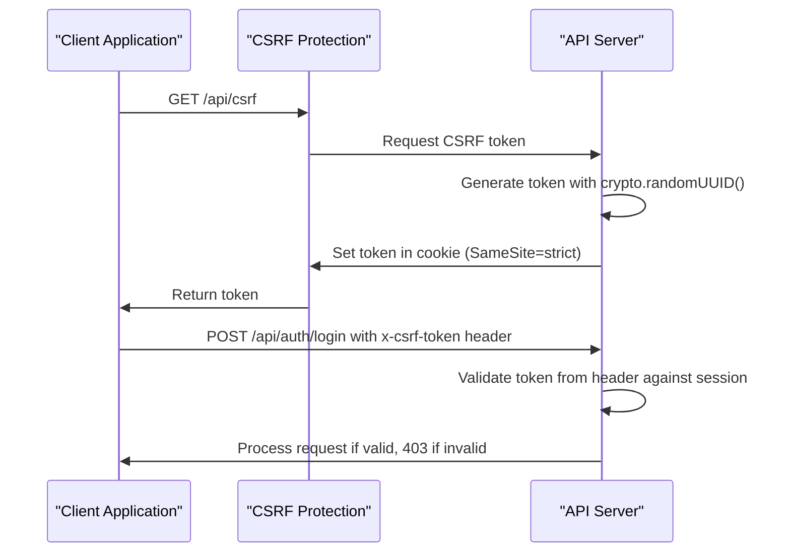
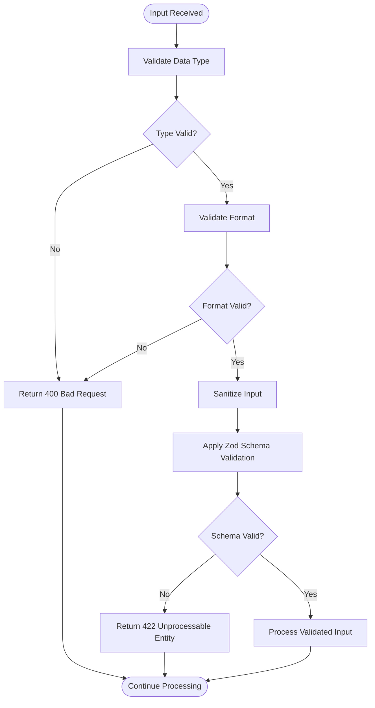
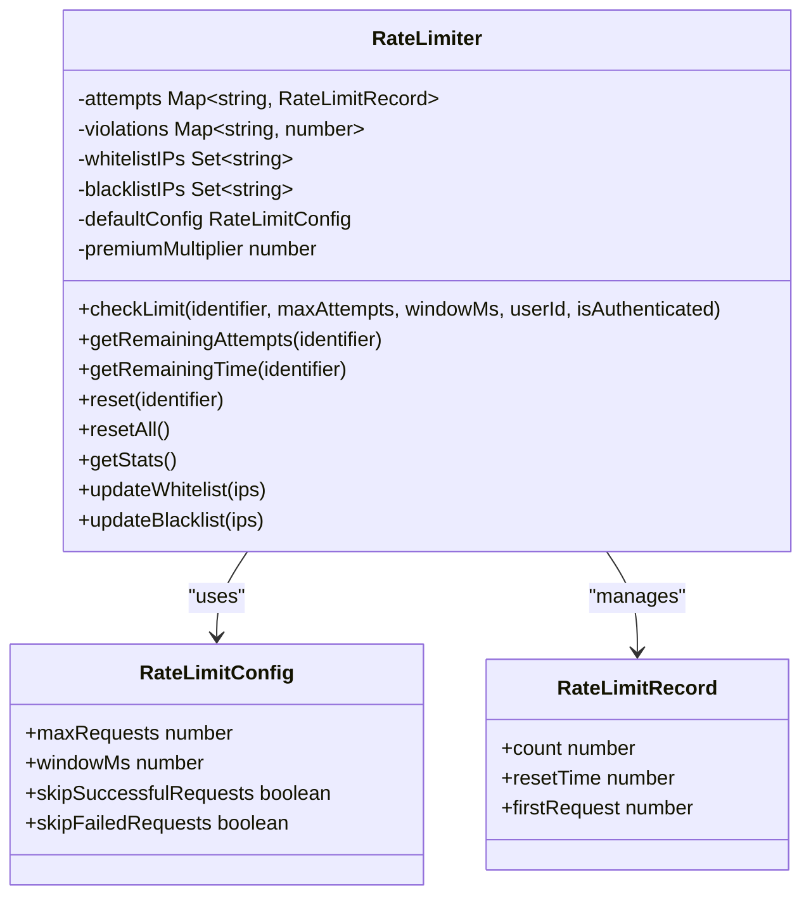
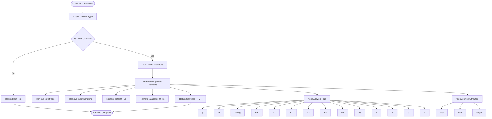
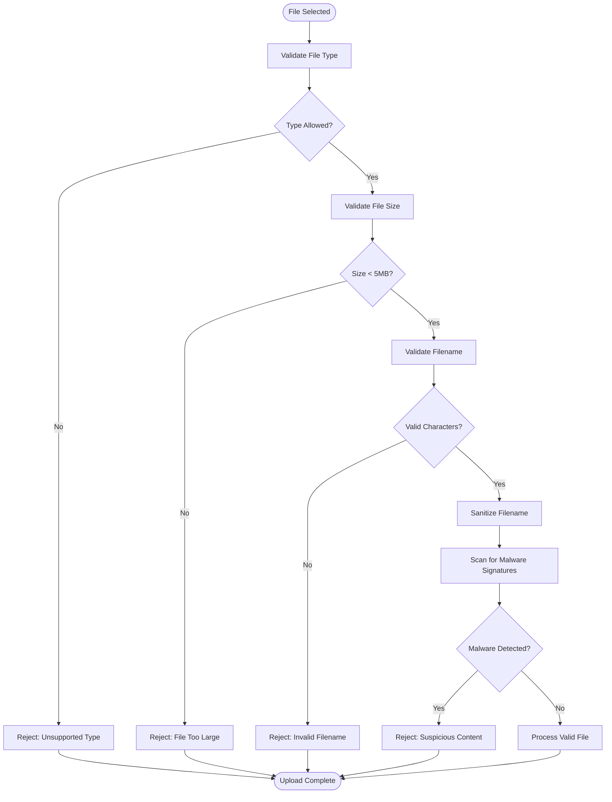
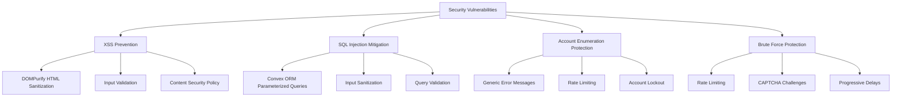
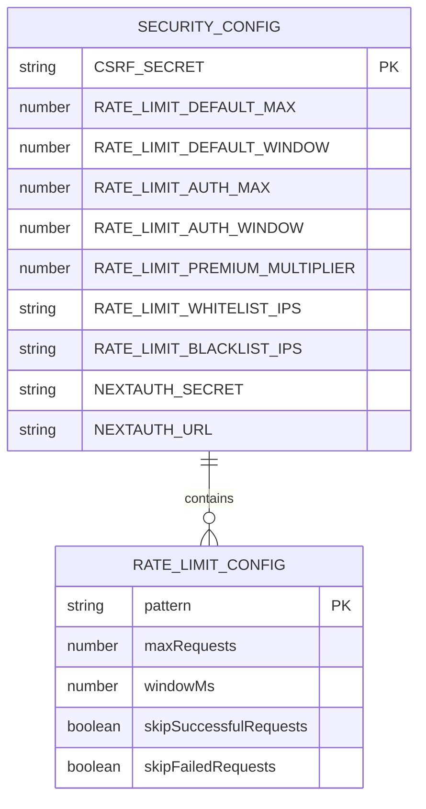
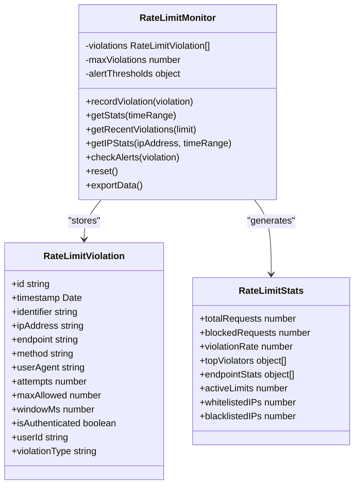

# Security Best Practices

<cite>
**Referenced Files in This Document**   
- [csrf.ts](file://src/lib/csrf.ts)
- [security.ts](file://src/lib/security.ts)
- [rate-limit.ts](file://src/lib/rate-limit.ts)
- [rate-limit-config.ts](file://src/lib/rate-limit-config.ts)
- [rate-limit-monitor.ts](file://src/lib/rate-limit-monitor.ts)
- [sanitization.ts](file://src/lib/sanitization.ts)
- [file-upload.tsx](file://src/components/ui/file-upload.tsx)
- [auth.ts](file://convex/auth.ts)
- [security_audit.ts](file://convex/security_audit.ts)
- [ENVIRONMENT.md](file://docs/ENVIRONMENT.md)
</cite>

## Table of Contents

1. [Introduction](#introduction)
2. [CSRF Protection Mechanism](#csrf-protection-mechanism)
3. [Input Validation with Zod Schemas](#input-validation-with-zod-schemas)
4. [Rate Limiting Implementation](#rate-limiting-implementation)
5. [HTML Sanitization with DOMPurify](#html-sanitization-with-dompurify)
6. [File Upload Security Measures](#file-upload-security-measures)
7. [Common Security Vulnerabilities](#common-security-vulnerabilities)
8. [Security Configuration Options](#security-configuration-options)
9. [Security Event Monitoring](#security-event-monitoring)
10. [Conclusion](#conclusion)

## Introduction

Kafkasder-panel implements a comprehensive security framework to protect against common web application vulnerabilities. The system employs multiple layers of defense including CSRF protection, input validation, rate limiting, and file upload security. This document details the implementation of these security measures, focusing on the CSRFProtection class, rate limiting mechanisms, DOMPurify integration for HTML sanitization, and file upload security protocols. The architecture leverages environment variables for configurable security parameters and includes monitoring capabilities for security events.

**Section sources**

- [security.ts](file://src/lib/security.ts#L1-L507)
- [ENVIRONMENT.md](file://docs/ENVIRONMENT.md#L1-L267)

## CSRF Protection Mechanism

The CSRF protection mechanism in Kafkasder-panel uses token-based validation to prevent cross-site request forgery attacks. The system generates cryptographically secure tokens that must be included in state-changing requests. The implementation includes both server-side token generation and client-side token management.

The CSRF token is generated using Node.js's crypto module with a 32-character hexadecimal string, ensuring sufficient entropy for security. Tokens are stored in HTTP-only cookies with strict SameSite policies to prevent unauthorized access. When a client makes a request to a protected endpoint, the system validates that the token in the request header matches the token in the session.

**Diagram sources**

- [csrf.ts](file://src/lib/csrf.ts#L1-L90)
- [security.ts](file://src/lib/security.ts#L423-L432)

**Section sources**

- [csrf.ts](file://src/lib/csrf.ts#L1-L90)
- [security.ts](file://src/lib/security.ts#L423-L432)
- [app/api/csrf/route.ts](file://src/app/api/csrf/route.ts#L1-L43)

## Input Validation with Zod Schemas

While the codebase does not explicitly show Zod schema implementations, it employs comprehensive input validation across API routes using a combination of custom validation functions and schema-based approaches. The validation system ensures that all user inputs are properly sanitized and conform to expected formats before processing.

The input validation framework includes specific validators for different data types such as email addresses, phone numbers, and Turkish ID numbers (TC Kimlik No). These validators use regular expressions and algorithmic checks to ensure data integrity and prevent injection attacks. For example, email validation confirms proper format with a regex pattern, while TC Kimlik No validation implements the official Turkish government algorithm to verify authenticity.

**Diagram sources**

- [security.ts](file://src/lib/security.ts#L36-L55)
- [sanitization.ts](file://src/lib/sanitization.ts#L82-L161)

**Section sources**

- [security.ts](file://src/lib/security.ts#L36-L55)
- [sanitization.ts](file://src/lib/sanitization.ts#L82-L161)

## Rate Limiting Implementation

The rate limiting system in Kafkasder-panel is implemented through the RateLimiter class, which provides protection against brute force attacks and denial-of-service attempts. The implementation uses an in-memory store to track request counts and employs a sliding window algorithm to enforce rate limits.

The RateLimiter class supports configurable limits via environment variables, allowing different thresholds for various endpoint types. Authentication endpoints have stricter limits (10 requests per 10 minutes) compared to read-only endpoints (200 requests per 15 minutes). The system also differentiates between authenticated and unauthenticated users, providing higher limits for authenticated sessions.

**Diagram sources**

- [security.ts](file://src/lib/security.ts#L77-L279)
- [rate-limit.ts](file://src/lib/rate-limit.ts#L1-L148)

**Section sources**

- [security.ts](file://src/lib/security.ts#L77-L279)
- [rate-limit.ts](file://src/lib/rate-limit.ts#L1-L148)
- [rate-limit-config.ts](file://src/lib/rate-limit-config.ts#L1-L195)
- [security_audit.ts](file://convex/security_audit.ts#L162-L196)

## HTML Sanitization with DOMPurify

Kafkasder-panel uses DOMPurify for HTML sanitization to prevent cross-site scripting (XSS) attacks. The implementation includes both synchronous and asynchronous versions of the sanitization functions to accommodate different runtime environments, including server-side rendering.

The sanitization process removes potentially dangerous HTML elements and attributes while preserving allowed content. The configuration permits basic formatting tags like paragraphs, headings, and emphasis elements, but strips out script tags, event handlers, and other executable content. This approach allows rich text input while maintaining security.

**Diagram sources**

- [sanitization.ts](file://src/lib/sanitization.ts#L21-L47)
- [security.ts](file://src/lib/security.ts#L14-L21)

**Section sources**

- [sanitization.ts](file://src/lib/sanitization.ts#L21-L47)
- [security.ts](file://src/lib/security.ts#L14-L21)

## File Upload Security Measures

The file upload security system in Kafkasder-panel implements multiple layers of protection to prevent malicious file uploads. The implementation includes type validation, size limits, filename sanitization, and basic malware scanning.

Files are validated against a whitelist of allowed MIME types including JPEG, PNG, PDF, and plain text. The system enforces a 5MB size limit and validates filenames to prevent path traversal attacks by rejecting names containing "../" sequences. Filenames are sanitized by replacing special characters with underscores and removing leading dots.

**Diagram sources**

- [security.ts](file://src/lib/security.ts#L282-L350)
- [file-upload.tsx](file://src/components/ui/file-upload.tsx#L117-L146)

**Section sources**

- [security.ts](file://src/lib/security.ts#L282-L350)
- [sanitization.ts](file://src/lib/sanitization.ts#L196-L204)
- [file-upload.tsx](file://src/components/ui/file-upload.tsx#L117-L146)

## Common Security Vulnerabilities

Kafkasder-panel addresses several common security vulnerabilities through its architecture and implementation. While SQL injection is mitigated by the Convex ORM which uses parameterized queries, the system implements additional protections against XSS, account enumeration, and other threats.

For XSS prevention, the system uses DOMPurify for HTML sanitization and implements proper output encoding. Account enumeration attacks are prevented by using generic error messages for authentication failures, ensuring that attackers cannot distinguish between valid and invalid usernames. The rate limiting system also helps prevent brute force attacks on authentication endpoints.

**Diagram sources**

- [security.ts](file://src/lib/security.ts#L58-L61)
- [auth.ts](file://convex/auth.ts)
- [rate-limit.ts](file://src/lib/rate-limit.ts#L92-L100)

**Section sources**

- [security.ts](file://src/lib/security.ts#L58-L61)
- [auth.ts](file://convex/auth.ts)
- [rate-limit.ts](file://src/lib/rate-limit.ts#L92-L100)

## Security Configuration Options

The security parameters in Kafkasder-panel are configurable through environment variables, allowing administrators to adjust settings based on deployment requirements. The system uses environment variables for CSRF secrets, rate limiting thresholds, and IP-based whitelisting/blacklisting.

Key configuration options include RATE_LIMIT_DEFAULT_MAX for default request limits, RATE_LIMIT_AUTH_MAX for authentication endpoint limits, and RATE_LIMIT_WHITELIST_IPS for trusted IP addresses that bypass rate limiting. The CSRF_SECRET environment variable provides the cryptographic secret for CSRF token generation.

**Diagram sources**

- [ENVIRONMENT.md](file://docs/ENVIRONMENT.md#L46-L55)
- [security.ts](file://src/lib/security.ts#L89-L97)

**Section sources**

- [ENVIRONMENT.md](file://docs/ENVIRONMENT.md#L46-L55)
- [security.ts](file://src/lib/security.ts#L89-L97)

## Security Event Monitoring

Kafkasder-panel includes comprehensive monitoring capabilities for security events through the RateLimitMonitor class and audit logging system. The monitoring framework tracks rate limit violations, suspicious activities, and security-related events, providing visibility into potential threats.

The RateLimitMonitor class maintains statistics on violations, tracks top offending IP addresses, and monitors endpoint-specific traffic patterns. It includes alert thresholds for high violation rates, excessive IPs from different locations, and endpoint-specific violation counts. The system logs all security events with timestamps, IP addresses, and user agents for forensic analysis.

**Diagram sources**

- [rate-limit-monitor.ts](file://src/lib/rate-limit-monitor.ts#L1-L303)
- [security_audit.ts](file://convex/security_audit.ts#L1-L38)

**Section sources**

- [rate-limit-monitor.ts](file://src/lib/rate-limit-monitor.ts#L1-L303)
- [security_audit.ts](file://convex/security_audit.ts#L1-L38)

## Conclusion

Kafkasder-panel implements a robust security framework that addresses multiple attack vectors through layered defenses. The system combines CSRF protection, comprehensive input validation, rate limiting, and file upload security to create a secure environment for users. By leveraging environment variables for configuration and implementing detailed monitoring, the application provides both strong security and operational visibility. The architecture demonstrates best practices in web application security, balancing protection with usability.
