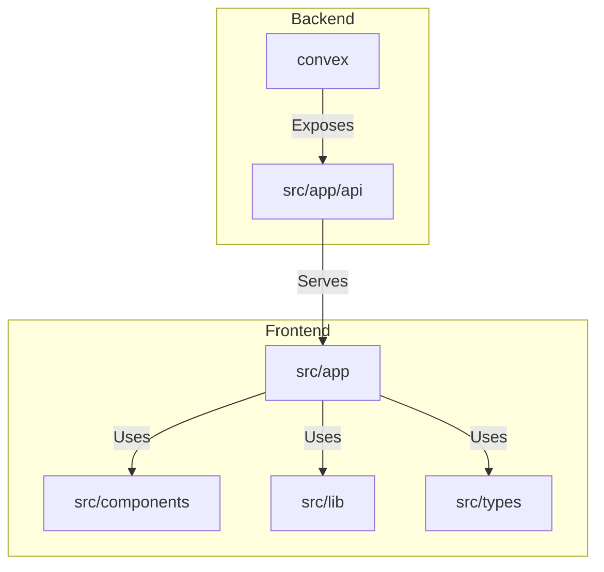
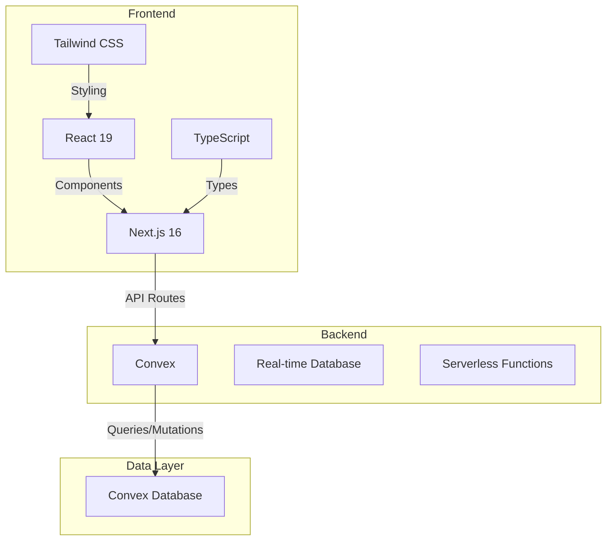
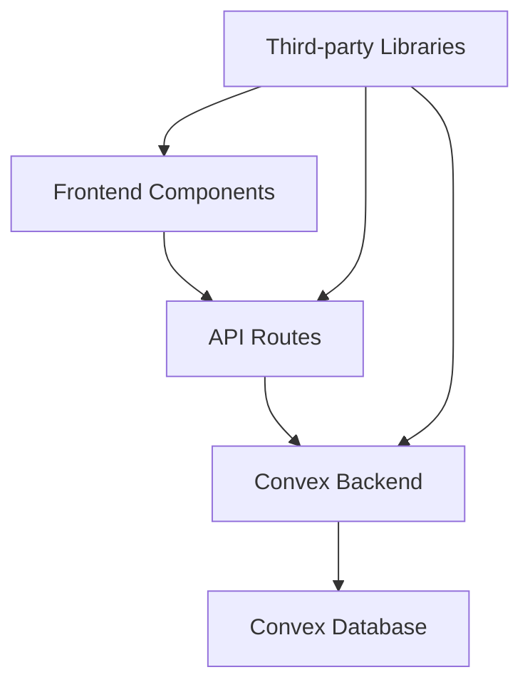

# System Overview

<cite>
**Referenced Files in This Document**   
- [README.md](file://README.md)
- [schema.ts](file://convex/schema.ts)
- [beneficiaries.ts](file://convex/beneficiaries.ts)
- [donations.ts](file://convex/donations.ts)
- [scholarships.ts](file://convex/scholarships.ts)
- [reports.ts](file://convex/reports.ts)
- [client.ts](file://src/lib/convex/client.ts)
- [server.ts](file://src/lib/convex/server.ts)
- [api.ts](file://src/lib/convex/api.ts)
- [beneficiary.ts](file://src/types/beneficiary.ts)
- [scholarship.ts](file://src/types/scholarship.ts)
- [database.ts](file://src/types/database.ts)
- [beneficiaries/route.ts](file://src/app/api/beneficiaries/route.ts)
- [donations/route.ts](file://src/app/api/donations/route.ts)
- [scholarships/route.ts](file://src/app/api/scholarships/route.ts)
- [reports/page.tsx](file://src/app/(dashboard)/fon/raporlar/page.tsx)
- [beneficiaries/page.tsx](file://src/app/(dashboard)/yardim/ihtiyac-sahipleri/page.tsx)
- [donations/page.tsx](file://src/app/(dashboard)/bagis/liste/page.tsx)
- [scholarships/page.tsx](file://src/app/(dashboard)/burs/ogrenciler/page.tsx)
</cite>

## Table of Contents

1. [Introduction](#introduction)
2. [Project Structure](#project-structure)
3. [Core Components](#core-components)
4. [Architecture Overview](#architecture-overview)
5. [Detailed Component Analysis](#detailed-component-analysis)
6. [Dependency Analysis](#dependency-analysis)
7. [Performance Considerations](#performance-considerations)
8. [Troubleshooting Guide](#troubleshooting-guide)
9. [Conclusion](#conclusion)

## Introduction

The Kafkasder-panel is a professional non-profit association management system designed for aid associations, foundations, and NGOs. It provides a comprehensive platform for managing beneficiaries, tracking donations, administering scholarships, generating financial reports, and streamlining organizational workflows. Built as a full-stack Next.js 16 and Convex application, the system offers real-time capabilities for efficient and collaborative management of non-profit operations.

**Section sources**

- [README.md](file://README.md#L1-L179)

## Project Structure

The Kafkasder-panel project follows a standard Next.js 16 App Router structure with a clear separation of concerns. The core application logic resides in the `src/app` directory, which contains the dashboard pages organized by functional modules such as beneficiary management, donation tracking, scholarship administration, and financial reporting. The `convex` directory houses the backend logic, including data models, queries, and mutations that interact with the Convex real-time database. The `src/lib` directory contains utility functions, API clients, and configuration files, while the `src/components` directory holds reusable UI components.



**Diagram sources**

- [src/app](file://src/app)
- [convex](file://convex)
- [src/lib](file://src/lib)
- [src/components](file://src/components)

**Section sources**

- [src/app](file://src/app)
- [convex](file://convex)
- [src/lib](file://src/lib)
- [src/components](file://src/components)

## Core Components

The Kafkasder-panel system is built around several core components that handle the primary functions of a non-profit organization. These include beneficiary management, donation tracking, scholarship administration, financial reporting, and organizational workflows. Each component is implemented as a collection in the Convex database and is accessible through dedicated API routes in the Next.js application. The frontend components are designed to provide a user-friendly interface for interacting with these core functionalities.

**Section sources**

- [README.md](file://README.md#L15-L23)
- [schema.ts](file://convex/schema.ts#L43-L800)

## Architecture Overview

The Kafkasder-panel application follows a full-stack Next.js 16 and Convex architecture. The frontend is built using React 19 and TypeScript, with Tailwind CSS for styling. The backend is powered by Convex, which provides a real-time database and serverless functions. The application uses a modular architecture with clear separation between the frontend, backend, and data layers. The frontend components communicate with the backend through API routes, which in turn interact with the Convex database using queries and mutations.



**Diagram sources**

- [README.md](file://README.md#L32-L35)
- [schema.ts](file://convex/schema.ts)
- [client.ts](file://src/lib/convex/client.ts)
- [server.ts](file://src/lib/convex/server.ts)

## Detailed Component Analysis

### Beneficiary Management

The beneficiary management module is a core component of the Kafkasder-panel system. It allows organizations to manage detailed information about aid recipients, including personal details, family size, income level, and health status. The module supports various operations such as creating, updating, and deleting beneficiary records, as well as searching and filtering beneficiaries based on different criteria. The data model for beneficiaries is defined in the `beneficiaries` collection in the Convex schema, and the API routes for managing beneficiaries are implemented in the `src/app/api/beneficiaries` directory.

```mermaid
classDiagram
class BeneficiaryDocument {
+string name
+string tc_no
+string phone
+string email
+string address
+string city
+string district
+string neighborhood
+number family_size
+string status
+string priority
+string aid_type
+number totalAidAmount
+string aid_duration
+string application_source
+string notes
+boolean previous_aid
+boolean other_organization_aid
+boolean emergency
+string contact_preference
+string approval_status
+string approved_by
+string approved_at
}
BeneficiaryDocument -->|Indexed by| BeneficiaryIndex
class BeneficiaryIndex {
+string by_tc_no
+string by_status
+string by_city
+string by_search
}
```

**Diagram sources**

- [schema.ts](file://convex/schema.ts#L43-L162)
- [beneficiaries/route.ts](file://src/app/api/beneficiaries/route.ts)
- [beneficiaries/page.tsx](<file://src/app/(dashboard)/yardim/ihtiyac-sahipleri/page.tsx>)

**Section sources**

- [schema.ts](file://convex/schema.ts#L43-L162)
- [beneficiaries/route.ts](file://src/app/api/beneficiaries/route.ts)
- [beneficiaries/page.tsx](<file://src/app/(dashboard)/yardim/ihtiyac-sahipleri/page.tsx>)

### Donation Tracking

The donation tracking module enables organizations to record and manage incoming donations from various sources. It supports both standard donations and Kumbara (money box) donations, with detailed information about the donor, donation amount, currency, payment method, and donation purpose. The module also includes features for generating donation reports and tracking the status of donations. The data model for donations is defined in the `donations` collection in the Convex schema, and the API routes for managing donations are implemented in the `src/app/api/donations` directory.

```mermaid
classDiagram
class DonationDocument {
+string donor_name
+string donor_phone
+string donor_email
+number amount
+string currency
+string donation_type
+string payment_method
+string donation_purpose
+string notes
+string receipt_number
+string receipt_file_id
+string status
+boolean is_kumbara
+string kumbara_location
+string collection_date
+string kumbara_institution
+object location_coordinates
+string location_address
+object[] route_points
+number route_distance
+number route_duration
}
DonationDocument -->|Indexed by| DonationIndex
class DonationIndex {
+string by_status
+string by_donor_email
+string by_receipt_number
+string by_is_kumbara
+string by_kumbara_location
}
```

**Diagram sources**

- [schema.ts](file://convex/schema.ts#L163-L216)
- [donations/route.ts](file://src/app/api/donations/route.ts)
- [donations/page.tsx](<file://src/app/(dashboard)/bagis/liste/page.tsx>)

**Section sources**

- [schema.ts](file://convex/schema.ts#L163-L216)
- [donations/route.ts](file://src/app/api/donations/route.ts)
- [donations/page.tsx](<file://src/app/(dashboard)/bagis/liste/page.tsx>)

### Scholarship Administration

The scholarship administration module is designed to manage scholarship programs and applications. It allows organizations to create and manage scholarship programs, track applications from students, and monitor the status of scholarships. The module supports various types of scholarships, including academic, need-based, orphan, and special needs scholarships. The data model for scholarships is defined in the `scholarships` and `scholarship_applications` collections in the Convex schema, and the API routes for managing scholarships are implemented in the `src/app/api/scholarships` directory.

```mermaid
classDiagram
class ScholarshipDocument {
+string title
+string description
+number amount
+string currency
+number duration_months
+string category
+string eligibility_criteria
+string[] requirements
+string application_start_date
+string application_end_date
+string academic_year
+number max_recipients
+boolean is_active
+string created_by
+string created_at
}
class ScholarshipApplicationDocument {
+string scholarship_id
+string student_id
+string created_by
+string applicant_name
+string applicant_tc_no
+string applicant_phone
+string applicant_email
+string applicant_address
+string applicant_city
+string applicant_district
+string applicant_neighborhood
+number applicant_family_size
+string applicant_income_level
+string applicant_education_level
+string applicant_occupation
+string applicant_employment_status
+string applicant_health_status
+boolean applicant_has_chronic_illness
+string applicant_chronic_illness_detail
+boolean applicant_has_disability
+string applicant_disability_detail
+boolean applicant_has_health_insurance
+string applicant_regular_medication
+string applicant_notes
+string status
+number priority_score
+string reviewer_notes
+string submitted_at
+string reviewed_by
+string reviewed_at
+string[] documents
+string created_at
}
ScholarshipDocument --> ScholarshipApplicationDocument : "has"
ScholarshipDocument -->|Indexed by| ScholarshipIndex
class ScholarshipIndex {
+string by_category
+string by_is_active
+string by_application_dates
}
ScholarshipApplicationDocument -->|Indexed by| ScholarshipApplicationIndex
class ScholarshipApplicationIndex {
+string by_scholarship
+string by_status
+string by_tc_no
+string by_submitted_at
}
```

**Diagram sources**

- [schema.ts](file://convex/schema.ts#L1007-L1096)
- [scholarships/route.ts](file://src/app/api/scholarships/route.ts)
- [scholarships/page.tsx](<file://src/app/(dashboard)/burs/ogrenciler/page.tsx>)

**Section sources**

- [schema.ts](file://convex/schema.ts#L1007-L1096)
- [scholarships/route.ts](file://src/app/api/scholarships/route.ts)
- [scholarships/page.tsx](<file://src/app/(dashboard)/burs/ogrenciler/page.tsx>)

### Financial Reporting

The financial reporting module provides tools for generating detailed financial reports and analyzing financial data. It supports various types of reports, including income and expense reports, donation reports, and operational reports. The module allows users to filter and aggregate financial data based on different criteria, such as date range, category, and status. The data model for financial records is defined in the `finance_records` collection in the Convex schema, and the API routes for generating reports are implemented in the `src/app/api/reports` directory.

```mermaid
classDiagram
class FinanceRecordDocument {
+string record_type
+string category
+number amount
+string currency
+string description
+string transaction_date
+string payment_method
+string receipt_number
+string receipt_file_id
+string related_to
+string created_by
+string approved_by
+string status
}
FinanceRecordDocument -->|Indexed by| FinanceRecordIndex
class FinanceRecordIndex {
+string by_record_type
+string by_status
+string by_created_by
}
```

**Diagram sources**

- [schema.ts](file://convex/schema.ts#L543-L577)
- [reports/page.tsx](<file://src/app/(dashboard)/fon/raporlar/page.tsx>)

**Section sources**

- [schema.ts](file://convex/schema.ts#L543-L577)
- [reports/page.tsx](<file://src/app/(dashboard)/fon/raporlar/page.tsx>)

## Dependency Analysis

The Kafkasder-panel system has a well-defined dependency structure that ensures modularity and maintainability. The frontend components depend on the API routes for data, which in turn depend on the Convex backend for data storage and retrieval. The Convex backend is responsible for defining the data models and implementing the business logic through queries and mutations. The system also uses various third-party libraries and tools, such as Next.js for the frontend framework, Convex for the backend, and Tailwind CSS for styling.



**Diagram sources**

- [package.json](file://package.json)
- [next.config.ts](file://next.config.ts)
- [tailwind.config.js](file://tailwind.config.js)

**Section sources**

- [package.json](file://package.json)
- [next.config.ts](file://next.config.ts)
- [tailwind.config.js](file://tailwind.config.js)

## Performance Considerations

The Kafkasder-panel system is designed with performance in mind. The use of Convex as a real-time database ensures that data is synchronized across clients efficiently. The frontend components are optimized for performance using React's built-in optimization techniques, such as memoization and lazy loading. The API routes are designed to minimize the number of database queries and to cache responses when appropriate. The system also includes features for monitoring performance, such as Web Vitals tracking and rate limiting.

**Section sources**

- [README.md](file://README.md#L27-L28)
- [web-vitals.ts](file://src/lib/performance/web-vitals.ts)
- [rate-limit.ts](file://src/lib/rate-limit.ts)

## Troubleshooting Guide

The Kafkasder-panel system includes various features for troubleshooting and debugging issues. The system logs errors and security events to the `security_events` collection in the Convex database, which can be accessed through the admin interface. The system also includes a rate limiting mechanism to prevent abuse and a CSRF protection mechanism to prevent cross-site request forgery attacks. In case of issues with the Convex client, the system provides a fallback mechanism to handle build-time errors.

**Section sources**

- [security_audit.ts](file://convex/security_audit.ts)
- [rate-limit.ts](file://src/lib/rate-limit.ts)
- [csrf.ts](file://src/lib/csrf.ts)
- [client.ts](file://src/lib/convex/client.ts)

## Conclusion

The Kafkasder-panel system is a comprehensive and professional platform for managing non-profit organizations. Its modular architecture, real-time capabilities, and user-friendly interface make it an ideal solution for aid associations, foundations, and NGOs. The system's robust backend, powered by Convex, ensures data integrity and scalability, while the frontend, built with Next.js 16, provides a seamless user experience. With its focus on performance, security, and maintainability, the Kafkasder-panel system is well-suited for organizations looking to streamline their operations and improve their impact.

**Section sources**

- [README.md](file://README.md#L1-L179)
- [schema.ts](file://convex/schema.ts)
- [client.ts](file://src/lib/convex/client.ts)
