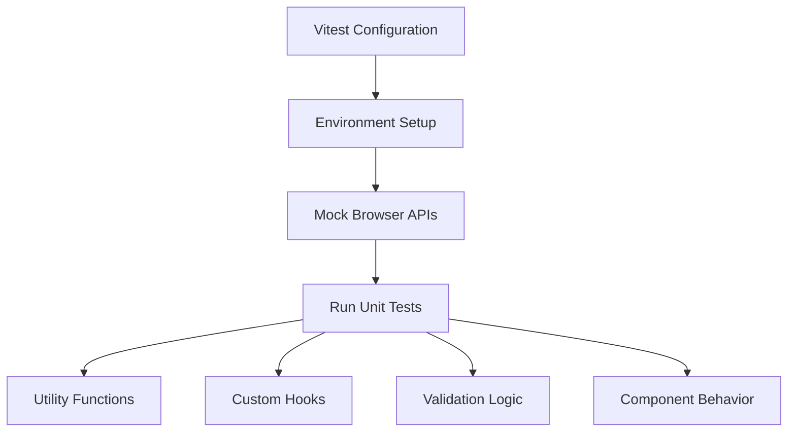
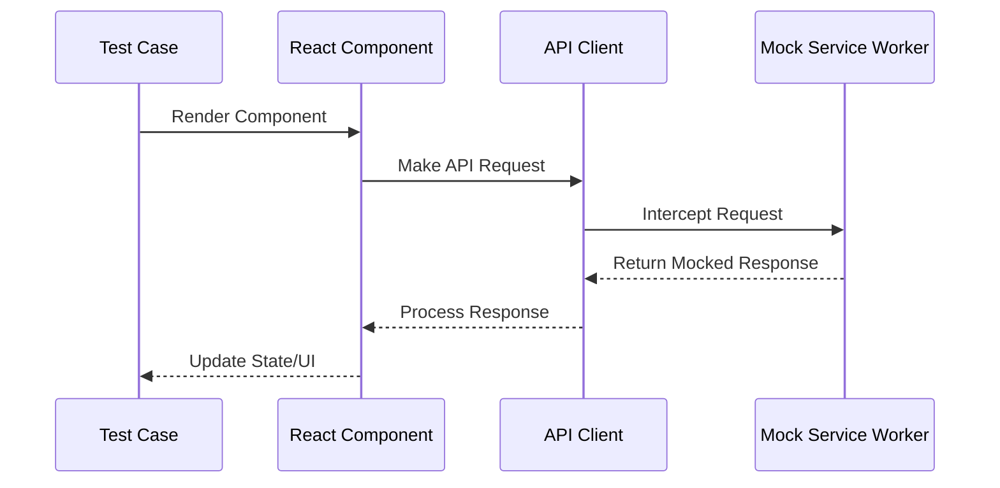
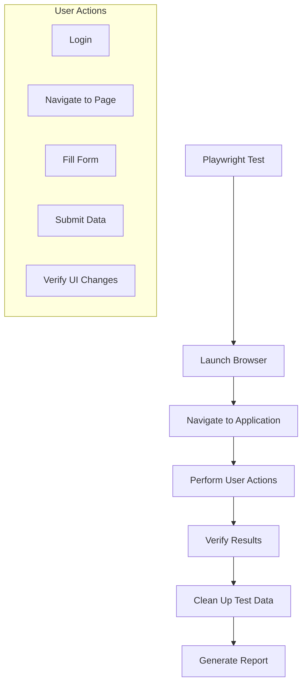
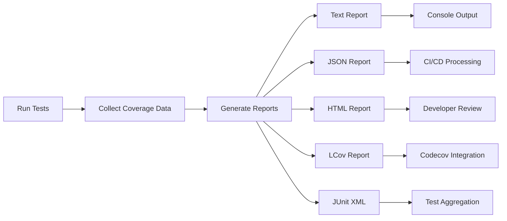
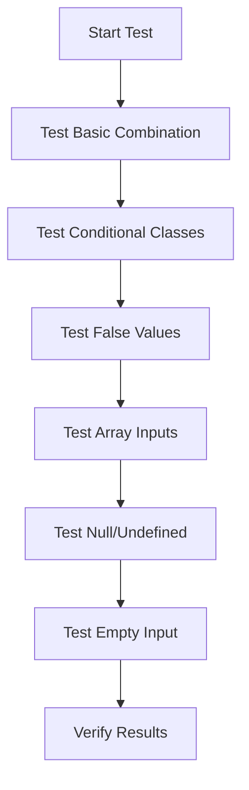
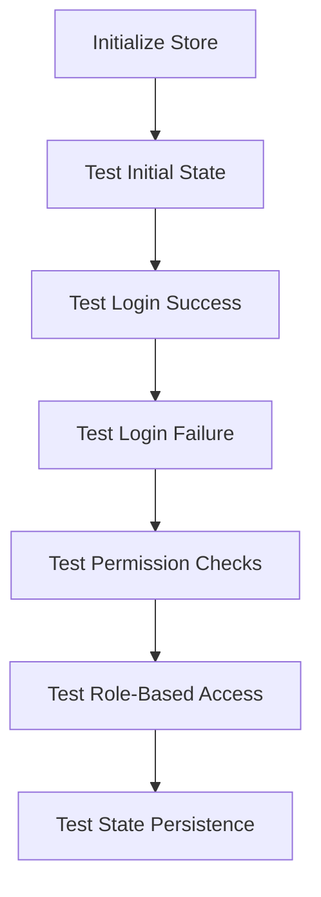
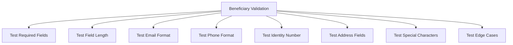
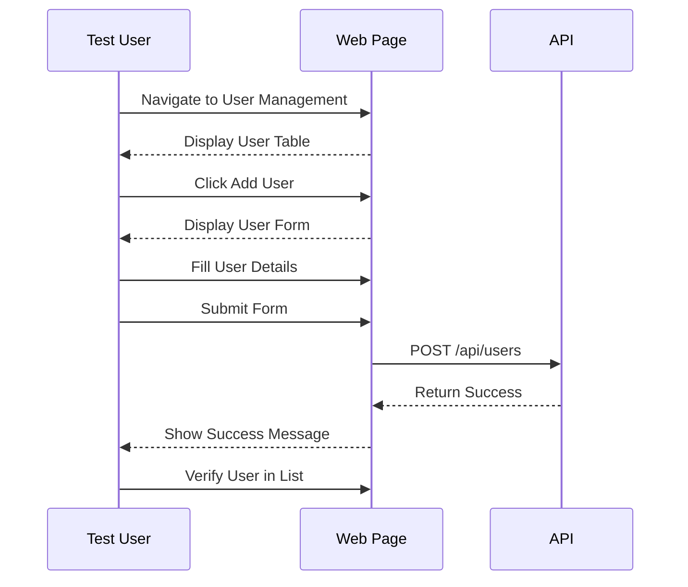

# Testing Strategy

<cite>
**Referenced Files in This Document**   
- [vitest.config.ts](file://vitest.config.ts)
- [package.json](file://package.json)
- [CONTRIBUTING.md](file://CONTRIBUTING.md)
- [src/__tests__/setup.ts](file://src/__tests__/setup.ts)
- [src/__tests__/mocks/handlers.ts](file://src/__tests__/mocks/handlers.ts)
- [e2e/test-utils.ts](file://e2e/test-utils.ts)
- [e2e/mock-api.ts](file://e2e/mock-api.ts)
- [src/lib/validations/beneficiary.ts](file://src/lib/validations/beneficiary.ts)
- [src/lib/validations/aid-application.ts](file://src/lib/validations/aid-application.ts)
- [src/lib/utils.ts](file://src/lib/utils.ts)
- [src/hooks/useInfiniteScroll.ts](file://src/hooks/useInfiniteScroll.ts)
- [src/stores/authStore.ts](file://src/stores/authStore.ts)
- [src/lib/api-client.ts](file://src/lib/api-client.ts)
</cite>

## Table of Contents

1. [Unit Testing with Vitest](#unit-testing-with-vitest)
2. [Integration Testing Strategy](#integration-testing-strategy)
3. [End-to-End Testing with Playwright](#end-to-end-testing-with-playwright)
4. [Test Coverage and Reporting](#test-coverage-and-reporting)
5. [Testing Best Practices](#testing-best-practices)
6. [Practical Test Examples](#practical-test-examples)

## Unit Testing with Vitest

The Kafkasder-panel application implements a comprehensive unit testing strategy using Vitest as the primary testing framework. Unit tests are located in the `src/__tests__` directory and follow the naming convention of `*.test.ts` or `*.test.tsx`. The testing approach focuses on validating individual units of code including utility functions, custom hooks, validation logic, and component behaviors.

Vitest is configured through `vitest.config.ts` to run in a JSDOM environment, enabling browser-like testing for React components. The configuration includes setup files from `src/__tests__/setup.ts` which initialize necessary mocks for browser APIs such as ResizeObserver and IntersectionObserver that are not natively available in the test environment.

**Diagram sources**

- [vitest.config.ts](file://vitest.config.ts)
- [src/**tests**/setup.ts](file://src/__tests__/setup.ts)

The unit testing strategy covers various aspects of the application:

- **Utility functions**: Located in `src/lib/utils.ts`, these functions are tested for correct behavior with different input types and edge cases
- **Custom hooks**: Hooks such as `useInfiniteScroll` in `src/hooks/` are tested for proper state management and side effects
- **Validation logic**: Validation functions in `src/lib/validations/` are thoroughly tested with both valid and invalid inputs
- **Authentication store**: The Zustand store at `src/stores/authStore.ts` is tested for proper state transitions and permission handling

**Section sources**

- [vitest.config.ts](file://vitest.config.ts#L1-L48)
- [src/**tests**/setup.ts](file://src/__tests__/setup.ts#L1-L33)
- [src/lib/utils.ts](file://src/lib/utils.ts)
- [src/hooks/useInfiniteScroll.ts](file://src/hooks/useInfiniteScroll.ts)
- [src/stores/authStore.ts](file://src/stores/authStore.ts)

## Integration Testing Strategy

The integration testing strategy for Kafkasder-panel focuses on testing the interaction between multiple components and modules, as well as API integrations. Integration tests are located in the `src/__tests__/integration/` directory and are designed to verify that different parts of the system work together as expected.

The application uses MSW (Mock Service Worker) to intercept API calls during testing, allowing for deterministic test results while simulating real API interactions. The mock handlers are defined in `src/__tests__/mocks/handlers.ts` and cover key endpoints such as authentication, user management, and beneficiary data retrieval.

**Diagram sources**

- [src/**tests**/mocks/handlers.ts](file://src/__tests__/mocks/handlers.ts#L1-L65)
- [src/lib/api-client.ts](file://src/lib/api-client.ts)

Key aspects of the integration testing strategy include:

- **API integration testing**: Verifying that components correctly handle API responses, including success cases, error states, and loading states
- **Form submission flows**: Testing complete form workflows from input validation to submission and response handling
- **Authentication flows**: Validating the complete authentication process including login, session management, and permission checks
- **Data fetching and caching**: Testing the integration between TanStack Query and the Convex backend for data retrieval and caching

The integration tests also verify complex business logic such as beneficiary data sanitization, which is tested in `src/__tests__/integration/beneficiary-sanitization.test.ts`. This ensures that sensitive data is properly handled and displayed according to organizational policies.

**Section sources**

- [src/**tests**/integration/beneficiary-sanitization.test.ts](file://src/__tests__/integration/beneficiary-sanitization.test.ts)
- [src/**tests**/mocks/handlers.ts](file://src/__tests__/mocks/handlers.ts#L1-L65)
- [src/lib/validations/beneficiary.ts](file://src/lib/validations/beneficiary.ts)
- [src/lib/validations/aid-application.ts](file://src/lib/validations/aid-application.ts)

## End-to-End Testing with Playwright

Kafkasder-panel employs Playwright for end-to-end (E2E) testing, providing comprehensive coverage of complete user workflows. The E2E tests are located in the `e2e/` directory and are written using the Playwright Test framework. These tests simulate real user interactions with the application, running in actual browsers to ensure the complete system works as expected.

The E2E testing framework is configured to run against the production-like environment, testing critical user journeys such as authentication, beneficiary management, donation processing, and error reporting. Each test file in the `e2e/` directory focuses on a specific feature area:

- `auth.spec.ts`: Authentication workflows including login, logout, and session management
- `beneficiaries.spec.ts`: Beneficiary creation, editing, and search functionality
- `donations.spec.ts`: Donation processing and reporting
- `errors.spec.ts`: Error tracking and reporting system
- `user-management.spec.ts`: User creation, role assignment, and permissions

**Diagram sources**

- [e2e/test-utils.ts](file://e2e/test-utils.ts#L1-L794)
- [e2e/mock-api.ts](file://e2e/mock-api.ts#L1-L510)

The E2E tests utilize a sophisticated testing utility system in `e2e/test-utils.ts` that provides helper functions for common operations such as:

- **Authentication**: Functions like `loginAsAdmin` and `loginAsUser` streamline the login process across multiple tests
- **Test data management**: The `TestDataManager` class handles the creation and cleanup of test data to ensure test isolation
- **Element interaction**: Robust helper functions for clicking, filling forms, and selecting dropdown options that handle timing issues and element visibility
- **Network simulation**: Tools to simulate different network conditions including slow networks and network errors

Additionally, the framework includes `e2e/mock-api.ts` which provides a comprehensive mock API implementation for deterministic testing. This mock API returns consistent test data and can simulate various scenarios such as network errors, slow responses, and different authentication states.

**Section sources**

- [e2e/test-utils.ts](file://e2e/test-utils.ts#L1-L794)
- [e2e/mock-api.ts](file://e2e/mock-api.ts#L1-L510)
- [e2e/auth.spec.ts](file://e2e/auth.spec.ts)
- [e2e/user-management.spec.ts](file://e2e/user-management.spec.ts)

## Test Coverage and Reporting

The testing strategy for Kafkasder-panel includes comprehensive coverage requirements and reporting mechanisms to ensure code quality and identify areas needing additional tests. The project is configured to generate multiple types of test reports, providing insights into test execution and code coverage.

According to the `vitest.config.ts` configuration, the test suite generates coverage reports in multiple formats:

- Text summary
- JSON format for machine processing
- HTML reports for interactive browsing
- LCOV format for integration with code coverage platforms

**Diagram sources**

- [vitest.config.ts](file://vitest.config.ts#L20-L36)
- [package.json](file://package.json#L16-L20)

The coverage configuration excludes certain directories that don't require testing coverage, such as:

- Node modules
- Test files themselves
- E2E test files
- Configuration files

The reporting system also includes JUnit XML output (`junit.xml`) which enables integration with CI/CD systems and test aggregation tools. This allows for tracking test results over time and identifying flaky tests.

Coverage requirements for the project include:

- All utility functions must have unit tests with 100% branch coverage
- All custom hooks must be tested for various states and side effects
- All validation logic must be tested with both valid and invalid inputs
- Critical user workflows must be covered by E2E tests
- Error handling scenarios must be explicitly tested

The project's CONTRIBUTING.md documentation emphasizes the importance of tests, requiring that all pull requests include appropriate unit and E2E tests for new features.

**Section sources**

- [vitest.config.ts](file://vitest.config.ts#L20-L36)
- [package.json](file://package.json#L16-L20)
- [CONTRIBUTING.md](file://CONTRIBUTING.md#L168-L237)

## Testing Best Practices

Kafkasder-panel follows several testing best practices to ensure high-quality, maintainable tests that effectively validate the application's functionality.

### Test Organization and Naming

The project follows a consistent file naming convention using `*.test.ts` or `*.spec.ts` suffixes. Tests are organized by type and feature:

- Unit tests in `src/__tests__` directory
- Integration tests in `src/__tests__/integration/`
- E2E tests in `e2e/` directory

Test names follow the pattern "should [behavior] when [condition]" to clearly describe the expected behavior. For example, "should display error message when login fails with invalid credentials."

### Test Isolation and Independence

Each test is designed to be independent and isolated, ensuring that test failures don't cascade. The E2E tests include comprehensive cleanup mechanisms through the `TestDataManager` class, which ensures that test data is removed after each test run.

### Mocking Strategy

The project employs a layered mocking strategy:

- **MSW (Mock Service Worker)**: Used for API mocking in unit and integration tests
- **Manual mocks**: Specific modules are mocked using Vitest's mocking capabilities
- **Playwright route interception**: Used in E2E tests to control API responses

### Performance and Reliability

To ensure test reliability, the framework includes several mechanisms:

- Retry logic for flaky operations
- Progressive timeouts based on operation complexity
- Network idle detection to ensure all requests are complete
- Loading state detection to prevent race conditions

The test utilities include functions like `waitForNetworkIdle` and `waitForLoadingToComplete` that help prevent timing-related test failures.

### Accessibility Testing

While not explicitly covered in the current test suite, the project's documentation suggests that accessibility testing should be included in the test strategy. This would involve testing for proper ARIA labels, keyboard navigation, and screen reader announcements.

**Section sources**

- [CONTRIBUTING.md](file://CONTRIBUTING.md#L186-L203)
- [e2e/test-utils.ts](file://e2e/test-utils.ts#L1-L794)
- [src/**tests**/setup.ts](file://src/__tests__/setup.ts#L1-L33)

## Practical Test Examples

This section provides practical examples of test cases for critical functionality in the Kafkasder-panel application.

### Utility Function Testing

The `cn` utility function in `src/lib/utils.ts` combines CSS class names and is tested for various input scenarios:

**Diagram sources**

- [src/**tests**/lib/utils.test.ts](file://src/__tests__/lib/utils.test.ts)

The test verifies that the function correctly handles:

- Basic class name concatenation
- Conditional classes based on boolean values
- Arrays of class names
- Null and undefined values
- Empty inputs

### Authentication Store Testing

The authentication store at `src/stores/authStore.ts` is tested for proper state management and permission handling:

**Diagram sources**

- [src/stores/**tests**/authStore.test.ts](file://src/stores/__tests__/authStore.test.ts)

The test cases verify:

- Initial state has no user and appropriate default permissions
- Successful login updates user state and permissions
- Failed login maintains previous state
- Permission checks return correct values based on user role
- Role-based access controls work as expected

### Form Validation Testing

Validation functions in `src/lib/validations/` are tested with comprehensive test cases:

**Diagram sources**

- [src/**tests**/lib/beneficiary-validation.test.ts](file://src/__tests__/lib/beneficiary-validation.test.ts)
- [src/lib/validations/beneficiary.ts](file://src/lib/validations/beneficiary.ts)

The validation tests cover:

- Required fields are properly enforced
- Field length constraints
- Email format validation
- Phone number format (Turkish format)
- Identity number validation
- Address field requirements
- Handling of special characters
- Edge cases like maximum length inputs

### End-to-End User Management

The user management workflow is tested through comprehensive E2E tests:

**Diagram sources**

- [e2e/user-management.spec.ts](file://e2e/user-management.spec.ts)
- [e2e/test-utils.ts](file://e2e/test-utils.ts)

The test verifies the complete user management workflow:

- Navigation to the user management page
- Display of existing users
- Form display for new user creation
- Form validation and submission
- API interaction
- Success feedback
- Verification that the user appears in the list

These practical examples demonstrate the comprehensive testing approach used in Kafkasder-panel, ensuring that critical functionality is thoroughly validated through multiple testing layers.

**Section sources**

- [src/**tests**/lib/utils.test.ts](file://src/__tests__/lib/utils.test.ts)
- [src/stores/**tests**/authStore.test.ts](file://src/stores/__tests__/authStore.test.ts)
- [src/**tests**/lib/beneficiary-validation.test.ts](file://src/__tests__/lib/beneficiary-validation.test.ts)
- [e2e/user-management.spec.ts](file://e2e/user-management.spec.ts)
